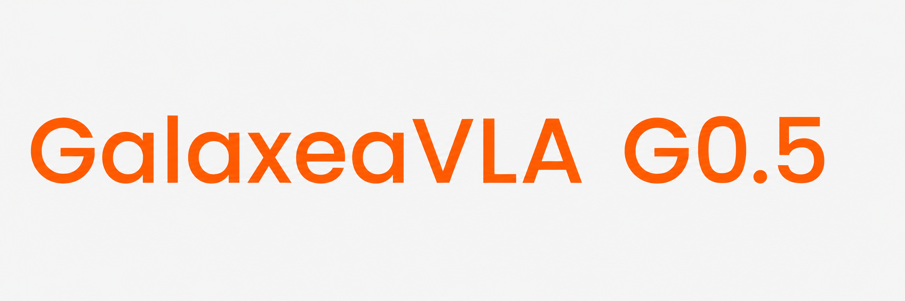
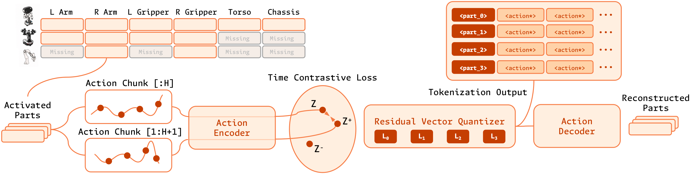
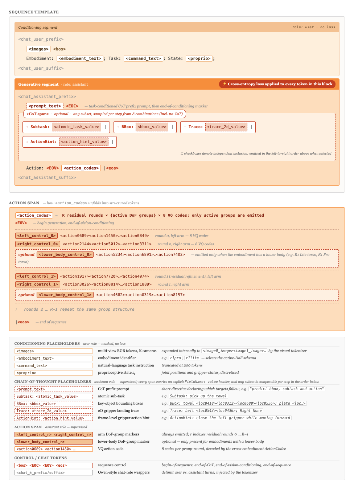

# Galaxea G0.5 VLA Model

[](https://opengalaxea.github.io/G05/)
[](https://opengalaxea.github.io/G05/Galaxea_G0_5.pdf)
[](https://opengalaxea.github.io/G05/videos/introduction_g05.mp4)
[](https://huggingface.co/OpenGalaxea/G05)

[English](README.md) | [Chinese](README_zh.md)

<div align="left">
  
  
</div>


## 📢 News

[Jun 16, 2026] We provide zero-shot inference deployment entrypoints for the **G0.5** model on the R1 Lite and DROID embodiment, along with a LIBERO simulation evaluation entrypoint and R1 Lite/R1 Pro post-training fine-tuning support. Post-training support for more simulation benchmarks and zero-shot inference deployment on so100/101 will be released soon.

[Jun 1, 2026] We introduce **G0.5**, our latest autoregressive VLA model with state-of-the-art performance. See the [Project Page](https://opengalaxea.github.io/G05/). Model weights and code are coming soon.

[Feb 12, 2026] Updated **G0Plus** pretrained weights trained on larger-scale teleoperation and web data. Released **G0Tiny** (250M, SmolVLM2 backbone) for R1 Pro Orin edge deployment. Added out-of-the-box demos: **Fold Towels** and **Handover Gift** (on-device G0Tiny inference via TensorRT at up to 10 Hz). Added [openpi](https://github.com/Physical-Intelligence/openpi)-based **pi0/pi0fast** fine-tuning support.

[Jan 4, 2026] We released **G0Plus**, our latest pretrained VLA model for multi-task robot manipulation.

[Oct 7, 2025] The Galaxea Open-World Dataset is now available in LeRobot format on [Hugging Face](https://huggingface.co/datasets/OpenGalaxea/Galaxea-Open-World-Dataset)!

[Sep 17, 2025] Released G0-VLA fine-tuning and real-robot inference code.

[Sep 9, 2025] Released G0-VLA pretrained model weights on [Hugging Face](https://huggingface.co/OpenGalaxea/G0-VLA) and [ModelScope](https://www.modelscope.cn/models/Galaxea/G0-VLA)!

[Sep 9, 2025] Released the Galaxea Open-World Dataset on [Hugging Face](https://huggingface.co/datasets/OpenGalaxea/Galaxea-Open-World-Dataset) and [ModelScope](https://www.modelscope.cn/datasets/Galaxea/Galaxea-Open-World-Dataset)!


## 📌 G0.5 Overview

**G0.5** is Galaxea's pretrained autoregressive vision-language-action model for general-purpose robot control. Instead of using the VLM only as a vision-language encoder for a separate action expert, G0.5 keeps the VLM as the actor: a single transformer decoder generates reasoning tokens and action tokens in one unified autoregressive stream under the same next-token prediction objective.

Key ideas from the G0.5 technical report:

1. **Unified autoregressive VLA**
   - G0.5 conditions on multi-view RGB observations, an embodiment identifier, natural-language task instruction, and robot proprioceptive state.
   - The model can first emit embodied reasoning, then continue with structured action tokens in the same generation stream.
   - Action tokens are decoded into continuous robot controls, executed in chunks, and replanned closed-loop from new observations.

2. **Cross-embodiment ActionCodec**
   - Heterogeneous robot actions are mapped into a shared 27-dimensional action space:
     `left_control(9) | left_gripper(1) | right_control(9) | right_gripper(1) | lower_body(7)`.
   - A learned residual vector-quantized action tokenizer represents semantically aligned motion groups such as left arm, right arm, and lower body.
   - Only active motion groups are emitted during action generation, avoiding unnecessary padding for idle degrees of freedom.

3. **Native chain-of-thought for control**
   - G0.5 trains reasoning and action as one token sequence, rather than treating reasoning as an external module or training-only auxiliary target.
   - The chain-of-thought span can include `Subtask`, `BBox`, `Trace`, and `ActionHint` fields for task decomposition, object grounding, 2D gripper traces, and frame-level motion hints.
   - This design improves grounding and long-horizon execution because generated reasoning is directly visible to the following action tokens.

4. **Visual memory**
   - G0.5 injects multi-second visual history through the vision encoder with factorized spatial-temporal attention.
   - Pre-training uses 6 frames sampled over a 5-second window, with stochastic history-frame dropout to reduce overfitting.
   - Historical tokens are discarded at the final layer to keep inference latency bounded.

5. **Pre-training and evaluation**
   - G0.5 is initialized from a Qwen3.5 2B VLM and pretrained on robot demonstrations from 14 embodiments together with large-scale web and embodied VQA data.
   - Robot action samples and VQA samples are optimized with the same cross-entropy objective, mixed at a VQA-to-action ratio of 1:4.
   - The model reports strong performance across diverse settings, including 82.5% zero-shot success on DROID, 87.3% on Bridge-SimplerEnv, 93.3% on RoboTwin 2.0, 98.9% on LIBERO, a 0.3136 task success score on BEHAVIOR-1K, and 76.7% average success after real-world fine-tuning on R1-Lite/R1-Pro.

<p align="center">
  
  <br>
  <em>G0.5 Tokenizer</em>
</p>

<p align="center">
  
  <br>
  <em>G0.5 Token Sequence Template</em>
</p>

## ⚙️ G0.5 Getting Started

### GPU Requirements

To run our pretrained models in this repository, you need an NVIDIA GPU with at least the following specifications. These estimates assume a single GPU, but you can also use multiple GPUs with model parallelism to reduce per-GPU memory requirements by configuring `--nnodes` and `--nproc-per-node` in the fine-tuning launch script.

| Mode               | Memory Required | Example GPU              |
| ------------------ | --------------- | ------------------------ |
| Inference          | > 8 GB          | RTX 3090 / **RTX 4090 (Recommended)**      |
| Fine-Tuning (Full) | > 70 GB         | A100 (80GB) / H20 (96GB) |

### Installation

```bash
git clone https://github.com/OpenGalaxea/GalaxeaVLA
cd GalaxeaVLA
uv sync --index-strategy unsafe-best-match
source .venv/bin/activate

uv pip install -e .
uv pip install -e .[dev]
```
Before installation:
1. We recommend [installing uv](https://docs.astral.sh/uv/getting-started/installation/) without using a conda environment.
2. If you encounter network issues, we recommend trying the following uv environment variables:
   ```bash
   export UV_DEFAULT_INDEX=https://mirrors.aliyun.com/pypi/simple/
   export UV_PYTHON_INSTALL_MIRROR=https://gh-proxy.com/https://github.com/astral-sh/python-build-standalone/releases/download
   ```


### Model Checkpoints

| Model                  | Description                       | Checkpoint Path                                              |
| ---------------------- | --------------------------------- | ------------------------------------------------------------ |
| G05-base | Pretrained weights for fine-tuning and zero-shot deployment on R1 Lite | https://huggingface.co/OpenGalaxea/G05/tree/main/g05-base |
| G05-so100 | For zero-shot deployment on SO-100 | [Coming Soon] |
| G05-droid | For zero-shot deployment on DROID | https://huggingface.co/OpenGalaxea/G05/tree/main/g05-droid |
| G05-libero | For evaluation on LIBERO | https://huggingface.co/OpenGalaxea/G05/tree/main/g05-libero |


### Inference on Real Robots

Real-robot deployment follows a server/client architecture. The GPU machine runs the G05 policy server from this repository, while the robot-side client collects raw observations, sends them over WebSocket + msgpack, receives action chunks, and executes them.

#### R1 Lite

Start the policy server on the GPU machine:

```bash
python scripts/serve_policy.py \
    --ckpt_path /path/to/checkpoints/model_state_dict.pt \
    --host 0.0.0.0 \
    --port 8080 \
    --device cuda \
    --action_steps 16 \
    eval_embodiment=galaxea_r1lite
```

Then start the R1 Lite client on the robot machine after setting the server address in `experiments/r1lite/config.toml`:

```bash
source /opt/ros/humble/setup.bash
source .venv/bin/activate
cd experiments/r1lite
python run.py --config config.toml
```

See [experiments/r1lite/README.md](experiments/r1lite/README.md) for the ROS2 topics, client/server protocol, instruction file, recording, and testing details.

#### SO-100 / SO-101

SO-100 deployment uses the same G05 policy server with a lightweight LeRobot-based client:

```bash
bash experiments/so100/start_server.sh /path/to/checkpoint.pt
conda env create -f experiments/so100/environment.yml
conda activate lerobot
bash experiments/so100/start_client.sh
```

Before running the client, update the camera indices and camera-slot mapping in `experiments/so100/start_client.sh`. See [experiments/so100/README.md](experiments/so100/README.md) for details.

#### DROID / Franka

DROID deployment serves the G05 policy from this repo and uses a separate Franka client repo for robot control:

```bash
CHECKPOINT_DIR=/path/to/g05_droid \
POLICY_PORT=8000 \
POLICY_DEVICE=cuda:0 \
bash experiments/droid/start_server.sh \
    model.model_arch.discrete_action=true model.model_arch.continuous_action=false
```

See [experiments/droid/README.md](experiments/droid/README.md) and [experiments/droid/PROTOCOL.md](experiments/droid/PROTOCOL.md) for the full setup and protocol contract.

### Evaluation on LIBERO

LIBERO evaluation also uses a server/client setup: a batched policy server runs on one GPU, and one parallel client is launched for each LIBERO suite.

```bash
bash scripts/run/eval_libero.sh /path/to/checkpoint.pt \
    --num_trials 50 \
    --num_parallel 10 \
    --save_videos
```

By default, the script evaluates `libero_goal`, `libero_spatial`, `libero_object`, and `libero_10`, then writes per-suite logs and `summary.json` under `outputs/libero_eval_<checkpoint_name>/`. Use `--suites "libero_goal libero_10"` to run a subset, and append Hydra-style overrides such as `model.model_arch.discrete_action=false` when needed.

See [experiments/libero/README.md](experiments/libero/README.md) for LIBERO installation notes, generated path config, output layout, and single-suite debugging commands.

### 🔥 Fine-Tuning Base Models on Galaxea Robots

To fine-tune our models with your own data, follow four steps:

1. Create or adapt a task config under `configs/task/`. For Galaxea robot fine-tuning, start from one of the provided configs:
   - R1 Lite: [configs/task/r1lite.yaml](configs/task/r1lite.yaml) with dataset paths in [configs/data/r1lite.yaml](configs/data/r1lite.yaml).
   - R1 Pro joint-space training: [configs/task/r1pro.yaml](configs/task/r1pro.yaml) with dataset paths in [configs/data/r1pro.yaml](configs/data/r1pro.yaml).
   - R1 Pro whole-body-control training with torso state/action: [configs/task/r1pro_wbc.yaml](configs/task/r1pro_wbc.yaml) with dataset paths in [configs/data/r1pro_wbc.yaml](configs/data/r1pro_wbc.yaml).

2. Install the required packages.

   ```bash
   sudo apt install ffmpeg
   ```

3. Set your environment variables.
    - `G05_OUTPUT_DIR`: Required by `configs/train.yaml`; checkpoints and Hydra logs are written under this directory.
    - `HF_HOME` / `HF_HUB_CACHE`: Recommended cache locations for Hugging Face model and tokenizer snapshots.
    - `HF_DATASETS_CACHE`: Recommended cache location for Hugging Face datasets and LeRobot metadata.
    - `LIBERO_CONFIG_PATH`: Required only for LIBERO simulation evaluation. It points to the directory where LIBERO reads or writes `config.yaml` with `bddl_files`, `init_states`, `assets`, and dataset paths.
    - `SWANLAB_API_KEY`: Required only when `logger.type=swanlab`.
    - `WANDB_API_KEY`: Required only when `logger.type=wandb` and `logger.mode=online`.

    ```bash
    export HF_ENDPOINT=https://hf-mirror.com
    export HF_HOME=<YOUR_HF_CACHE_ROOT>
    export HF_HUB_CACHE=$HF_HOME/hub
    export HF_DATASETS_CACHE=$HF_HOME/datasets
    export G05_OUTPUT_DIR=<YOUR_OUTPUT_DIR>
    export LIBERO_CONFIG_PATH=$(pwd)/experiments/libero
    export SWANLAB_API_KEY=<YOUR_SWANLAB_API_KEY>
    ```

    The repository-local `.env` file is a placeholder template for machine-specific paths and API keys. Fill in the placeholders locally, then source it before launching training or evaluation:

    ```bash
    source .env
    ```

4. Run fine-tuning.

   ```bash
   bash scripts/run/finetune.sh <num_of_gpu> <task_path>

   # examples:
   bash scripts/run/finetune.sh 8 r1lite
   bash scripts/run/finetune.sh 8 r1pro
   bash scripts/run/finetune.sh 8 r1pro_wbc
   ```

   R1 Pro configs use the grouped 27D ActionCodec layout:
   `left_control(9) | left_gripper(1) | right_control(9) | right_gripper(1) | lower_body(7)`.
   The WBC variant maps `torso` into the `lower_body` group through [configs/data/parts_meta/r1pro.yaml](configs/data/parts_meta/r1pro.yaml).

#### Fine-Tuning FAQ

1. Q: How do I convert my data to a [LeRobot](https://github.com/huggingface/lerobot) dataset?

   A: The [demo datasets](https://huggingface.co/OpenGalaxea/G0-VLA/tree/main/G0Plus_Finetune_LeRobot_Datasets_Demo) are provided on Hugging Face for quick testing.

2. Q: Why can't I view the training logs in SwanLab?

   A: Make sure you set your own SwanLab `workspace` in [train.yaml](configs/train.yaml).

3. Q: Why can't I find the pretrained model?

   A: The G0.5 model config is [g05.yaml](configs/model/g05.yaml). Update `model.model_arch.pretrained_model_path` or the task-level `model.pretrained_ckpt` if your checkpoints live in custom paths.

4. Q: Why am I getting an out-of-memory (OOM) error?

   A: Make sure you have enough GPU memory as mentioned above. Alternatively, reduce `model.batch_size` in the corresponding task config under [configs/task](configs/task).

## Acknowledgements

This project builds upon prior work from the open source community. The implementation was inspired by [open-pi-zero](https://github.com/allenzren/open-pi-zero), [OpenVLA](https://github.com/openvla/openvla), [Octo](https://github.com/octo-models/octo), [OpenPI](https://github.com/Physical-Intelligence/openpi), and [LeRobot](https://github.com/huggingface/lerobot), and the experiments make use of datasets including [OXE](https://github.com/google-deepmind/open_x_embodiment), [RDT](https://github.com/thu-ml/RoboticsDiffusionTransformer), [BridgeV2](https://github.com/rail-berkeley/bridge_data_v2), and [DROID](https://github.com/droid-dataset/droid). We sincerely thank the authors of these projects for making their code and data publicly available.


## 📜 Citation

If you use our dataset or models, please cite:

```bibtex
@article{galaxea2026g05,
  title={Galaxea G0.5 Technical Report},
  author={Galaxea Team},
  year={2026},
  url={https://opengalaxea.github.io/G05/Galaxea_G0_5.pdf}
}
```

## License

This repository contains materials released under different licenses depending on the commit date:
- Apache-2.0 (Legacy): All content committed before 2026-01-04 is licensed under the Apache License 2.0.
- G0 PLUS Community License Agreement: All content committed on or after 2026-01-04 and before 2026-06-16 is licensed under the G0 PLUS Community License (Non-Commercial + Limited Patent License). See [G0 Plus Community License Agreement](licenses/LICENSE-G0Plus).
- G0.5 Community License Agreement: All content committed on or after 2026-06-16 is licensed under the G0.5 Community License (Non-Commercial + Limited Patent License). See [G0.5 Community License Agreement](licenses/LICENSE-G0.5).
For avoidance of doubt, there are two licensing boundaries, each determined by the first commit that introduces the corresponding license switch:
- Boundary 1 (Apache-2.0 / G0 PLUS): First commit under the G0 PLUS license (introducing the G0 PLUS license switch): [38b31e4](https://github.com/OpenGalaxea/GalaxeaVLA/tree/38b31e4f732ef28719a5458a18e2836dd52f9d12)
- Boundary 2 (G0 PLUS / G0.5): First commit under the G0.5 license (introducing the G0.5 license switch): [dc0a1ef](https://github.com/OpenGalaxea/GalaxeaVLA/tree/dc0a1ef4531256adea4ee9f3d7d2fa44613cb866)
In the event of any inconsistency between the date descriptions and the commit hashes, the commit hashes shall prevail.

### What you can do under the G05 Community License

You may use, reproduce, modify, and distribute the G0.5 materials only for non-commercial purposes, such as academic research, personal use, education, and evaluation. Commercial use (including production deployment, providing services to third parties, or productization) requires a separate commercial license from us.
Notices and attribution
If you redistribute any part of the G0.5 materials, you must include:
- a copy/link of G0.5 Community License Agreement, and
- the NOTICE file in this repository, and
- prominent notices on modified files indicating changes.

This repository is released under the **G05 Community License Agreement (Non-Commercial + Limited Patent License)**. See [LICENSE](./LICENSE).

The G05 materials include model code, weights, configurations, training/inference scripts, documentation, and accompanying materials.

### Third-party licenses

G05 uses Qwen3.5 as its pretrained VLM backbone and includes Qwen3.5-derived implementation components. Qwen3.5 model weights, configuration files, and related upstream materials are licensed by Qwen under Apache License 2.0. See [LICENSE_QWEN3_5.txt](./LICENSE_QWEN3_5.txt).

### Legal and safety compliance

This repository release does not itself provide a public-facing generative AI service. If you deploy, fine-tune, redistribute, or expose any model, service, output, or robot-control workflow, you are responsible for complying with applicable laws and regulations, including requirements for data rights, personal information protection, safety assessment or filing, content safety, generated-content labeling, and robotics safety in your jurisdiction.

### Notices and attribution

If you redistribute any part of the G05 materials, you must include:
- a copy/link of the G05 Community License Agreement,
- the required NOTICE text/file described in the license, and
- prominent notices on modified files indicating changes.

## Star History

[](https://www.star-history.com/#OpenGalaxea/GalaxeaVLA&type=date&legend=top-left)
