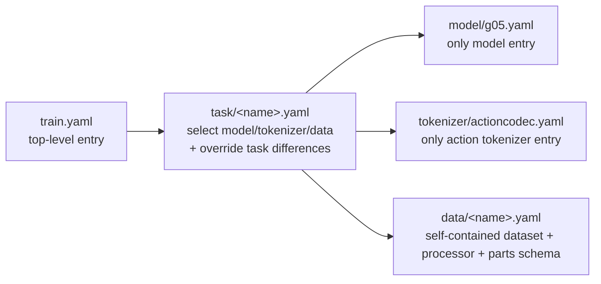

# Config Quick Start

## Hierarchy



- Entry point: `bash scripts/run/finetune.sh <n_gpu> <task>`. The task can be `libero` or `configs/task/libero.yaml`.
- Current tasks are limited to `bridge`, `droid`, `libero`, `r1lite`, `r1pro`, `r1pro_wbc`, `robotwin`, and `so100`.
- `configs/data/<task>.yaml` is the complete data entry for that task. It is no longer split into mixture and embodiment subdirectories.
- Shared `parts_meta` / `merge_spec` layouts live under `configs/data/parts_meta/` and are referenced by `action_state_merger`.

## Where To Change Things

| Goal | File | Field |
|------|------|-------|
| Learning rate / batch size / epochs | `configs/task/<task>.yaml` | `model.learning_rate` / `model.batch_size` / `model.max_epochs` |
| Pretrained weights | `configs/task/<task>.yaml` | `model.pretrained_ckpt` |
| Dataset statistics | `configs/task/<task>.yaml` | `datastatics_path` |
| Dataset paths | `configs/data/<task>.yaml` | `embodiment_datasets.*.dataset_groups.*.dataset_dirs` |
| Raw action/state fields | `configs/data/<task>.yaml` | `processors.*.shape_meta` |
| Action horizon | `configs/data/<task>.yaml` | `action_size` |
| Parts schema / merge rules | `configs/data/parts_meta/*.yaml` and task/data configs | `action_state_merger.max_*_shape_meta` / `merge_spec` |
| Action tokenizer defaults | `configs/tokenizer/actioncodec.yaml` | `vq_config` |
| Task tokenizer differences | `configs/task/<task>.yaml` | `tokenizer.vq_config` |
| Model architecture defaults | `configs/model/g05.yaml` | `model_arch` |
| Eval frequency / output directory | `configs/train.yaml` or CLI | `eval_steps` / `exp_name` |

Temporary CLI override example:

```bash
bash scripts/run/finetune.sh 1 libero model.batch_size=8 eval_steps=200
```

## Validation After Edits

```bash
python tools/resolve_config.py libero --key model.model_arch
python tools/resolve_config.py libero --diff bridge --only-diff
python tests/show_vla_label.py --task libero
bash scripts/run/finetune.sh 1 configs/task/libero.yaml --test
```

## Add Your Own Dataset

1. Copy the closest `configs/data/<task>.yaml` and update `shape_meta`, `dataset_groups`, processor transforms, and merger.
2. Copy the closest `configs/task/<task>.yaml` and point `/data` in `defaults` to the new data file.
3. If the output action dimension changes, also update `model.model_arch.action_dim/proprio_dim` and `tokenizer.vq_config.parts_meta`.
4. Run the validation commands above for resolved config, label inspection, and smoke training.
