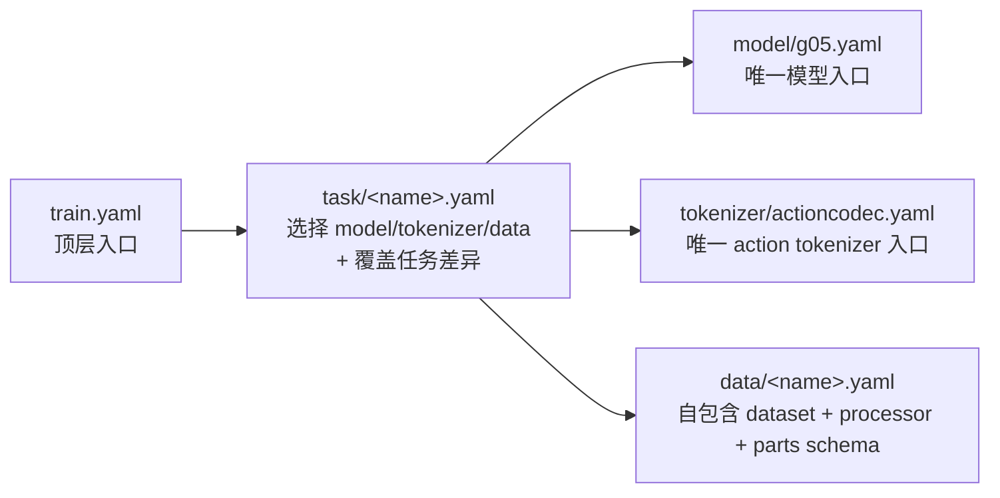

# Config Quick Start

## 层级结构



- 入口：`bash scripts/run/finetune.sh <n_gpu> <task>`，task 可写 `libero` / `configs/task/libero.yaml`
- 当前 task 只保留：`bridge`、`droid`、`libero`、`r1lite`、`robotwin`、`so100`
- `configs/data/<task>.yaml` 是该 task 的完整数据入口，不再拆成 mixture 和 embodiment 子目录
- 共享 `parts_meta` / `merge_spec` layout 位于 `configs/data/parts_meta/`，由 `action_state_merger` 引用

## 想改 X -> 改哪

| 想改什么 | 改哪个文件 | 字段 |
|---------|-----------|------|
| 学习率 / batch size / epoch | `configs/task/<task>.yaml` | `model.learning_rate` / `model.batch_size` / `model.max_epochs` |
| 预训练权重 | `configs/task/<task>.yaml` | `model.pretrained_ckpt` |
| 数据集统计 | `configs/task/<task>.yaml` | `datastatics_path` |
| 数据集路径 | `configs/data/<task>.yaml` | `embodiment_datasets.*.dataset_groups.*.dataset_dirs` |
| action/state 原始字段 | `configs/data/<task>.yaml` | `processors.*.shape_meta` |
| action horizon | `configs/data/<task>.yaml` | `action_size` |
| parts schema / merge 规则 | `configs/data/parts_meta/*.yaml` 和 task/data 配置 | `action_state_merger.max_*_shape_meta` / `merge_spec` |
| action tokenizer 默认 | `configs/tokenizer/actioncodec.yaml` | `vq_config` |
| task tokenizer 差异 | `configs/task/<task>.yaml` | `tokenizer.vq_config` |
| 模型架构默认 | `configs/model/g05.yaml` | `model_arch` |
| eval 频率 / 输出目录 | `configs/train.yaml` 或命令行 | `eval_steps` / `exp_name` |

命令行临时覆盖任何字段：

```bash
bash scripts/run/finetune.sh 1 libero model.batch_size=8 eval_steps=200
```

## 改完后怎么验证

```bash
python tools/resolve_config.py libero --key model.model_arch
python tools/resolve_config.py libero --diff bridge --only-diff
python tests/show_vla_label.py --task libero
bash scripts/run/finetune.sh 1 configs/task/libero.yaml --test
```

## 接入自己的数据集

1. 复制最接近的 `configs/data/<task>.yaml`，改 `shape_meta`、`dataset_groups`、processor transform 和 merger。
2. 复制最接近的 `configs/task/<task>.yaml`，在 `defaults` 中把 `/data` 指向新的 data 文件。
3. 如果输出动作维度变化，同步修改 `model.model_arch.action_dim/proprio_dim` 和 `tokenizer.vq_config.parts_meta`。
4. 按上面的验证命令检查 resolve、label 和 smoke train。
