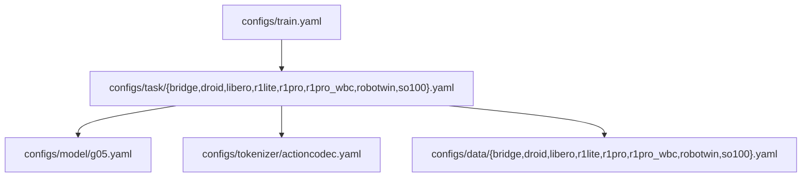

# Config Architecture

> Minimal posttrain keeps one model entry, one tokenizer entry, and one self-contained data entry per task.

## 1. Composition



`configs/train.yaml` is the Hydra top-level entry. Each task explicitly selects the matching data config, the only model config, and the only tokenizer config through `defaults`:

```yaml
# configs/task/libero.yaml
defaults:
  - override /model: g05
  - override /tokenizer: actioncodec
  - override /data: libero
  - _self_
```

Task files keep only training, evaluation, deployment, and tokenizer differences. Shared model structure lives in `model/g05.yaml`, and shared tokenizer defaults live in `tokenizer/actioncodec.yaml`.

## 2. Data Configs

Each data file is self-contained:

- `MixtureLerobotDataset` parameters such as `action_size`, `obs_size`, and `val_set_proportion`.
- `embodiment_datasets`, including dataset class, `shape_meta`, and `dataset_groups`.
- `processors`, including processor `shape_meta`, transforms, normalization, filters, and `action_state_merger`.

The old `configs/data/_mixtures/` and `configs/data/<embodiment>/` trees have been folded into self-contained task data files. Shared parts layouts are kept in `configs/data/parts_meta/`.

## 3. Parts Schema

`parts_meta` shared layouts are maintained as standalone YAML files under `configs/data/parts_meta/` and referenced from processor configs:

```yaml
action_state_merger:
  max_action_shape_meta: ${oc.load:configs/data/parts_meta/dual_arm_grouped_0409.yaml,parts_meta}
  max_state_shape_meta: ${oc.load:configs/data/parts_meta/dual_arm_grouped_0409.yaml,parts_meta}
  merge_spec: ${oc.load:configs/data/parts_meta/dual_arm_grouped_0409.yaml,merge_spec}
```

Standard dual-arm tasks output grouped 20D:

```text
left_control(9) | left_gripper(1) | right_control(9) | right_gripper(1)
```

R1Lite and R1Pro output grouped 27D by adding `lower_body(7)`.

## 4. Tokenizer

The only tokenizer config is `configs/tokenizer/actioncodec.yaml`. Tasks override only fields that truly differ, such as Bridge BAR `block_size`, R1Lite/R1Pro 27D `parts_meta`, and `dropout_noop_parts` for selected tasks.

## 5. New Task Checklist

1. Create `configs/data/<name>.yaml` with self-contained dataset, processor, and parts schema.
2. Create `configs/task/<name>.yaml`, with defaults pointing to `/model: g05`, `/tokenizer: actioncodec`, and `/data: <name>`.
3. Override only training hyperparameters, checkpoints, evaluation/deployment flags, and required tokenizer differences in the task file.
4. Run `python tools/resolve_config.py <name> --key data` and `python tools/resolve_config.py <name> --key model.model_arch` to inspect the resolved config.

## 6. Related Documents

| Document | Contents |
|----------|----------|
| [QUICK_START.md](../../configs/QUICK_START.md) | Config quick reference. |
| [parts_meta.md](parts_meta.md) | Parts schema and mergers. |
| [tokenizer.md](tokenizer.md) | Action tokenizer architecture. |
