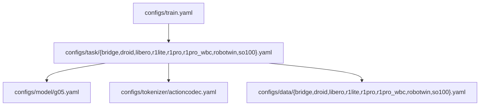

# Config 架构

> Minimal posttrain 配置只保留一个模型入口、一个 tokenizer 入口，以及每个 task 对应的自包含 data 入口。

## 1. 组合方式



`configs/train.yaml` 是 Hydra 顶层入口。每个 task 通过 defaults 明确选择同名 data、唯一 model 和唯一 tokenizer：

```yaml
# configs/task/libero.yaml
defaults:
  - override /model: g05
  - override /tokenizer: actioncodec
  - override /data: libero
  - _self_
```

task 文件只保留训练、评测、部署和 tokenizer 差异项。通用模型结构在 `model/g05.yaml`，通用 tokenizer 默认在 `tokenizer/actioncodec.yaml`。

## 2. Data 配置

每个 data 文件自包含：

- `MixtureLerobotDataset` 参数，如 `action_size`、`obs_size`、`val_set_proportion`
- `embodiment_datasets`，包含 dataset class、`shape_meta`、`dataset_groups`
- `processors`，包含 processor `shape_meta`、transform、normalization、filter、`action_state_merger`

旧的 `configs/data/_mixtures/`、`configs/data/<embodiment>/` 已合并进自包含的 task data 文件。共享 parts layout 保留在 `configs/data/parts_meta/`。

## 3. Parts Schema

`parts_meta` 共享布局维护在 `configs/data/parts_meta/`，由 processor 配置引用：

```yaml
action_state_merger:
  max_action_shape_meta: ${oc.load:configs/data/parts_meta/dual_arm_grouped_0409.yaml,parts_meta}
  max_state_shape_meta: ${oc.load:configs/data/parts_meta/dual_arm_grouped_0409.yaml,parts_meta}
  merge_spec: ${oc.load:configs/data/parts_meta/dual_arm_grouped_0409.yaml,merge_spec}
```

标准双臂任务输出 grouped 20D：

```text
left_control(9) | left_gripper(1) | right_control(9) | right_gripper(1)
```

R1Lite 和 R1Pro 输出 grouped 27D，额外包含 `lower_body(7)`。

## 4. Tokenizer

唯一 tokenizer 配置是 `configs/tokenizer/actioncodec.yaml`。task 只覆盖真正变化的字段，例如 Bridge 的 BAR `block_size`、R1Lite/R1Pro 的 27D `parts_meta`、以及部分 task 的 `dropout_noop_parts`。

## 5. 新增 Task Checklist

1. 新建 `configs/data/<name>.yaml`，自包含 dataset、processor、parts schema。
2. 新建 `configs/task/<name>.yaml`，defaults 指向 `/model: g05`、`/tokenizer: actioncodec`、`/data: <name>`。
3. 只在 task 中覆盖训练超参、checkpoint、评测/部署开关和必要 tokenizer 差异。
4. 运行 `python tools/resolve_config.py <name> --key data` 和 `python tools/resolve_config.py <name> --key model.model_arch` 检查最终配置。

## 6. 相关文档

| 文档 | 内容 |
|------|------|
| [QUICK_START.md](../../configs/QUICK_START.md) | Config 速查 |
| [parts_meta.md](parts_meta.md) | parts schema 与 merger |
| [tokenizer.md](tokenizer.md) | Action tokenizer 架构 |
