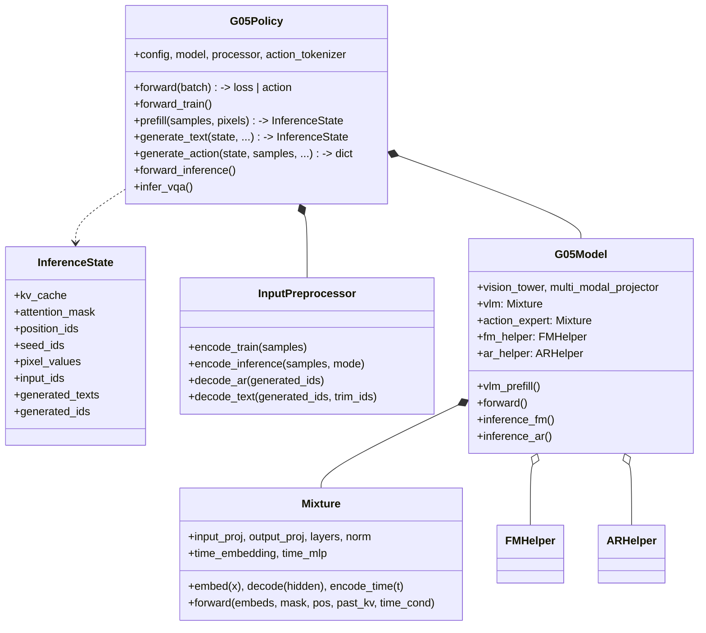
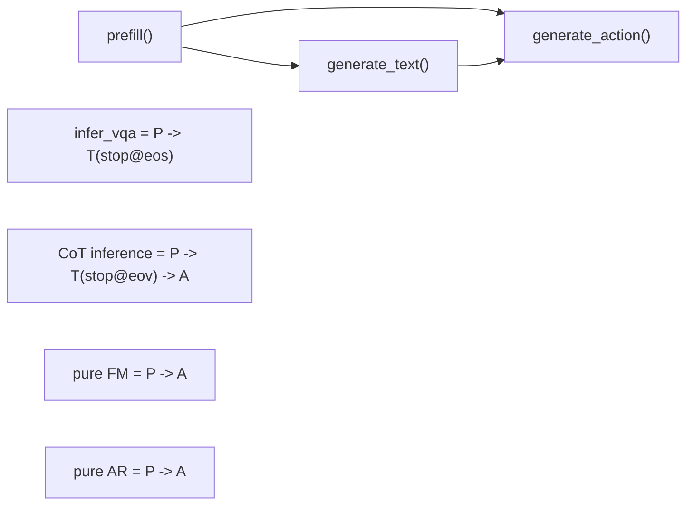

# G05 v2 Architecture Design

> Updated on 2026-03-28

## 1. Refactor Goals

The refactor turns roughly 4,400 lines of `galaxea_zero` code into a G05 architecture with clearer ownership and consistent training/inference behavior.

One-sentence summary: **Mixture is a complete LLM module. VLM and Action Expert are two homogeneous Mixture instances with different configs.**

### Problems Before The Refactor

| # | Problem | Severity |
|---|---------|----------|
| 1 | Training and inference used different Action Encoder input dtypes, bf16 vs float32. | BUG |
| 2 | Training and inference used different Action Decoder precision, float32 vs bf16. | BUG |
| 3 | Action Expert had two unrelated forward paths, JointModel and Mixture. | BUG |
| 4 | Config fields were scattered with many `cfg.get()` defaults. | Design |
| 5 | PaliGemma-specific names, such as embed_tokens/lm_head/vision, were hardcoded in PiAR. | Design |
| 6 | JointModel was an unnecessary intermediate layer. | Design |
| 7 | AR/FM algorithm logic was mixed into weight-owning classes. | Design |

### Design Decisions

| # | Topic | Decision |
|---|-------|----------|
| D1 | `position_ids_type` | Keep all modes: `pi0fast`, `lyc`, `lycv2`, and `gaussian`; select through config. |
| D2 | `action_position_offset` | Use dynamic max from `position_ids[:, :split_index].max()` and remove the fixed offset config. |
| D3 | time convention | Support both `pi_convention` and `galaxea_convention` through config. |
| D4 | Action Expert mask among action tokens | Configurable, default fully attend with `action_causal: false`. |
| D5 | KV cache format | Standardize on `List[(K, V)]`; remove KVCache objects. |
| D6 | Detaching VLM KV during training | Controlled by `joint_training`, default detach. |
| D7 | Distributed training | DDP-only in the open-source version. FSDP paths were removed, but fixed-length `_fsdp_pad` remains useful. |

## 2. Core Design

**Mixture is a complete LLM module.** VLM and Action Expert are homogeneous Mixture instances whose differences are config-driven:

| Area | VLM Mixture | Action Expert Mixture |
|------|-------------|-----------------------|
| Input projection | `embed_tokens`: `Embedding(vocab -> 2048)` | `action_encoder`: `Linear(action_dim -> 1024)` |
| Layers | 18 DecoderLayers, 2048d, RMSNorm | 18 DecoderLayers, 1024d, AdaLN |
| Output projection | `lm_head`: `Linear(2048 -> vocab)`, tied | `action_decoder`: `Linear(1024 -> action_dim)` |
| Time conditioning | none | `time_embedding` + `time_mlp` |
| KV cache | produces cache | consumes VLM cache through `past_key_values` |

Vision, SiGLIP plus projector, lives at the `G05Model` layer because it is multimodal fusion and not part of either LLM stream.

The processor owns all data-to-token and token-to-data conversion: training encoding, inference encoding, AR reverse decoding, and text decoding. Policy only routes.

## 3. File Layout

```text
src/g05/models/g05/
├── g05_policy.py              # base Policy: three-stage inference API, routing, pre/postprocess
├── g05_policy_qwen35.py       # Qwen3.5 Policy subclass
├── g05_model.py               # base Model: Vision + 2xMixture + vlm_prefill + mask/pos
├── g05_model_qwen35.py        # Qwen3.5 Model subclass, MRoPE / MEM frame drop
├── inferencer.py              # inference wrapper
├── helpers/
│   ├── fm_helper.py           # FM algorithm class, zero weights
│   ├── ar_helper.py           # AR algorithm class, zero weights
│   ├── ar_sampling.py         # AR sampling strategies
│   ├── mask_helper.py         # VLM / AE masks and position_ids
│   └── proprio_helper.py      # proprio encoding
├── io/
│   ├── input_preprocessor.py  # template-driven token encoding/decoding
│   ├── templates.py           # templates and token maps
│   └── batch_schema.py        # batch field schema
├── model/
│   ├── modules.py             # SinusoidalPosEmb, AdaLN, etc.
│   └── utils.py               # rotate_half, repeat_kv, attention
└── qwen35/
    ├── mixture_qwen35.py      # MixtureQwen35
    ├── vision.py              # Qwen3.5 ViT with MEM T+S attention
    ├── gated_deltanet.py      # GatedDeltaNet linear attention
    ├── modules.py / processing.py
```

## 4. Layering



### Cohesion

| Component | Owns | Should not own |
|-----------|------|----------------|
| **InputPreprocessor** | Token encoding, train/infer APIs, AR decoding, text decoding, truncate/pad. | `pixel_values` processing or model calls. |
| **G05Policy** | Three-stage inference orchestration, `pixel_values` processing, optimizer parameter groups. | Token sequence construction, mask construction, model internals. |
| **G05Model** | Multimodal assembly, `vlm_prefill`, mask/position handling, helper routing. | Time sampling, loss formulas, Euler integration. |
| **Mixture** | Weights, forward, precision management. | Mask/position construction, losses, inference loops. |
| **FMHelper** | Weight-free FM algorithm: time, `psi_t`, loss, Euler. | Parameters, `split_index`, prefill. |
| **ARHelper** | Weight-free AR algorithm: CE loss, decode loop, accuracy split. | Parameters, action decoding, prefill. |

## 5. Key Decisions

### Shared `vlm_prefill`

`G05Model.vlm_prefill()` is the only VLM forward path for both training and inference:

```python
def vlm_prefill(self, input_ids, attention_mask, pixel_values, dtype):
    causal_mask, position_ids = self.build_causal_mask_and_position_ids(...)
    inputs_embeds = self._forward_embed(input_ids, pixel_values)
    vlm_hidden, vlm_kv = self.vlm(inputs_embeds, causal_mask, position_ids, ...)
    return vlm_hidden, vlm_kv, position_ids
```

Callers are `forward()` for training and `G05Policy.prefill()` for inference. FM/AR helpers never prefill; the caller owns that step.

### `split_index` Decoupling

FMHelper does not know `split_index`. `G05Model.forward()` slices prefix KV before calling it:

```python
vlm_kv_prefix = [(k[:, :, :split_index], v[:, :, :split_index]) for k, v in vlm_kv]
fm_helper.train_step(model, vlm_kv_prefix, attn_mask[:, :split_index], ...)
```

### Processor APIs

| API | Direction | Use |
|-----|-----------|-----|
| `encode_train()` | samples -> tokens | Training: prefix + suffix, concat, truncate, pad. |
| `encode_inference(mode)` | samples -> tokens | Inference: `fm=return_prefix`, `ar=context_only`. |
| `decode_ar()` | tokens -> actions/tokens/cot_texts | AR reverse path from generated IDs to continuous actions and CoT text. |
| `decode_text()` | tokens -> `List[str]` | Generic text decoding for VQA and CoT. |

### Dynamic AR `attention_mask`

Each newly generated token appends the matching `TOKEN_INDEX`:

```python
token_idx = self._assign_token_index(next_token)
attention_mask = torch.cat([attention_mask, token_idx], dim=-1)
```

Token mapping:

- text tokens -> `PRED_TEXT_TOKEN_INDEX` (6)
- loc tokens -> `COT_TOKEN_INDEX` (5)
- action tokens -> `ACTION_TOKEN_INDEX` (3)

### Three-Stage Inference API



`InferenceState` carries KV cache, attention mask, position IDs, seed IDs, pixel values, input IDs, and optional generated text/IDs through these stages.

### EOV And CoT

`<EOV>` is registered as one special token in `InputPreprocessor`, and model embeddings are resized accordingly.

Effects:

- AR inference can stop CoT generation with `stop_token_ids=[eov_id]`.
- `has_eov` decides whether FM action generation should run.
- Old checkpoints naturally fall back when they never generate the untrained EOV token.

### AR Stop Logic

The decode loop uses one `stop_ids` set:

- `eos_token_id` is always included.
- Callers may add IDs such as `[eov_id]`.
- BAR mode checks stop conditions only outside a block.

### CE Accuracy Split

`ar_helper.cal_ce_loss` uses `action_token_range` to split accuracy into:

- `action_accuracy` for action tokens.
- `cot_accuracy` for non-action CoT/text tokens.

It caches details in `_last_ce_cache` for metric reuse.

## 6. Mixture

```python
class Mixture(nn.Module):
    def embed(self, x):
        """VLM: input_ids -> [B,S,d]; AE: psi_t -> [B,H,d], float32."""

    def decode(self, hidden):
        """VLM: logits [B,S,V]; AE: velocity [B,H,D], float32."""

    def encode_time(self, t):
        """t [B] -> time_cond [B,d_act], always float32."""

    def forward(self, inputs_embeds, attention_mask, position_ids,
                past_key_values=None, time_cond=None, return_kv_cache=False,
                attn_implementation="eager", mixture_name=None):
        """Shared Transformer forward for training and inference.
        KV cache format is List[(K, V)] per layer.
        """
```

## 7. G05Model

```python
class G05Model(nn.Module):
    def vlm_prefill(self, input_ids, attention_mask, pixel_values, dtype):
        """Shared VLM forward: embed -> mask -> forward -> hidden, kv, pos."""

    def forward(self, input_ids, attention_mask, pixel_values,
                actions, action_pad_masks, action_dim_is_pad,
                split_index, labels, continuous_action, skip_ce_loss):
        """Training:
        1. vlm_prefill -> hidden, kv, pos
        2. ar_helper.train_step(hidden, labels) -> ce_loss + accuracies
        3. slice vlm_kv[:split_index]
        4. fm_helper.train_step(prefix_kv, ...) -> fm_loss
        """

    def inference_fm(self, attn, pixels, past_kv, ...):
        """FM inference facade. Caller must provide past_key_values."""

    def inference_ar(self, seed_ids, attn, pixels, past_kv, ...):
        """AR inference facade. seed_ids is [B,1]."""
```

## 8. Helpers

### FMHelper, Weight-Free

FMHelper owns time sampling, `psi_t` interpolation, velocity loss, and Euler integration. It accesses weights only through `model.action_expert.embed/forward/decode`, and it never pre-fills VLM.

Training receives already-sliced prefix KV:

```python
train_step(model, vlm_kv_prefix, attn_mask_prefix, pos_prefix,
           actions, action_pad_masks, action_dim_is_pad, dtype)
```

Inference requires caller-provided `past_key_values` and can use `position_ids_override` for action position offset.

### ARHelper, Weight-Free

ARHelper owns CE loss, accuracy split, and the AR decode loop including BAR. It does not decode actions back to continuous values; `InputPreprocessor.decode_ar()` owns that.

## 9. End-To-End Flow

### Training

```text
batch["samples"] -> processor.encode_train()
                  -> input_ids, labels, attention_mask, split_index
batch["pixel_values"] -> process_pixel_values()
batch["action"] -> actions [B,H,D]

G05Model.forward(...)
  -> vlm_prefill()
  -> ar_helper.train_step(hidden, labels)
  -> vlm_kv_prefix = vlm_kv[:, :, :split_index]
  -> fm_helper.train_step(vlm_kv_prefix, attn[:split], pos[:split], actions)
  -> loss, {"fm_loss", "ce_loss", "action_accuracy", "cot_accuracy"}
```

### Inference

```text
Stage 1: prefill()
  samples -> processor.encode_inference(mode="ar")
  pixel_values -> process_pixel_values()
  model.vlm_prefill() -> kv_cache, position_ids
  seed_ids = input_ids[:, -1:]

Stage 2: generate_text(), optional
  model.inference_ar(seed_ids, past_kv=kv_cache, stop_token_ids)
  updates state with generated_texts, generated_ids, seed_ids, kv_cache

Stage 3: generate_action()
  continuous_action -> model.inference_fm(..., past_kv=kv_cache)
  discrete_action   -> model.inference_ar(...) -> processor.decode_ar()
```

| Scenario | prefill | generate_text | generate_action |
|----------|---------|---------------|-----------------|
| CoT -> FM/AR | yes | yes, stop at EOV | yes |
| Pure FM | yes | no | yes |
| Pure AR | yes | no | yes |
| VQA | yes | yes, stop at EOS | no |

## 10. Distributed Training

Open-source training is **DDP-only**. Training and inference both use the same `Mixture.forward()` path.

The historical `max_pad_token_length` + `_fsdp_pad` mechanism remains useful: it pads batch sequences to a fixed length, originally for FSDP and now also for stable shapes and `torch.compile`. Set the config value to `null` to disable it.

## 11. Precision Policy

| Component | Input dtype | Output dtype | Mechanism |
|-----------|-------------|--------------|-----------|
| `vlm.embed()` | LongTensor | Embedding dtype | sqrt(d) scaling |
| `vlm.decode()` | hidden dtype | hidden dtype | Linear |
| `ae.embed()` | float32 | float32 | `autocast(enabled=False)` |
| `ae.decode()` | float32 | float32 | `autocast(enabled=False)` |
| `ae.encode_time()` | float32 | float32 | `autocast(enabled=False)` |
| VLM transformer | bf16 under autocast | bf16 | training autocast |
| AE transformer | inherited from embeds | inherited | may cast to bf16 internally |

AE embed/decode always use float32, removing the old training/inference precision mismatch.

## 12. Migration Map

### Weights To Mixture

| Current location | Target location | Target API |
|------------------|-----------------|------------|
| `PiAR.embed_tokens` | `Mixture(vlm).input_proj` | `vlm.embed()` |
| `PiAR.lm_head` | `Mixture(vlm).output_proj` | `vlm.decode()` |
| `GalaxeaJoint.action_encoder` | `Mixture(ae).input_proj` | `ae.embed()` |
| `GalaxeaJoint.action_decoder` | `Mixture(ae).output_proj` | `ae.decode()` |
| `GalaxeaJoint.time_embedding/mlp` | `Mixture(ae).time_*` | `ae.encode_time()` |

### Vision To G05Model

| Current | Target |
|---------|--------|
| `PiAR.vision_tower` | `G05Model.vision_tower` |
| `PiAR.multi_modal_projector` | `G05Model.multi_modal_projector` |
| `PiAR._forward_siglip_and_text_embedding` | `G05Model._forward_embed` |

### Algorithms To Helpers

| Current | Target |
|---------|--------|
| `GalaxeaJoint.psi_t/cal_fm_loss/forward(FM)/infer_fm` | `FMHelper` |
| `GalaxeaJoint.cal_ce_acc` + `PiAR.infer_autoregressively` | `ARHelper` |
| `Policy.sample_fm_time` | `FMHelper.sample_time` |
| `GalaxeaARPolicy.decode_actions` | `InputPreprocessor.decode_ar` |
| `Policy.preprocess_inputs` | `InputPreprocessor.encode_train` |

## Related Documents

- [G05 Config Design](g05_config.md): config structure, HF from_pretrained, YAML layout, checkpoint mapping.
- [G05 I/O Format](g05_io.md): end-to-end I/O, exact component formats, masks, positions, and KV cache.
