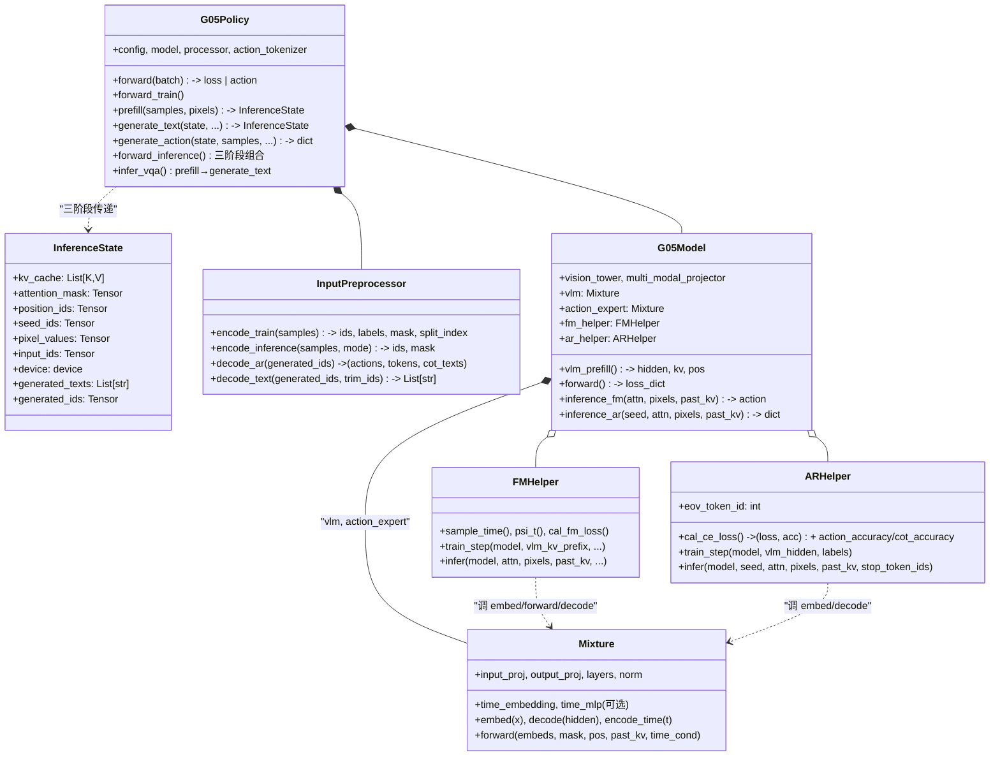
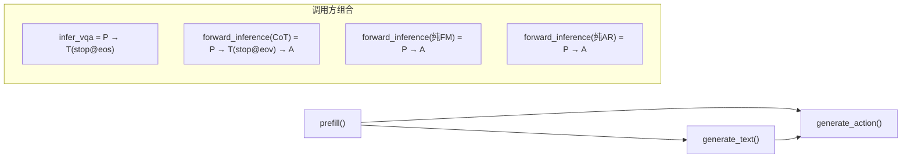

# G05 v2 -- 架构设计

> 更新于 2026.03.28

## 1. 重构目标

将 galaxea_zero 的 ~4400 行代码重构为职责清晰、训练/推理一致的 G05 架构。

**一句话**: Mixture = 完整 LLM 模块，VLM 和 Action Expert 是同构的两个实例，只是 config 不同。

### 核心问题（重构前）

| # | 问题 | 严重度 |
|---|------|--------|
| 1 | 训练/推理 Action Encoder 输入 dtype 不一致（bf16 vs float32） | BUG |
| 2 | 训练/推理 Action Decoder 精度不一致（float32 vs bf16） | BUG |
| 3 | 两条完全不同的 AE forward 代码路径（JointModel vs Mixture） | BUG |
| 4 | Config 字段散落，大量 `cfg.get()` 带默认值 | 设计 |
| 5 | PaliGemma 硬编码（embed_tokens/lm_head/vision 在 PiAR 中） | 设计 |
| 6 | JointModel 是不必要的中间层 | 设计 |
| 7 | AR/FM 算法逻辑混在权重类中 | 设计 |

### 设计决定

| # | 问题 | 决定 |
|---|------|------|
| D1 | position_ids_type | 全部保留 (pi0fast, lyc, lycv2, gaussian)，config 选择 |
| D2 | action_position_offset | 动态 max：取 `position_ids[:, :split_index].max()`，移除固定 offset config |
| D3 | time_convention | 两种都支持：`pi_convention` / `galaxea_convention`，写入 config |
| D4 | AE mask action 间关系 | 可配置，默认全 attend：config `action_causal: false` |
| D5 | KV cache 格式 | 统一 `List[(K, V)]`，消灭 KVCache 对象 |
| D6 | 训练 VLM KV detach | `joint_training` flag 控制，默认 detach |
| D7 | 分布式训练 | DDP-only（FSDP 路径已移除）；`_fsdp_pad` 固定长度 padding 机制保留 |

---

## 2. 核心设计理念

**Mixture = 完整的 LLM 模块。** VLM 和 Action Expert 是同构的两个 Mixture 实例，config 驱动差异：

| | VLM Mixture | Action Expert Mixture |
|--|-------------|----------------------|
| Input Proj | `embed_tokens`: Embedding(vocab -> 2048) | `action_encoder`: Linear(action_dim -> 1024) |
| Layers | 18 x DecoderLayer, 2048d, RMSNorm | 18 x DecoderLayer, 1024d, AdaLN |
| Output Proj | `lm_head`: Linear(2048 -> vocab, tied) | `action_decoder`: Linear(1024 -> action_dim) |
| Time Cond | 无 | `time_embedding` + `time_mlp` |
| KV Cache | 产生 cache | 消费 VLM 的 cache (via `past_key_values`) |

**Vision（SiGLIP + projector）放在 G05Model 层** -- 多模态融合，不属于任何一个 LLM stream。

**Processor 拥有数据 <-> token 双向转换的完整职责** -- 训练编码、推理编码、AR 反向解码、文本解码全在 Processor 内，Policy 只做路由。

---

## 3. 文件结构

```
src/g05/models/g05/
├── g05_policy.py              # Policy 基类: 三阶段推理 API + 路由 + 预/后处理
├── g05_policy_qwen35.py       # Qwen3.5 Policy 子类
├── g05_model.py               # Model 基类: Vision + 2xMixture + vlm_prefill + mask/pos
├── g05_model_qwen35.py        # Qwen3.5 Model 子类 (MRoPE / MEM frame drop)
├── inferencer.py              # 推理封装
├── helpers/
│   ├── fm_helper.py           # FM 算法类 (零权重)
│   ├── ar_helper.py           # AR 算法类 (零权重)
│   ├── ar_sampling.py         # AR 采样策略
│   ├── mask_helper.py         # MaskHelper: VLM / AE 的 mask + position_ids 构建
│   └── proprio_helper.py      # proprio 编码
├── io/
│   ├── input_preprocessor.py  # InputPreprocessor: 模板驱动 token 编解码
│   ├── templates.py           # 模板与 token map 定义
│   └── batch_schema.py        # batch 字段 schema
├── model/
│   ├── modules.py             # SinusoidalPosEmb, AdaLN, etc.
│   └── utils.py               # rotate_half, repeat_kv, attention
└── qwen35/
    ├── mixture_qwen35.py      # MixtureQwen35: embed/decode/encode_time/forward
    ├── vision.py              # Qwen3.5 ViT (MEM T+S attention)
    ├── gated_deltanet.py      # GatedDeltaNet 线性注意力层
    ├── modules.py / processing.py
```

---

## 4. 层次关系



### 内聚度

| 组件 | 拥有的职责 | 不应该有的 |
|------|-----------|-----------|
| **InputPreprocessor** | token 编码(train/infer)、AR 解码、文本解码、truncate/pad | pixel_values 处理, 模型调用 |
| **G05Policy** | 三阶段推理编排、pixel_values 处理、optim param groups | token 序列构建, mask 构建, 模型细节 |
| **G05Model** | 多模态组装、vlm_prefill、mask/pos、路由到 helpers | time 采样, loss 公式, Euler 积分 |
| **Mixture** | 权重 + forward + 精度管理 | mask/pos 构建, loss, 推理循环 |
| **FMHelper** | FM 算法 (零权重): time/psi_t/loss/Euler | nn.Parameter, split_index, prefill |
| **ARHelper** | AR 算法 (零权重): CE loss/decode loop/accuracy 拆分 | nn.Parameter, action decode, prefill |

---

## 5. 关键设计决策

### D1: vlm_prefill 共享方法

`G05Model.vlm_prefill()` 统一处理训练和推理的 VLM 前向:

```python
def vlm_prefill(self, input_ids, attention_mask, pixel_values, dtype):
    causal_mask, position_ids = self.build_causal_mask_and_position_ids(...)
    if self.checkpoint_vision and self.training:
        inputs_embeds = checkpoint(self._forward_embed, ...)
    else:
        inputs_embeds = self._forward_embed(input_ids, pixel_values)
    vlm_hidden, vlm_kv = self.vlm(inputs_embeds, causal_mask, position_ids, ...)
    return vlm_hidden, vlm_kv, position_ids
```

调用者: `forward()` (训练), `G05Policy.prefill()` (推理)。
FM/AR helper **不做 prefill** — 调用方负责。

### D2: split_index 解耦

FM helper **不感知** split_index。G05Model.forward() 负责预切 prefix:

```python
# G05Model.forward()
vlm_kv_prefix = [(k[:,:,:split_index], v[:,:,:split_index]) for k, v in vlm_kv]
fm_helper.train_step(model, vlm_kv_prefix, attn_mask[:, :split_index], ...)
```

### D3: Processor 四 API

| API | 方向 | 用途 |
|-----|------|------|
| `encode_train()` | samples -> tokens | 训练: prefix+suffix -> concat -> truncate -> pad |
| `encode_inference(mode)` | samples -> tokens | 推理: fm=return_prefix, ar=context_only |
| `decode_ar()` | tokens -> (actions, tokens, cot_texts) | AR backward: generated_ids -> continuous actions + CoT 文本 |
| `decode_text()` | tokens -> List[str] | 通用文本解码: trim + tokenizer.decode (VQA/CoT 共用) |

### D4: AR attention_mask 动态增长

AR decode loop 中，每生成一个 token 都 append 对应的 `TOKEN_INDEX` 到 attention_mask:

```python
# ar_helper decode loop
_token_idx = self._assign_token_index(next_token)  # 根据 token ID 范围分配 TOKEN_INDEX
attention_mask = cat([attention_mask, _token_idx])
```

`_assign_token_index` 根据 token ID 映射:
- text tokens → `PRED_TEXT_TOKEN_INDEX` (6)
- loc tokens → `COT_TOKEN_INDEX` (5)
- action tokens → `ACTION_TOKEN_INDEX` (3)

### D5: 推理三阶段 API



**InferenceState** 贯穿三阶段:

```python
@dataclass
class InferenceState:
    kv_cache: list                # List[(K,V)] per layer
    attention_mask: torch.Tensor  # [B, S] TOKEN_INDEX values
    position_ids: torch.Tensor    # [B, S] 0-indexed (from prefill, FM 用)
    seed_ids: torch.Tensor        # [B, 1] 下一阶段的 seed token
    pixel_values: torch.Tensor    # [B, n_img, C, H, W] 已处理
    input_ids: torch.Tensor       # [B, S] 原始 input_ids
    device: torch.device = None
    generated_texts: Optional[List[str]] = None  # generate_text 填充
    generated_ids: Optional[torch.Tensor] = None  # generate_text 填充
```

**组合示例**:
```python
# forward_inference
state = self.prefill(samples, pixel_values)
if self.predict_cot:
    state = self.generate_text(state, stop_token_ids=[eov_id], ...)
    results["cot_text"] = state.generated_texts
results.update(self.generate_action(state, samples, ...))

# infer_vqa
state = self.prefill(samples, pixel_values)
state = self.generate_text(state, stop_token_ids=[eos_id], ...)
return state.generated_texts
```

### D6: EOV special token 与 CoT 支持

`<EOV>` 在 `InputPreprocessor` 的 token 注册阶段注册为 special token（单个 token ID，`models/g05/io/input_preprocessor.py:225`），同时触发 model embedding resize。

作用:
- AR 推理通过 `stop_token_ids=[eov_id]` 在 EOV 停止生成 CoT
- `has_eov` 标志判断是否走 FM action 生成
- 旧 checkpoint 自然 fallback (模型不会生成未训练的 EOV → `has_eov=False`)

### D7: AR stop 机制

AR decode loop 的停止由统一的 `stop_ids` set 控制:
- `eos_token_id` **始终自动加入** stop set (默认终止条件)
- 调用方可额外传 `stop_token_ids` (如 `[eov_id]` 用于 CoT 停止)
- BAR 模式下只在 `not in_bar` 时检查 stop (block 内不中断)

### D8: CE loss accuracy 拆分

`ar_helper.cal_ce_loss` 基于 `action_token_range` 将 accuracy 拆分为:
- `action_accuracy`: action token 预测准确率
- `cot_accuracy`: 非 action token (CoT/text) 预测准确率

通过 `_last_ce_cache` 缓存供外部 metric patch 复用。

---

## 6. Mixture 设计

```python
class Mixture(nn.Module):
    # --- 高层接口（精度在此管理，调用侧无需关心 dtype）---

    def embed(self, x):
        """VLM: input_ids -> [B,S,d] (+ sqrt(d) scaling); AE: psi_t -> [B,H,d] (float32)"""

    def decode(self, hidden):
        """VLM: -> logits [B,S,V]; AE: -> velocity [B,H,D] (float32)"""

    def encode_time(self, t):
        """t [B] -> time_cond [B, d_act]。始终 float32。"""

    def forward(self, inputs_embeds, attention_mask, position_ids,
                past_key_values=None, time_cond=None, return_kv_cache=False,
                attn_implementation="eager", mixture_name=None):
        """Transformer forward -- 训练和推理共用的唯一路径。
        KV cache 格式: List[(K, V)] per layer。"""
```

---

## 7. G05Model 设计

```python
class G05Model(nn.Module):
    # 组装: Vision + 2xMixture + MaskHelper + 2xHelper

    def vlm_prefill(self, input_ids, attention_mask, pixel_values, dtype):
        """共享 VLM 前向: embed -> mask -> forward -> (hidden, kv, pos)"""

    def forward(self, input_ids, attention_mask, pixel_values,
                actions, action_pad_masks, action_dim_is_pad,
                split_index, labels, continuous_action, skip_ce_loss):
        """训练:
        1. vlm_prefill -> hidden, kv, pos
        2. ar_helper.train_step(hidden, labels) -> ce_loss + action/cot accuracy
        3. vlm_kv[:split_index] -> 预切 prefix
        4. fm_helper.train_step(vlm_kv_prefix, ...) -> fm_loss
        -> {fm_loss, ce_loss, action_accuracy, cot_accuracy}
        """

    def inference_fm(self, attn, pixels, past_kv, ...):
        """FM 推理门面。调用方必须提供 past_key_values。"""

    def inference_ar(self, seed_ids, attn, pixels, past_kv, ...):
        """AR 推理门面。调用方必须提供 past_key_values。
        seed_ids 为 [B,1] seed token。"""
```

---

## 8. FMHelper 设计（零权重）

```python
class FMHelper:
    """内聚: time 采样 + psi_t 插值 + velocity loss + Euler 积分。
    通过 model 引用访问权重 (model.action_expert.embed/forward/decode)。
    不做 prefill — 调用方负责。"""

    def train_step(self, model, vlm_kv_prefix, attn_mask_prefix, pos_prefix,
                   actions, action_pad_masks, action_dim_is_pad, dtype):
        """接收已切好的 prefix，不感知 split_index。"""

    def infer(self, model, attention_mask, pixel_values, past_key_values,
              action_dim_is_pad=None, position_ids_override=None):
        """Euler 积分推理。past_key_values 必须由调用方提供。
        position_ids_override 用于 action position offset 计算。"""
```

---

## 9. ARHelper 设计（零权重）

```python
class ARHelper:
    """内聚: CE loss + accuracy 拆分 + AR decode loop (含 BAR)。
    不做 prefill — 调用方负责。"""

    # Token range + accuracy
    action_token_range -> (begin, end)  # action token ID 范围
    eov_token_id: int                   # EOV token ID (由 G05Policy 初始化)

    def cal_ce_loss(self, vlm_hidden, labels, model):
        """shift -> mask -> vlm.decode -> CE loss + action/cot accuracy 拆分"""

    def infer(self, model, input_ids, attention_mask, pixel_values,
              past_key_values, stop_token_ids=None, return_kv_cache=False,
              max_new_tokens=300, ...):
        """AR decode loop。
        past_key_values 必须由调用方 vlm_prefill() 提供。
        input_ids 为 [B, 1] seed token。
        eos_token_id 始终自动加入 stop set。
        BAR 模式走 _infer_single (逐样本)。"""
```

---

## 10. 端到端数据流

### 训练

```
batch["samples"]     -> processor.encode_train()
                        +-- preprocess("return_prefix") -> prefix [B, S_p]
                        +-- preprocess("return_suffix") -> suffix [B, S_s]
                        +-- cat -> [B, S_p+S_s]
                        +-- _truncate(max_chunk_token_length)
                        +-- _fsdp_pad(max_pad_token_length)
                        -> (input_ids [B,S], labels [B,S], attn_mask [B,S], split_index)

batch["pixel_values"] -> process_pixel_values() -> [B, n_img, 3, 224, 224]
batch["action"]       -> actions [B, H, D]

G05Model.forward(input_ids, attn_mask, pixels, actions, split_index, labels)
  +-- vlm_prefill()
  |   +-- build_causal_mask_and_position_ids()
  |   +-- _forward_embed() = vlm.embed + vision_tower + merge
  |   +-- vlm(embeds, mask, pos) -> hidden [B,S,2048] + kv List[18x(K,V)]
  +-- ar_helper.train_step(hidden, labels) -> ce_loss + action_accuracy + cot_accuracy
  +-- vlm_kv_prefix = vlm_kv[:, :, :split_index]      <- 预切 prefix
  +-- fm_helper.train_step(vlm_kv_prefix, attn[:split], pos[:split], actions)
      +-- sample_time -> t
      +-- psi_t(noise, actions, t)
      +-- ae.embed -> ae.encode_time -> ae.forward(past_kv=prefix) -> ae.decode
      +-- cal_fm_loss -> fm_loss

-> (loss, {"fm_loss": T, "ce_loss": T, "action_accuracy": float, "cot_accuracy": float})
```

### 推理 — 三阶段流水线

```
┌─────────────────────────────────────────────────────────────┐
│ Stage 1: prefill()                                          │
│                                                             │
│   samples -> processor.encode_inference(mode="ar")          │
│              -> (input_ids, attention_mask) [B, S_prefix]   │
│   pixel_values -> process_pixel_values()                    │
│   model.vlm_prefill() -> (_, vlm_kv, position_ids)         │
│   seed_ids = input_ids[:, -1:]                              │
│   has_eov = EOV in input_ids                                │
│                                                             │
│   -> InferenceState(kv_cache, attention_mask, position_ids, │
│                     seed_ids, pixel_values, ...)            │
└────────────────────┬────────────────────────────────────────┘
                     │
        ┌────────────┴─────────────┐
        ▼                          ▼
┌───────────────────────┐  ┌──────────────────────────┐
│ Stage 2: generate_text│  │ (skip if no CoT/VQA)     │
│ (optional)            │  │                          │
│                       │  │                          │
│ model.inference_ar(   │  │                          │
│   seed_ids,           │  │                          │
│   past_kv=kv_cache,   │  │                          │
│   stop_token_ids,     │  │                          │
│ )                     │  │                          │
│ -> update state:      │  │                          │
│    kv_cache, attn,    │  │                          │
│    seed_ids, has_eov, │  │                          │
│    generated_texts,   │  │                          │
│    generated_ids      │  │                          │
└────────────┬──────────┘  │                          │
             └──────┬──────┘                          │
                    ▼                                 │
┌─────────────────────────────────────────────────────┘
│ Stage 3: generate_action()
│
│   if continuous_action:
│     model.inference_fm(attn, pixels, past_kv=kv_cache,
│                        position_ids_override=position_ids)
│     -> action [B, H, D]
│
│   if discrete_action:
│     model.inference_ar(seed_ids, attn, pixels, past_kv=kv_cache)
│     -> generated_ids -> processor.decode_ar() -> ar_action [B, H, D]
│
│   -> {"action": [B,H,D], "ar_action": ..., "cot_text": ...}
└──────────────────────────────────────────────────────────────┘
```

### 场景矩阵

| 场景 | prefill | generate_text | generate_action |
|------|---------|--------------|-----------------|
| CoT → FM/AR | ✅ | ✅ (stop@EOV) | ✅ |
| 纯 FM (无 CoT) | ✅ | ❌ | ✅ |
| 纯 AR (discrete) | ✅ | ❌ | ✅ |
| VQA | ✅ | ✅ (stop@EOS) | ❌ |

---

## 11. 分布式训练

训练采用 **DDP-only**（开源版已移除 FSDP 路径），训练与推理统一走 `Mixture.forward()` 一条路径。

历史遗留但仍有用的机制：`max_pad_token_length` + `_fsdp_pad`（`models/g05/io/input_preprocessor.py:1260`）把 batch 内序列 pad 到固定长度——最初为 FSDP 设计，现在用于稳定 shape（利于 torch.compile），config 设 `null` 即不 pad。

---

## 12. 精度策略

| 组件 | 输入 dtype | 输出 dtype | 机制 |
|------|-----------|-----------|------|
| `vlm.embed()` | LongTensor | 继承 Embedding dtype | sqrt(d) scaling |
| `vlm.decode()` | 继承 hidden | 继承 hidden | Linear |
| `ae.embed()` | float32 | float32 | `autocast(enabled=False)` |
| `ae.decode()` | float32 | float32 | `autocast(enabled=False)` |
| `ae.encode_time()` | float32 | float32 | `autocast(enabled=False)` |
| VLM transformer | bf16 (autocast) | bf16 | training autocast |
| AE transformer | 继承 embed | 继承 embed | may cast bf16 |

AE embed/decode 始终 float32，消除了旧代码中训练(bf16)和推理(fp32)不一致的 bug。

---

## 13. 迁移总表

### 权重迁移: 散落 -> Mixture

| 当前位置 | 目标位置 | 目标接口 |
|---------|---------|---------|
| `PiAR.embed_tokens` | `Mixture(vlm).input_proj` | `vlm.embed()` |
| `PiAR.lm_head` | `Mixture(vlm).output_proj` | `vlm.decode()` |
| `GalaxeaJoint.action_encoder` | `Mixture(ae).input_proj` | `ae.embed()` |
| `GalaxeaJoint.action_decoder` | `Mixture(ae).output_proj` | `ae.decode()` |
| `GalaxeaJoint.time_embedding/mlp` | `Mixture(ae).time_*` | `ae.encode_time()` |

### Vision: PiAR -> G05Model

| 当前 | 目标 |
|------|------|
| `PiAR.vision_tower` | `G05Model.vision_tower` |
| `PiAR.multi_modal_projector` | `G05Model.multi_modal_projector` |
| `PiAR._forward_siglip_and_text_embedding` | `G05Model._forward_embed` |

### 算法: 散落 -> Helper

| 当前 | 目标 |
|------|------|
| `GalaxeaJoint.psi_t/cal_fm_loss/forward(FM)/infer_fm` | `FMHelper` |
| `GalaxeaJoint.cal_ce_acc` + `PiAR.infer_autoregressively` | `ARHelper` |
| `Policy.sample_fm_time` | `FMHelper.sample_time` |
| `GalaxeaARPolicy.decode_actions` | `InputPreprocessor.decode_ar` |
| `Policy.preprocess_inputs` | `InputPreprocessor.encode_train` |

---

## 相关文档

- [G05 Config 设计](g05_config.md) -- Config 结构、HF from_pretrained、YAML 结构、checkpoint 映射
- [G05 I/O 格式](g05_io.md) -- 全链路 I/O（Dataset -> Model）、各组件精确格式、Mask/Position/KV Cache
