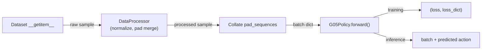

# G05 v2 I/O Format

> Updated on 2026-03-10

## Symbols

| Symbol | Meaning | Typical value |
|--------|---------|---------------|
| B | batch size | 4 |
| S | VLM sequence length, prefix + suffix | about 700 |
| H | action horizon, chunk steps | 50 |
| D | action dimension | embodiment-specific, for example 20 or 27 |
| V | vocabulary size | 257216 |
| d_vlm | VLM hidden size | 2048 |
| d_act | Action Expert hidden size | 1024 |
| d_head | attention head dimension | 256 |
| n_kv | KV heads for GQA | 1 |
| n_layers | transformer layers | 18 |
| n_img | number of input images | 3 |
| P | patches per image for SiGLIP | 256 |

## 1. Full Pipeline



## 2. Dataset To Collate

### Dataset `__getitem__` Output

```python
{
    "task": str,
    "action": {"<key>": Tensor [H, D_raw]},
    "state":  {"<key>": Tensor [T_obs, D_raw]},
    "images": {"<key>": Tensor [T_obs, 3, 224, 224]},  # uint8
    "action_is_pad": Tensor [H],
    "state_is_pad":  Tensor [T_obs],
}
```

### DataProcessor Output

The processor normalizes, applies the action/state merger, and builds the `samples` dict:

```python
{
    "pixel_values":      Tensor [n_img, 3, 224, 224],
    "action":            Tensor [H, D],       # normalized
    "action_is_pad":     Tensor [H],
    "action_dim_is_pad": Tensor [D],          # dimension-level padding
    "gt_action":         Tensor [H, D],       # unnormalized, used for eval
    "samples": {
        "template": str,
        "command":  str,
        "proprio":  {"value": Tensor, "proprio_dim_is_pad": Tensor},
        "action":   {"value": Tensor, "action_dim_is_pad": Tensor},
        "image0": 0, "image1": 0, ...,
    },
}
```

### Collate Output

`collate_fn_pad_sequences` stacks tensors and pads text sequences. `samples` remains `List[Dict]` and is not stacked.

```python
{
    "pixel_values":      Tensor [B, n_img, 3, 224, 224],
    "action":            Tensor [B, H, D],
    "action_is_pad":     Tensor [B, H],
    "action_dim_is_pad": Tensor [B, D],
    "gt_action":         Tensor [B, H, D],
    "samples":           List[Dict],
}
```

## 3. InputPreprocessor

File: `src/g05/models/g05/io/input_preprocessor.py`

### `encode_train()`

```text
Inputs:
  samples:                List[Dict], RoboVQA-style samples
  device:                 torch.device
  training:               bool = True
  max_chunk_token_length: int = 2048
  max_pad_token_length:   int | None

Steps:
  1. preprocess(control_flag="return_prefix")
     content before <EOV>: image tokens, text tokens, proprio tokens, <EOV>
     right-aligned with left padding
  2. preprocess(control_flag="return_suffix")
     content after <EOV>: action tokens and <eos>
  3. concatenate prefix and suffix
  4. truncate to max_chunk_token_length
  5. fixed-length pad to max_pad_token_length when configured

Outputs:
  input_ids:      [B, S] LongTensor
  labels:         [B, S] LongTensor, -100 means masked from loss
  attention_mask: [B, S] FloatTensor with TOKEN_INDEX values
  split_index:    int, prefix length and VLM/AE split boundary
```

### `encode_inference()`

```text
Inputs:
  samples: List[Dict]
  device:  torch.device
  mode:    "fm" | "ar"
  training: bool = False

Mapping:
  mode="fm" -> control_flag="return_prefix" -> before <EOV>, right-aligned
  mode="ar" -> control_flag="context_only"  -> before <EOC>, right-aligned

Outputs:
  input_ids:      [B, S_prefix] LongTensor
  attention_mask: [B, S_prefix] FloatTensor with TOKEN_INDEX values
```

### `decode_ar()`

```text
Inputs:
  generated_ids:     List[Optional[Tensor]], one generated token sequence per sample
  horizon_steps:     int, H
  action_dim:        int, D
  device:            torch.device | None
  action_dim_is_pad: [B, D] | None

Per sample:
  1. tokenizer.decode(ids) -> text
  2. _extract_action_str() -> content between "Action: {" and "}|"
  3. tokenizer.encode() -> raw action token IDs
  4. action_tokenizer.decode_token_ids_to_actions() -> continuous action [H, D]

Outputs:
  decoded_actions: List[Tensor[H, D]]
  decoded_tokens:  List[Tensor[N]]
```

### `preprocess()`

All high-level APIs share this lower-level implementation.

| control_flag | Returned content | Right-aligned | Use |
|--------------|------------------|---------------|-----|
| `None` | Full sequence; `<EOV>` is learnable; static text after `<EOC>` is predicted. | No | Training full pass. |
| `"return_prefix"` | Before `<EOV>`, including image/text/proprio/EOV. | Yes | Train prefix and FM inference. |
| `"return_suffix"` | After `<EOV>`, action tokens and eos. | No | Train suffix. |
| `"context_only"` | Before `<EOC>`, with `<EOV>` learnable if present. | Yes | AR inference. |

### TOKEN_INDEX Attention Mask

```python
PADDING_TOKEN_INDEX   = 0   # padding
IMAGE_TOKEN_INDEX     = 1   # image tokens, bidirectional
PROPRIO_TOKEN_INDEX   = 2   # proprio tokens, bidirectional
ACTION_TOKEN_INDEX    = 3   # action tokens, block-wise causal
TEXT_TOKEN_INDEX      = 4   # input text, bidirectional
COT_TOKEN_INDEX       = 5   # CoT tokens
PRED_TEXT_TOKEN_INDEX = 6   # predicted text, causal
```

`attention_mask` is not a 0/1 mask. It contains TOKEN_INDEX values used by `MaskHelper.build_vlm_mask()` to construct block-wise causal masks.

## 4. G05Policy

File: `src/g05/models/g05/g05_policy.py`

### `forward(batch)`

```text
Input batch:
  samples:           List[Dict]
  pixel_values:      [B, n_img, 3, 224, 224]
  action:            [B, H, D]
  action_is_pad:     [B, H]
  action_dim_is_pad: [B, D]

Routing:
  inference_mode=False -> forward_train()
  inference_mode=True  -> forward_inference()

Outputs:
  training:  (loss, loss_dict)
  inference: batch updated in-place with batch["action"]
```

### `forward_train()`

```text
1. processor.encode_train(samples)
   -> input_ids, labels, attention_mask, split_index
2. process_pixel_values(pixel_values)
3. model.forward(...)
   -> {"fm_loss", "ce_loss", "action_accuracy"}
```

### `forward_inference()`

```text
AR path: predict_cot or discrete_action or is_vlm_batch -> forward_infer_ar()
FM path: continuous_action and not is_vlm_batch -> forward_infer_fm()
Dual-head mode: AR writes results["ar_action"], FM writes results["action"].
```

## 5. G05Model

File: `src/g05/models/g05/g05_model.py`

### `vlm_prefill()`

```text
Inputs:
  input_ids:      [B, S]
  attention_mask: [B, S] with TOKEN_INDEX values
  pixel_values:   [B, n_img, 3, 224, 224]
  dtype:          torch.dtype

Steps:
  1. build_causal_mask_and_position_ids()
     -> causal_mask [B, 1, S, S], position_ids [B, S]
  2. _forward_embed(input_ids, pixel_values)
     -> vision_tower -> projector -> image features
     -> vlm.embed(input_ids) -> text embeddings
     -> replace image token positions with image features
  3. vlm(inputs_embeds, causal_mask, position_ids, return_kv_cache=True)

Outputs:
  vlm_hidden:   [B, S, d_vlm]
  vlm_kv:       List[(K[B,n_kv,S,d_head], V[B,n_kv,S,d_head])] x n_layers
  position_ids: [B, S]
```

### Training `forward()`

```text
Inputs:
  input_ids [B,S], attention_mask [B,S], pixel_values
  actions [B,H,D], action_pad_masks [B,H], action_dim_is_pad [B,D]
  split_index, labels [B,S]

Steps:
  1. vlm_prefill() -> vlm_hidden, vlm_kv, position_ids
  2. AR: ar_helper.train_step(model, vlm_hidden, labels)
  3. Slice prefix KV: vlm_kv_prefix = vlm_kv[:, :, :split_index]
  4. FM: fm_helper.train_step(model, vlm_kv_prefix, prefix masks/positions, actions)

Output:
  {"fm_loss": T, "ce_loss": T, "action_accuracy": float}
```

### Inference Facades

```text
inference_fm:
  input: input_ids [B,S_prefix], attention_mask, pixel_values
  delegates to fm_helper.infer()
  output: action [B,H,D]

inference_ar:
  input: input_ids [B,S_prefix], attention_mask, pixel_values
  delegates to ar_helper.infer()
  output: {"generated_ids": [B, gen_len]}
```

## 6. FMHelper

File: `src/g05/models/g05/helpers/fm_helper.py`. It is a weight-free algorithm class.

### Training

```text
Inputs:
  model
  vlm_kv_prefix:         prefix-sliced List[(K, V)]
  attention_mask_prefix: [B, S_prefix]
  position_ids_prefix:   [B, S_prefix]
  actions:               [B, H, D]
  action_pad_masks:      [B, H]
  action_dim_is_pad:     [B, D] | None
  dtype

Steps:
  sample_time -> t
  x0 = randn_like(actions)
  psi_t(x0, x1=actions, t)
  ae.embed(psi_t)
  ae.encode_time(t)
  build_action_mask_and_position_ids()
  ae.forward(..., past_kv=vlm_kv_prefix, time_cond)
  ae.decode(hidden) -> velocity
  cal_fm_loss()
```

### Inference

```text
1. model.vlm_prefill() -> vlm_kv, position_ids
2. build_action_mask_and_position_ids()
3. initialize action with Gaussian noise [B,H,D]
4. Euler integrate for num_inference_steps, default 10
5. clamp(action, +/- clip_value)

Output: action [B,H,D]
```

## 7. ARHelper

File: `src/g05/models/g05/helpers/ar_helper.py`. It is a weight-free algorithm class.

### Training

```text
Inputs:
  vlm_hidden: [B, S, d_vlm]
  labels:     [B, S], -100 means masked

Steps:
  shift hidden[..., :-1, :] against labels[..., 1:]
  mask labels != -100
  vlm.decode(hidden_masked) -> logits [N_valid, V]
  CrossEntropyLoss(logits, labels_masked) * ce_weight

Output: ce_loss and accuracy
```

### Inference

```text
Phase 1: VLM prefill
  model.vlm_prefill() -> vlm_hidden, vlm_kv
  vlm.decode(hidden[:, -1:]) -> logits -> sample first token

Phase 2: decode loop
  for each new token:
    if EOS or stop token -> break
    vlm.embed(token)
    build causal mask for the new token
    vlm(..., past_kv=vlm_kv) -> hidden, updated kv
    vlm.decode(hidden) -> logits -> sample next token
    append generated TOKEN_INDEX to attention_mask

Output: {"generated_ids": [B, gen_len]}
```

## 8. Masks

### VLM Mask

```text
Shape: [B, 1, S, S]
Values: 0.0 means attend, -inf means blocked.

IMAGE, TEXT, PROPRIO: bidirectional prefix-LM
PRED_TEXT: causal
ACTION: block-wise causal
PADDING: masked out
```

### Action Expert Mask

```text
Shape: [B, 1, H, S_prefix + H]

Action tokens attend to all non-pad VLM prefix tokens and all action tokens.
When action_causal=true, action-to-action attention becomes causal.
```

## 9. Position IDs

VLM position IDs are `[B, S]` LongTensor. Strategies are selected by `position_ids_type`:

- `"lyc"`: cumulative non-pad positions, pad -> 1, final positions are 0-indexed.
- `"pi0fast"`: cumulative non-pad positions, pad -> 0, final positions are 0-indexed.
- `"gaussian"`: cumulative positions with Gaussian offset during training, final positions are 0-indexed.

Action Expert position IDs:

```text
action_pos = arange(1, H+1) + vlm_position_ids[:, :split].max()
```

## 10. KV Cache Across Mixtures

```text
VLM forward -> kv_cache: List[(K, V)] x n_layers
K, V: [B, n_kv, S_vlm, d_head]

Training:
  G05Model.forward() slices vlm_kv_prefix = vlm_kv[:, :, :split_index]
  fm_helper receives prefix KV and does not know split_index.

Inference:
  fm_helper.infer() passes full vlm_kv to ae.forward(past_key_values=vlm_kv)
  ar_helper.infer() uses full vlm_kv as the initial decode-loop cache.

Action Expert:
  past_key_values[layer] = (K_vlm, V_vlm)
  key = cat([K_vlm, K_action], dim=2) -> [B, n_kv, S_vlm+H, d_head]
```

VLM and AE must share `n_kv_heads` and `d_head`.

## 11. Mixture I/O

File: `src/g05/models/g05/qwen35/mixture_qwen35.py`.

### `embed(x)`

```text
VLM:    x [B, S] LongTensor -> [B, S, d_vlm]
Action: x [B, H, D] float   -> [B, H, d_act]
```

### `decode(hidden)`

```text
VLM:    hidden [B, S, d_vlm] -> logits [B, S, V]
Action: hidden [B, H, d_act] -> velocity [B, H, D]
```

### `encode_time(t)`

```text
t [B] -> SinusoidalPosEmbPi0 -> MLP -> SiLU -> MLP -> SiLU -> time_cond [B, d_act]
```

### `forward(...)`

```text
inputs_embeds:   [B, S, hidden]
attention_mask:  [B, 1, S, S_total]
position_ids:    [B, S]
past_key_values: optional List[(K, V)] x n_layers
time_cond:       optional [B, hidden], AE only
return_kv_cache: bool

return_kv_cache=False -> hidden_states [B, S, hidden]
return_kv_cache=True  -> (hidden_states, kv_cache)
```

## Related Documents

- [G05 Architecture Design](g05_architecture.md): hierarchy, Mixture, Helper, and precision policy.
- [G05 Config Design](g05_config.md): config structure, HF from_pretrained, and checkpoint mapping.
