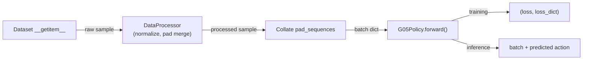

# G05 v2 -- 输入/输出格式

> 更新于 2026.03.10

## 符号约定

| 符号 | 含义 | 典型值 |
|------|------|--------|
| B | batch size | 4 |
| S | VLM 序列长度 (prefix + suffix) | ~700 |
| H | action horizon (chunk steps) | 50 |
| D | action dim | 按 embodiment 配置，例如 20 或 27 |
| V | vocab size | 257216 |
| d_vlm | VLM hidden size | 2048 |
| d_act | Action Expert hidden size | 1024 |
| d_head | attention head dim | 256 |
| n_kv | KV heads (GQA) | 1 |
| n_layers | transformer layers | 18 |
| n_img | num_input_images | 3 |
| P | patches per image (SiGLIP) | 256 |

---

## 1. 全链路总览



---

## 2. Dataset -> Collate (Layer 1-3)

### Dataset `__getitem__` 输出

```python
{
    "task": str,
    "action": {"<key>": Tensor [H, D_raw]},
    "state":  {"<key>": Tensor [T_obs, D_raw]},
    "images": {"<key>": Tensor [T_obs, 3, 224, 224]},  # uint8
    "action_is_pad": Tensor [H],     # bool
    "state_is_pad":  Tensor [T_obs], # bool
}
```

### DataProcessor (`galaxea_cot_processor.py`) 输出

归一化 + PaddingActionMerger (输出维度按 embodiment 配置) + 构建 `samples` 字典:

```python
{
    "pixel_values":      Tensor [n_img, 3, 224, 224],
    "action":            Tensor [H, D],            # 归一化后
    "action_is_pad":     Tensor [H],
    "action_dim_is_pad": Tensor [D],               # 维度级 padding
    "gt_action":         Tensor [H, D],            # 未归一化 (eval 用)
    "samples": {                                    # RoboVQA 格式，给 InputPreprocessor
        "template": str,
        "command":  str,
        "proprio":  {"value": Tensor, "proprio_dim_is_pad": Tensor},
        "action":   {"value": Tensor, "action_dim_is_pad": Tensor},
        "image0": 0, "image1": 0, ...,             # 占位符
    },
}
```

### Collate (`collate_fn_pad_sequences`) 输出

stack tensors, pad text sequences。**`samples` 保持为 `List[Dict]` 不做 stack**。

```python
{
    "pixel_values":      Tensor [B, n_img, 3, 224, 224],
    "action":            Tensor [B, H, D],
    "action_is_pad":     Tensor [B, H],
    "action_dim_is_pad": Tensor [B, D],
    "gt_action":         Tensor [B, H, D],
    "samples":           List[Dict],   # 长度=B
}
```

---

## 3. InputPreprocessor (Layer 4) -- 三 API

> 文件: `src/g05/models/g05/io/input_preprocessor.py`

### 3.1 `encode_train()` -- 训练编码

```
输入:
  samples:                List[Dict]     B 个 RoboVQA 格式样本
  device:                 torch.device
  training:               bool = True
  max_chunk_token_length: int = 2048     超出截断
  max_pad_token_length:   int | None     FSDP 固定长度

内部:
  1. preprocess(control_flag="return_prefix")
     模板 <EOV> 之前: [image tokens | text tokens | proprio tokens | <EOV>]
     右对齐 (left-pad)
  2. preprocess(control_flag="return_suffix")
     模板 <EOV> 之后: [action tokens | <eos>]
  3. cat(prefix, suffix)
  4. _truncate(max_chunk_token_length)
  5. _fsdp_pad(max_pad_token_length)

输出:
  input_ids:      [B, S]   LongTensor
  labels:         [B, S]   LongTensor     -100 = masked (不算 loss)
  attention_mask: [B, S]   FloatTensor    TOKEN_INDEX 编码 (见 S8)
  split_index:    int                     prefix 长度, VLM/AE 切分边界
```

### 3.2 `encode_inference()` -- 推理编码

```
输入:
  samples: List[Dict]
  device:  torch.device
  mode:    "fm" | "ar"
  training: bool = False

映射:
  mode="fm" -> control_flag="return_prefix" -> <EOV> 之前，右对齐
  mode="ar" -> control_flag="context_only"  -> <EOC> 之前，右对齐

输出:
  input_ids:      [B, S_prefix]   LongTensor
  attention_mask: [B, S_prefix]   FloatTensor (TOKEN_INDEX)
```

### 3.3 `decode_ar()` -- AR 反向解码

```
输入:
  generated_ids:     List[Optional[Tensor]]   每个样本的生成 token ids [gen_len]
  horizon_steps:     int                      H
  action_dim:        int                      D
  device:            torch.device | None
  action_dim_is_pad: [B, D] | None

内部:
  for each sample:
    1. tokenizer.decode(ids) -> 文本
    2. _extract_action_str() -> 提取 "Action: {这部分}|" 之间的内容
    3. tokenizer.encode() -> raw action token ids
    4. action_tokenizer.decode_token_ids_to_actions() -> 连续动作 [H, D]

输出:
  decoded_actions: List[Tensor[H, D]]   连续动作
  decoded_tokens:  List[Tensor[N]]      原始 action token ids
```

### 3.4 `preprocess()` -- 底层入口 (internal)

三个高层 API 的共享实现。`control_flag` 语义:

| control_flag | 返回内容 | 右对齐 | 用途 |
|:------------|:---------|:-------|:-----|
| `None` | 全序列, `<EOV>` -> 可学 token, `<EOC>` 后 static -> predicted | No | 训练 (full pass) |
| `"return_prefix"` | `<EOV>` 之前 (image+text+proprio+EOV) | Yes | encode_train prefix / encode_inference fm |
| `"return_suffix"` | `<EOV>` 之后 (action tokens+eos) | No | encode_train suffix |
| `"context_only"` | `<EOC>` 之前 (含 `<EOV>` -> 可学 token) | Yes | encode_inference ar |

### 3.5 attention_mask 编码 (TOKEN_INDEX)

```python
PADDING_TOKEN_INDEX   = 0   # padding
IMAGE_TOKEN_INDEX     = 1   # 图像 token (bidirectional)
PROPRIO_TOKEN_INDEX   = 2   # proprio token (bidirectional)
ACTION_TOKEN_INDEX    = 3   # action token (block-wise causal)
TEXT_TOKEN_INDEX      = 4   # 输入文本 (bidirectional)
COT_TOKEN_INDEX       = 5   # CoT token
PRED_TEXT_TOKEN_INDEX = 6   # 预测文本 (causal)
```

**注意**: attention_mask **不是** 0/1，而是 TOKEN_INDEX 枚举值，用于 `MaskHelper.build_vlm_mask()` 构建 block-wise causal mask。

---

## 4. G05Policy (Layer 5)

> 文件: `src/g05/models/g05/g05_policy.py`

### 4.1 `forward(batch)` -- 路由入口

```
输入 batch (dict):
  +-- samples:           List[Dict]                B 个样本原始数据
  +-- pixel_values:      [B, n_img, 3, 224, 224]
  +-- action:            [B, H, D]                 连续动作 GT
  +-- action_is_pad:     [B, H]                    bool
  +-- action_dim_is_pad: [B, D]                    bool

路由:
  inference_mode=False -> forward_train()
  inference_mode=True  -> forward_inference()

输出:
  训练: (loss: scalar, loss_dict: Dict[str, Tensor])
  推理: batch (原地更新 batch["action"])
```

### 4.2 `forward_train()` -- 训练路径

```
调用链:
  1. processor.encode_train(samples)
     -> (input_ids [B,S], labels [B,S], attention_mask [B,S], split_index)
  2. process_pixel_values(pixel_values) -> pixel_values
  3. model.forward(input_ids, attention_mask, pixel_values,
                   actions, split_index, labels, ...)
     -> {"fm_loss": T, "ce_loss": T, "action_accuracy": float}

输出: (loss: scalar, loss_dict)
```

### 4.3 `forward_inference()` -- 推理路由

```
路由逻辑:
  +-- AR path: predict_cot or discrete_action or is_vlm_batch
  |   -> forward_infer_ar()
  +-- FM path: continuous_action and not is_vlm_batch
      -> forward_infer_fm()
  双头模式: AR -> results["ar_action"], FM -> results["action"]
```

### 4.4 `forward_infer_fm()` -- FM 推理

```
调用链:
  1. processor.encode_inference(samples, mode="fm")
     -> (input_ids [B, S_prefix], attention_mask [B, S_prefix])
  2. model.inference_fm(input_ids, attention_mask, pixel_values)
     -> action [B, H, D]

输出: action [B, H, D]
```

### 4.5 `forward_infer_ar()` -- AR 推理

```
调用链:
  1. processor.encode_inference(samples, mode="ar")
     -> (input_ids [B, S_prefix], attention_mask [B, S_prefix])
  2. model.inference_ar(input_ids, attention_mask, pixel_values)
     -> {"generated_ids": [B, gen_len]}
  3. processor.decode_ar(generated_ids_per_sample, horizon_steps, action_dim)
     -> (decoded_actions: List[[H,D]], decoded_tokens: List[[N]])

输出: {"action": [B,H,D], "ar_action": [B,H,D]}
```

---

## 5. G05Model (Layer 6)

> 文件: `src/g05/models/g05/g05_model.py`

### 5.1 `vlm_prefill()` -- 共享 VLM 前向

```
输入:
  input_ids:      [B, S]
  attention_mask: [B, S]         TOKEN_INDEX 编码
  pixel_values:   [B, n_img, 3, 224, 224]
  dtype:          torch.dtype

内部:
  1. build_causal_mask_and_position_ids(input_ids, attention_mask)
     -> causal_mask [B, 1, S, S], position_ids [B, S]
  2. _forward_embed(input_ids, pixel_values):
     +-- vision_tower(pixels)         -> [B, n_img*P, 1152]
     +-- multi_modal_projector()      -> [B, n_img*P, d_vlm]
     +-- vlm.embed(input_ids)         -> text_embeds [B, S, d_vlm]
     +-- merge at image_token positions -> inputs_embeds [B, S, d_vlm]
  3. vlm(inputs_embeds, causal_mask, position_ids, return_kv_cache=True)
     -> hidden [B, S, d_vlm], kv_cache List[n_layers x (K, V)]

输出:
  vlm_hidden:   [B, S, d_vlm]
  vlm_kv:       List[(K[B, n_kv, S, d_head], V[B, n_kv, S, d_head])] x n_layers
  position_ids: [B, S]
```

### 5.2 `forward()` -- 训练

```
输入:
  input_ids [B,S], attention_mask [B,S], pixel_values,
  actions [B,H,D], action_pad_masks [B,H], action_dim_is_pad [B,D],
  split_index: int, labels [B,S],
  continuous_action: bool, skip_ce_loss: bool

内部:
  1. vlm_prefill() -> vlm_hidden, vlm_kv, position_ids
  2. AR: ar_helper.train_step(model, vlm_hidden, labels)
       -> (ce_loss, accuracy)
  3. 预切 prefix: vlm_kv_prefix = vlm_kv[:, :, :split_index]
  4. FM: fm_helper.train_step(model, vlm_kv_prefix,
           attn_mask[:, :split_index], pos_ids[:, :split_index],
           actions, action_pad_masks, action_dim_is_pad)
       -> fm_loss

输出: {"fm_loss": T, "ce_loss": T, "action_accuracy": float}
```

### 5.3 `inference_fm()` / `inference_ar()` -- 推理门面

```
inference_fm:
  输入: input_ids [B, S_prefix], attention_mask, pixel_values
  委托: fm_helper.infer(model, ...)
  输出: action [B, H, D]

inference_ar:
  输入: input_ids [B, S_prefix], attention_mask, pixel_values, **kwargs
  委托: ar_helper.infer(model, ...)
  输出: {"generated_ids": [B, gen_len]}
```

---

## 6. FMHelper (Layer 7a)

> 文件: `src/g05/models/g05/helpers/fm_helper.py` -- 零权重算法类

### 6.1 `train_step()` -- FM 训练

```
输入:
  model:                  G05Model
  vlm_kv_prefix:          List[(K, V)]       已切到 prefix 的 KV cache
  attention_mask_prefix:  [B, S_prefix]
  position_ids_prefix:    [B, S_prefix]
  actions:                [B, H, D]          GT
  action_pad_masks:       [B, H]
  action_dim_is_pad:      [B, D] | None
  dtype:                  torch.dtype

内部:
  1. sample_time(B)                    -> t [B]
  2. x0 = randn_like(actions)           噪声
  3. psi_t(x0, x1=actions, t)         -> 插值 [B, H, D]
  4. ae.embed(psi_t)                   -> action_embeds [B, H, d_act]    (fp32)
  5. ae.encode_time(t)                -> time_cond [B, d_act]           (fp32)
  6. build_action_mask_and_position_ids(attn_prefix, H, pos_prefix)
     -> action_mask [B, 1, H, S_prefix+H], action_pos [B, H]
  7. ae.forward(embeds, mask, pos, past_kv=vlm_kv_prefix, time_cond)
     -> action_hidden [B, H, d_act]
  8. ae.decode(hidden)                -> v_psi [B, H, D]               (fp32)
  9. cal_fm_loss(v_psi, x0, x1, masks) -> scalar

输出: fm_loss (scalar, x fm_weight)
```

### 6.2 `infer()` -- FM 推理 (Euler 积分)

```
输入:
  model, input_ids [B, S_prefix], attention_mask, pixel_values,
  action_dim_is_pad [B, D] | None

内部:
  1. model.vlm_prefill() -> vlm_kv, position_ids
  2. build_action_mask_and_position_ids()
  3. action = randn(B, H, D)           初始噪声
  4. for step in range(num_inference_steps):    # 默认 T=10
       ae.embed(action)    -> embeds         [B, H, d_act]
       ae.encode_time(t)   -> time_cond      [B, d_act]
       ae.forward(embeds, mask, pos, past_kv=vlm_kv, time_cond)
                           -> hidden         [B, H, d_act]
       ae.decode(hidden)   -> velocity       [B, H, D]
       action += dt x velocity
  5. clamp(action, +/- clip_value)

输出: action [B, H, D]
```

---

## 7. ARHelper (Layer 7b)

> 文件: `src/g05/models/g05/helpers/ar_helper.py` -- 零权重算法类

### 7.1 `train_step()` -- AR 训练

```
输入:
  model:       G05Model
  vlm_hidden:  [B, S, d_vlm]
  labels:      [B, S]          -100 = masked

内部:
  1. shift: hidden[..., :-1, :] vs labels[..., 1:]
  2. mask = (labels != -100)
  3. vlm.decode(hidden_masked) -> logits [N_valid, V]
  4. CrossEntropyLoss(logits, labels_masked) x ce_weight

输出: (ce_loss: scalar, accuracy: float)
```

### 7.2 `infer()` -- AR 推理 (autoregressive decode)

```
输入:
  model, input_ids [B, S_prefix], attention_mask [B, S_prefix],
  pixel_values, max_new_tokens=300, temperature, top_k, top_p,
  generated_token_index = PRED_TEXT_TOKEN_INDEX (6)

内部:
  Phase 1 -- VLM Prefill:
    model.vlm_prefill() -> vlm_hidden, vlm_kv
    vlm.decode(hidden[:, -1:]) -> logits -> sample -> first token

  Phase 2 -- Decode Loop:
    for step in range(max_new_tokens - 1):
      if EOS -> break
      vlm.embed(token) -> embeds [B, 1, d_vlm]
      build_causal_mask(token, attention_mask, kv_len) -> mask, pos
      vlm(embeds, mask, pos, past_kv=vlm_kv) -> hidden, vlm_kv
      kv_len += 1
      vlm.decode(hidden) -> logits -> sample -> next_token
      attention_mask = cat([attention_mask, generated_token_index])
        ^ 每步增长，保证后续 mask 正确

输出: {"generated_ids": [B, gen_len]}
```

---

## 8. Attention Mask 格式

### VLM causal mask (4D)

```
Shape: [B, 1, S, S]
值:    0.0 -> 可 attend, -inf -> 不可 attend

结构 (由 TOKEN_INDEX -> MaskHelper 生成):
  IMAGE (1):     bidirectional  (prefix-LM)
  TEXT (4):      bidirectional  (prefix-LM)
  PROPRIO (2):   bidirectional  (prefix-LM)
  PRED_TEXT (6): causal
  ACTION (3):    block-wise causal
  PADDING (0):   masked out
```

### Action Expert mask (4D)

```
Shape: [B, 1, H, S_prefix + H]

+------------------------+----------+
| VLM prefix (S_prefix)  | Action H |
| padding -> -inf        | 全 attend|
+------------------------+----------+

Action tokens attend to: 所有 VLM non-pad + 自身所有 action tokens
(action_causal=true 时 action 间变为 causal)
```

---

## 9. Position IDs 格式

### VLM position_ids

```
Shape: [B, S] LongTensor
策略 (position_ids_type):
  "lyc":      cumsum(attention_mask > 0), pad -> 1, 最终 -1 (0-indexed)
  "pi0fast":  cumsum(attention_mask > 0), pad -> 0, 最终 -1 (0-indexed)
  "gaussian": cumsum + gaussian offset (train only), 最终 -1 (0-indexed)
```

### Action Expert position_ids

```
Shape: [B, H] LongTensor
action_pos = arange(1, H+1) + vlm_position_ids[:, :split].max()
```

---

## 10. KV Cache -- 跨 Mixture 通信

```
VLM forward -> kv_cache: List[(K, V)] x n_layers
  K, V: [B, n_kv, S_vlm, d_head]

训练:
  vlm_kv_prefix = vlm_kv[:, :, :split_index]  <- G05Model.forward() 预切
  fm_helper 接收 prefix KV, 不感知 split_index

推理:
  fm_helper.infer():  vlm_kv 全量传给 ae.forward(past_key_values=vlm_kv)
  ar_helper.infer():  vlm_kv 全量作为 decode loop 的 initial cache

AE 消费时:
  past_key_values[layer] = (K_vlm, V_vlm)
  内部 concat: key = cat([K_vlm, K_action], dim=2)
              -> [B, n_kv, S_vlm+H, d_head]

!! VLM 和 AE 必须共享 n_kv_heads 和 d_head
```

---

## 11. Mixture I/O

> 文件: `src/g05/models/g05/qwen35/mixture_qwen35.py`（`MixtureQwen35`）

### `embed(x)` -- 输入投影

```
VLM:    x [B, S] LongTensor  -> [B, S, d_vlm]   (Embedding + sqrt(d) scaling)
Action: x [B, H, D] float    -> [B, H, d_act]   (Linear, float32)
```

### `decode(hidden)` -- 输出投影

```
VLM:    hidden [B, S, d_vlm]   -> logits [B, S, V]     (lm_head, tied)
Action: hidden [B, H, d_act]   -> velocity [B, H, D]   (Linear, float32)
```

### `encode_time(t)` -- 时间编码 (仅 AE)

```
t [B] -> SinusoidalPosEmbPi0 -> MLP -> SiLU -> MLP -> SiLU -> time_cond [B, d_act]
(float32)
```

### `forward(...)` -- Transformer

```
输入:
+-- inputs_embeds:    [B, S, hidden]           来自 embed()
+-- attention_mask:   [B, 1, S, S_total]       4D causal mask (0 or -inf)
+-- position_ids:     [B, S]                   LongTensor
+-- past_key_values:  List[(K, V)] x n_layers  可选 (cross-attend VLM KV)
|   +-- K: [B, n_kv, S_past, d_head]
|   +-- V: [B, n_kv, S_past, d_head]
+-- time_cond:        [B, hidden]              可选 (AdaLN, 仅 AE)
+-- return_kv_cache:  bool

输出 (return_kv_cache=False): hidden_states [B, S, hidden]
输出 (return_kv_cache=True):  (hidden_states, kv_cache)
```

---

## 相关文档

- [G05 架构设计](g05_architecture.md) -- 层次结构、Mixture、Helper、精度策略
- [G05 Config 设计](g05_config.md) -- Config 结构、HF from_pretrained、checkpoint 映射
