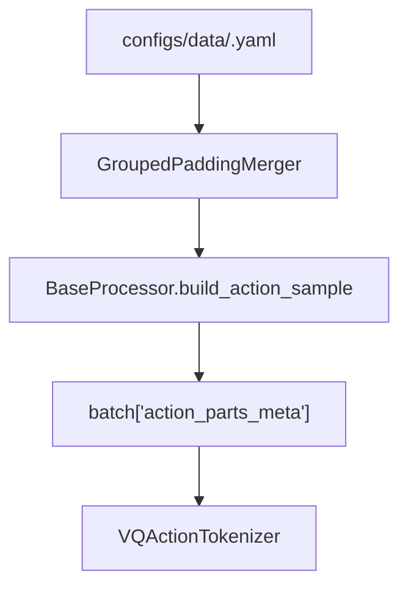

# Parts Schema And Merger

> `parts_meta` describes the segment dimensions of action/state flat tensors. Shared layouts live in `configs/data/parts_meta/` and are referenced from model, task, or data processor configs with `${oc.load:...}`.

## 1. `shape_meta` vs `parts_meta`

| Item | `shape_meta` | `parts_meta` |
|------|--------------|--------------|
| Describes | Real dataset fields, `lerobot_key`, shape, and time offset. | Part dimensions in the merger output space. |
| Location | Dataset / processor entries in `configs/data/<task>.yaml`. | `configs/data/parts_meta/*.yaml`, referenced by `action_state_merger.max_*_shape_meta`. |
| Granularity | Raw action/state for one embodiment. | Aligned space used by the task. |
| Consumers | Dataset loader and processor transforms. | `PaddingActionMerger`, `GroupedPaddingMerger`, tokenizer. |

`shape_meta` tells the processor which raw keys exist. `parts_meta` tells the merger what output layout those keys should align to.

## 2. Current Layouts

Standard dual-arm tasks use grouped 20D:

```yaml
max_action_shape_meta:
  left_arm: 8
  right_arm: 8
  left_gripper: 1
  right_gripper: 1
  left_ee_pose: 9
  right_ee_pose: 9
merge_spec:
  left_control: [left_arm, left_ee_pose]
  left_gripper: [left_gripper]
  right_control: [right_arm, right_ee_pose]
  right_gripper: [right_gripper]
```

Merged output:

```text
left_control(9) | left_gripper(1) | right_control(9) | right_gripper(1)
```

R1Lite and R1Pro use grouped 27D by appending:

```text
lower_body(7)
```

R1Pro WBC maps `torso` into the `lower_body` group through `configs/data/parts_meta/r1pro.yaml`.

## 3. Merger Types

| Merger | Uses parts_meta | Uses merge_spec | Description |
|--------|-----------------|-----------------|-------------|
| `PaddingActionMerger` | yes | no | Pads and concatenates in raw part order. |
| `GroupedPaddingMerger` | yes | yes | Aligns by raw key first, then selects mutually exclusive alternatives by group. |

Task-level model processors that produce grouped ActionCodec input use `GroupedPaddingMerger` for the final training layout. Data configs may still use `PaddingActionMerger` before task-level grouping.

## 4. Data Flow



The processor writes the merger output layout into `action_parts_meta`. The tokenizer uses it to decide whether input actions need padding to the model layout.

## 5. Change Checklist

1. Edit `shape_meta` in `configs/data/<task>.yaml` and the matching layout in `configs/data/parts_meta/*.yaml`.
2. If the merged output dimension changes, update the task's `model.model_arch.action_dim` and `model.model_arch.proprio_dim`.
3. If the grouped layout visible to the tokenizer changes, update the task's `tokenizer.vq_config.parts_meta`.
4. Run:

```bash
python tools/resolve_config.py <task> --key data.processors
python tools/resolve_config.py <task> --key model.model_arch.action_dim
python tests/show_vla_label.py --task <task>
```

## 6. Code Index

| Component | Location |
|-----------|----------|
| Merger implementations | `src/g05/data_processor/transforms/action_state_merger.py` |
| parts_meta utilities | `src/g05/tokenizer/utils/parts_meta_utils.py` |
| tokenizer padding | `src/g05/tokenizer/utils/parts_meta_padding.py` |
| processor injection of `action_parts_meta` | `src/g05/data_processor/processor/base_processor.py` |
