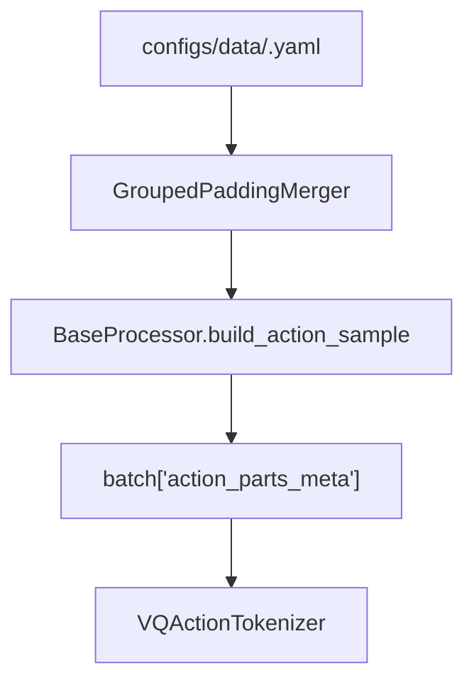

# Parts Schema 与 Merger

> `parts_meta` 描述 action/state flat tensor 的分段维度。共享布局维护在 `configs/data/parts_meta/`，model、task 或 data processor 配置通过 `${oc.load:...}` 引用。

## 1. shape_meta vs parts_meta

| 项 | `shape_meta` | `parts_meta` |
|----|--------------|--------------|
| 描述 | 数据集中真实字段、`lerobot_key`、shape、time offset | merger 输出空间的 part 维度 |
| 位置 | `configs/data/<task>.yaml` 的 dataset / processor | `configs/data/parts_meta/*.yaml`，由 `action_state_merger.max_*_shape_meta` 引用 |
| 粒度 | 单个 embodiment 的原始 action/state | task 使用的对齐空间 |
| 消费者 | dataset loader、processor transform | `PaddingActionMerger` / `GroupedPaddingMerger`、tokenizer |

`shape_meta` 告诉 processor 原始数据有哪些 key；`parts_meta` 告诉 merger 把这些 key 对齐到什么输出布局。

## 2. 当前布局

标准双臂任务使用 grouped 20D：

```yaml
max_action_shape_meta:
  left_arm: 8
  right_arm: 8
  left_gripper: 1
  right_gripper: 1
  left_ee_pose: 9
  right_ee_pose: 9
merge_spec:
  left_control: [left_arm, left_ee_pose]
  left_gripper: [left_gripper]
  right_control: [right_arm, right_ee_pose]
  right_gripper: [right_gripper]
```

merged 输出：

```text
left_control(9) | left_gripper(1) | right_control(9) | right_gripper(1)
```

R1Lite 和 R1Pro 使用 grouped 27D，在标准 20D 后追加：

```text
lower_body(7)
```

R1Pro WBC 会通过 `configs/data/parts_meta/r1pro.yaml` 将 `torso` 合并到 `lower_body` 组。

## 3. Merger

| Merger | parts_meta | merge_spec | 说明 |
|--------|------------|------------|------|
| `PaddingActionMerger` | 需要 | 不用 | 按原始 part 顺序 padding/concat |
| `GroupedPaddingMerger` | 需要 | 需要 | 先按 raw key 对齐，再按 group 选择互斥 alternatives |

需要生成 grouped ActionCodec 输入的 task-level model processor 使用 `GroupedPaddingMerger` 作为最终训练布局。data 配置在 task-level grouping 之前仍可能使用 `PaddingActionMerger`。

## 4. 数据流



processor 会把 merger 的输出布局写入 `action_parts_meta`，tokenizer 用它判断输入 action 是否需要按模型布局 padding。

## 5. 修改 Checklist

1. 在 `configs/data/<task>.yaml` 修改 `shape_meta`，并在 `configs/data/parts_meta/*.yaml` 修改对应 layout。
2. 如果 merged 输出维度变化，同步修改 task 的 `model.model_arch.action_dim/proprio_dim`。
3. 如果 tokenizer 看到的 grouped layout 变化，同步修改 task 的 `tokenizer.vq_config.parts_meta`。
4. 运行：

```bash
python tools/resolve_config.py <task> --key data.processors
python tools/resolve_config.py <task> --key model.model_arch.action_dim
python tests/show_vla_label.py --task <task>
```

## 6. 代码索引

| 组件 | 位置 |
|------|------|
| Merger 实现 | `src/g05/data_processor/transforms/action_state_merger.py` |
| parts meta 工具 | `src/g05/tokenizer/utils/parts_meta_utils.py` |
| tokenizer padding | `src/g05/tokenizer/utils/parts_meta_padding.py` |
| processor 注入 `action_parts_meta` | `src/g05/data_processor/processor/base_processor.py` |
