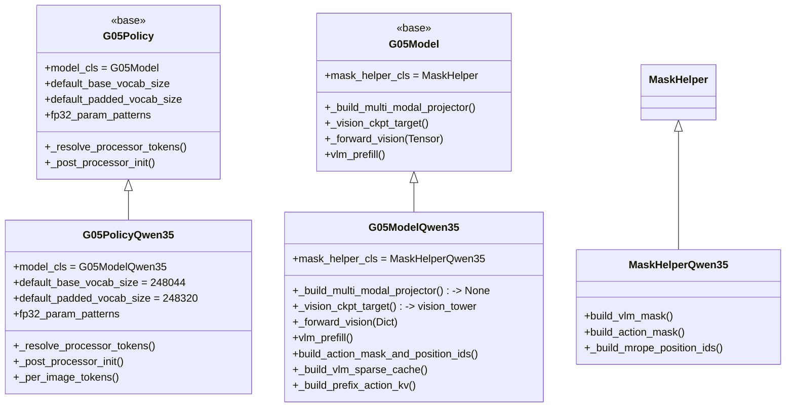

# Qwen3.5 VLA Design

> Architecture and development guide for the Qwen3.5 variant in the G05 framework.

## 1. Overall Principle

The Qwen3.5 variant follows a **minimal override** rule: do not rewrite `__init__` unless necessary. Declare class variables and hooks for differences, and reuse the G05 base classes for everything else.



Override count:

| Class | Overrides |
|-------|-----------|
| `G05ModelQwen35` | one class variable, `mask_helper_cls`, plus hooks for projector, vision checkpoint target, and one `__init__` addition |
| `G05PolicyQwen35` | five class variables plus `_post_processor_init` |
| `MaskHelperQwen35` | two method overrides plus one new helper |

## 2. Vision Pipeline

### 2.1 Structure

PaliGemma uses **SiGLIP ViT -> external projector**. Qwen3.5 uses **Conv3D ViT -> built-in PatchMerger**, so `multi_modal_projector` is `None`.

```text
pixel_values: Dict[cam_name -> Tensor[B, n_k, C, H_k, W_k]]
        |
        | iterate by camera
        v
[per camera] flatten -> Conv3D patch -> [B*n_k * grid_h*grid_w, patch_dim]
        |
        | concatenate patches from all cameras
        v
vision_tower(pixel_values_flat, image_grid_thw)
        |
        | pooler_output: [total_patches_merged, D]
        | slice by camera -> reshape
        v
image_features: [B, total_tokens, D]
```

Key design: call the vision tower once. All camera patches are concatenated, and `image_grid_thw` marks image boundaries through `cu_seqlens`. This avoids extra kernel overhead from multiple forward calls.

### 2.2 Multi-Resolution Support

`pixel_values` is `Dict[str, Tensor]`, and each camera can have an independent resolution `(H_k, W_k)`. Token count is `(H_k // patch_size // merge_size) * (W_k // patch_size // merge_size)`.

Cached grid format:

```text
_cached_image_grid_thw: Tensor[n_img, 3]
# [temporal=1, grid_h_k, grid_w_k]
# n_img = sum of n_k across cameras
# no batch dimension; the same grid layout is shared within the batch
```

### 2.3 MRoPE Dependency

`_cached_image_grid_thw` is written by `_forward_vision()` and consumed by `MaskHelperQwen35._build_mrope_position_ids()` to assign independent 2D grid positions per image. This determines prefill order: vision/embed must run before mask/position construction.

## 3. Attention

### 3.1 Hybrid Layer Stack

```text
Layer 0: linear_attention  (GatedDeltaNet)
Layer 1: linear_attention
Layer 2: linear_attention
Layer 3: full_attention
Layer 4: linear_attention
...
```

`MixtureQwen35` reads `config.layer_types[layer_idx]` to select layer type. Both layer types use the same `MixtureDecoderLayerQwen35` shell.

### 3.2 Full Attention Differences

Compared with PaliGemma standard attention, Qwen3.5 full attention differs in three ways.

**Gated output**

```text
qg = q_proj(x) -> [query | gate]
output = attn_output * sigmoid(gate)
```

**QK Norm**

Query and key are normalized by `Qwen3_5RMSNorm` before RoPE. Keep `q_norm` and `k_norm` in fp32.

**Partial RoPE**

`partial_rotary_factor = 0.25`, so only the first 25% of `head_dim` is rotated:

```python
q_rot, q_pass = q[..., :rotary_dim], q[..., rotary_dim:]
q_embed = torch.cat([rotate(q_rot, cos, sin), q_pass], dim=-1)
```

### 3.3 GatedDeltaNet

GDN is linear-complexity recurrent attention. It does not produce KV cache; it maintains recurrent state.

```text
input x [B, S, d]
|- in_proj_qkv -> causal Conv1d -> Q, K, V
|- in_proj_z   -> output gate
|- in_proj_b   -> beta, sigmoid state update scale
|- in_proj_a   -> negative g, state forgetting scale
`- core:
   train/prefill -> chunk_gated_delta_rule(chunk_size=32)
   decode step   -> recurrent_gated_delta_rule
   output -> RMSNormGated(core_out, gate) -> out_proj
```

Implementation paths:

- Fast path: `causal_conv1d` + FLA Triton kernels; requires `causal-conv1d` and `fla`.
- Slow path: pure PyTorch fallback, functionally equivalent but about 5-10x slower.

GDN does not support outer gradient checkpointing. FLA kernels use their own saved tensors and recompute logic; wrapping them in `checkpoint.checkpoint()` can double-compute backward. Linear layers bypass checkpoint logic in `MixtureQwen35.forward()`.

## 4. Position Encoding: MRoPE

### 4.1 3D Position IDs

PaliGemma uses 1D `[B, S]` position IDs. Qwen3.5 uses 3D MRoPE `[3, B, S]` for temporal, height, and width.

```text
Text tokens:
  temporal = height = width = current text position

Image tokens:
  temporal = image start position
  height   = grid row expanded from that start
  width    = grid column expanded from that start
```

`mrope_section [11, 11, 10]` controls how the 32-dimensional rotation space is split across T/H/W, based on the actual rotated dimension from `partial_rotary_factor=0.25`.

### 4.2 Build Order

MRoPE construction depends on vision output, specifically `_cached_image_grid_thw`. Therefore Qwen3.5 prefill order differs from the base class:

```text
PaliGemma: mask/pos -> embed -> vlm forward
Qwen3.5:   embed -> mask/pos -> vlm forward
              |
              _forward_vision writes _cached_image_grid_thw
              mask/pos reads it to build MRoPE
```

### 4.3 Decode Position IDs

During decode, where `kv_len > 0`, Qwen3.5 does not rebuild full MRoPE. It uses cached `_mrope_position_deltas`:

```python
position_ids = (cumsum_pos - 1) + deltas
position_ids = position_ids.unsqueeze(0).expand(3, -1, -1)
```

`deltas` is the extra image-position span relative to text positions. It makes decode positions continue after the prefill sequence.

## 5. KV Cache

### 5.1 SparseKVCache

Only full-attention layers produce KV cache; linear layers maintain recurrent state. `SparseKVCache` uses dicts keyed by real layer index:

```text
SparseKVCache {
    key_cache:              Dict[layer_idx -> Tensor[B,H,S,D]]
    value_cache:            Dict[layer_idx -> Tensor[B,H,S,D]]
    conv_states:            Dict[layer_idx -> Tensor]
    recurrent_states:       Dict[layer_idx -> Tensor]
    split_recurrent_states: Dict[layer_idx -> Tensor]
}
```

`has_previous_state` is determined by whether the final linear layer has `conv_states`, indicating decode mode.

### 5.2 VLM To Action Expert State Transfer

During training, VLM runs the full sequence, prefix plus AR action tokens, but Action Expert should only see the prefix. GDN extracts clean prefix state by running an additional prefix-only chunk at `split_idx`:

```text
VLM forward(full_seq, split_idx=prefix_len):
  full_attn layers: slice KV cache [:split_idx] -> key/value_cache
  GDN layers:       full_seq -> recurrent_states, includes AR tokens and is not used by AE
                    prefix_seq -> split_recurrent_states, clean state for AE
```

`_build_prefix_action_kv()` assembles the cache for AE based on `ae_vlm_condition_mode`:

| mode | full-attn KV | GDN recurrent state | AE mask width |
|------|--------------|---------------------|---------------|
| `both` | `[:split_idx]` | `split_recurrent_states` | `S_prefix + H` |
| `recurrent_only` | empty | `split_recurrent_states` | `H` |
| `cross_attn_only` | `[:split_idx]` | empty, initialized from zero | `S_prefix + H` |

In `recurrent_only` mode, `build_action_mask_and_position_ids()` receives an empty prefix mask `[:, :0]` so AE mask shape matches KV layout.

## 6. Precision

### 6.1 fp32 Parameters

Qwen3.5 adds three fp32 parameter groups on top of the base class:

```python
"q_norm"           # full attention QK norm
"k_norm"           # full attention QK norm
"linear_attn.norm" # GDN RMSNormGated
```

`Qwen3_5RMSNorm` uses a `(1 + weight)` formulation and initializes `weight` to zeros, meaning identity plus residual learning. Keeping these parameters in fp32 avoids underflow risk during early bf16 training.

### 6.2 Gradient Checkpointing

| Module | Strategy | Reason |
|--------|----------|--------|
| vision_tower | `gradient_checkpointing_enable()` per layer | Qwen3.5 ViT supports internal layer checkpointing. |
| VLM full-attention layers | `checkpoint.checkpoint()` with immutable KV inputs | Mutable SparseKVCache inside checkpoint can double-concat. |
| VLM GDN layers | no outer checkpoint | FLA Triton kernels already recompute and are not compatible with outer checkpointing. |
| action_expert | `gradient_checkpointing_enable()` | Standard path. |

## 7. Vocab And Tokenizer

### 7.1 Vocab Layout

Qwen3.5 has no padding gap; action tokens start immediately after the original vocabulary.

| Area | PaliGemma | Qwen3.5 |
|------|-----------|---------|
| base vocab | 257152 | 248044 |
| padded vocab | 257920 with padding gap | 248320 |
| embedding resize | keep `[:base_vocab]`, drop gap | keep all `[:old_vocab]` |
| embedding scaling | `sqrt(hidden_size)` | none |

### 7.2 Action Token Offset Fix

Qwen3.5 special-token insertion can make `action_token_begin_idx` differ from the value inferred by padding logic. Fix it after processor initialization:

```python
def _post_processor_init(self):
    self._fix_action_token_offset()  # before super()
    super()._post_processor_init()   # then sync proprio_embedder.state_token_id
```

`_fix_action_token_offset()` queries the actual ID of the first action token from the tokenizer, fixes `action_token_begin_idx`, and synchronizes it to `ar_helper`.

## 8. FLOPs Estimate

Qwen3.5 FLOPs estimation supports mixed camera resolutions by summing per image:

```python
n_cams = cfg.num_input_images // cfg.num_obs_steps
per_camera_tokens = [tokens(exterior)] + [tokens(wrist)] * (n_cams - 1)

for vis_tokens in per_image_tokens:
    vis_patches = vis_tokens * merge_size**2
    vision_flops += 6 * N_vit * vis_patches + 6 * N_merger * vis_tokens
    vision_flops += 12 * L * H * d * vis_patches**2

S_vlm = sum(per_image_tokens) + max_text_tokens
```

## 9. Development Notes

1. **Prefill embeds before mask**: `_forward_vision()` writes `_cached_image_grid_thw`, and `build_causal_mask_and_position_ids()` reads it for MRoPE. Reversing the order silently degrades image-token positions into text positions.
2. **`_cached_image_grid_thw` has no batch dimension**: shape is `[n_img, 3]`, not `[B*n_img, 3]`. Each batch sample iterates the same grid layout.
3. **SparseKVCache keys are layer indices**: linear layers are not in `key_cache`. Use `cache.has_item(layer_idx)` and `cache.get(layer_idx)`.
4. **Use `split_recurrent_states` for AE**: `recurrent_states` has seen the full sequence including AR action tokens and would leak information.
5. **`ae_vlm_condition_mode` couples mask and KV**: `_build_prefix_action_kv()` and `build_action_mask_and_position_ids()` must stay aligned. Do not hardcode AE mask width.
6. **Checkpointed KV must be immutable**: pass extracted `past_kv` tuples into checkpoint functions to avoid double-concat on backward recompute.
7. **Guard image_grid_thw truncation**: `MaskHelperQwen35._build_mrope_position_ids()` truncates image positions to actual token count to survive FSDP padding or left truncation.
8. **Batch slicing during MRoPE decode**: when BAR inference splits batches, confirm `_mrope_position_deltas[:bsz]` matches the current batch size.

## 10. File Index

| File | Responsibility |
|------|----------------|
| `g05/g05_model_qwen35.py` | vision forward, prefill order, SparseKVCache construction and assembly |
| `g05/g05_policy_qwen35.py` | vocab constants, fp32 patterns, token offset fix, FLOPs estimation |
| `g05/mask_helper.py` | `MaskHelperQwen35`: causal image mask and MRoPE construction |
| `g05/qwen35/modules.py` | `Qwen3_5TextRotaryEmbedding`, `Qwen3_5RMSNorm`, `RMSNormGated` |
| `g05/qwen35/mixture_qwen35.py` | `MixtureQwen35`, hybrid attention forward shared by VLM and AE |
| `g05/qwen35/gated_deltanet.py` | `Qwen3_5GatedDeltaNet`, chunk and recurrent implementations |
| `g05/qwen35/vision.py` | Conv3D ViT, PatchMerger, pretrained weight loading |
| `models/kv_cache.py` | `SparseKVCache`, dict-based cache with conv/recurrent/split states |
