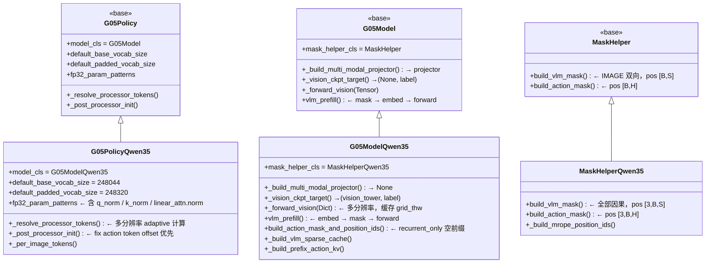

# Qwen3.5 VLA 设计文档

> G05 框架中 Qwen3.5 variant 的架构设计与开发指南。

---

## 1. 总体设计原则

Qwen3.5 variant 遵循**最小覆盖原则**：不重写 `__init__`，只声明差异化的类变量和钩子，其余完全复用 G05 基类。



各类的**覆盖点数量**：

| 类 | 覆盖点 |
|----|-------|
| `G05ModelQwen35` | 1 类变量（`mask_helper_cls`）+ 3 钩子（`_build_multi_modal_projector` / `_vision_ckpt_target` / `__init__` 追加一行） |
| `G05PolicyQwen35` | 5 类变量 + `_post_processor_init` 钩子 |
| `MaskHelperQwen35` | 2 方法覆盖 + 1 新方法 |

---

## 2. Vision Pipeline

### 2.1 整体结构

PaliGemma 的 vision pipeline 是：**SiGLIP ViT → 外部 projector**（Linear + LayerNorm）。

Qwen3.5 改为：**Conv3D ViT → 内置 PatchMerger**，`multi_modal_projector` 为 `None`。

```
pixel_values: Dict[cam_name → Tensor[B, n_k, C, H_k, W_k]]
        │
        │ 按 camera 遍历
        ▼
[per camera] flatten → Conv3D patch → [B*n_k * grid_h*grid_w, patch_dim]
        │
        │ concat 所有 camera 的 patches
        ▼
vision_tower(pixel_values_flat, image_grid_thw)  ← 一次调用处理所有图像
        │
        │ pooler_output: [total_patches_merged, D]
        │ 按 camera 切片 → reshape
        ▼
image_features: [B, total_tokens, D]   ← token 顺序 = Dict 插入顺序
```

**关键设计：一次性调用视觉塔**。所有 camera 的 patches concat 后统一处理，`image_grid_thw` 标记每张图像的边界（`cu_seqlens` 机制），避免多次 forward 的额外 kernel 开销。

### 2.2 多分辨率支持

`pixel_values` 的类型是 `Dict[str, Tensor]`，每个 camera key 可以有独立的分辨率 `(H_k, W_k)`。token 数量 `(H_k // patch_size // merge_size) × (W_k // patch_size // merge_size)` 随分辨率变化。

对应的 `image_grid_thw` 缓存格式：

```
_cached_image_grid_thw: Tensor[n_img, 3]   # [temporal=1, grid_h_k, grid_w_k]
                                            # n_img = sum of n_k across all cameras
                                            # 不含 batch 维，batch 内共享同一 grid 布局
```

### 2.3 MRoPE 依赖

`_cached_image_grid_thw` 在 `_forward_vision()` 中写入，由 `MaskHelperQwen35._build_mrope_position_ids()` 消费，用来为每张图像分配独立的 2D 网格位置。这个依赖决定了 prefill 的调用顺序（见 §4.1）。

---

## 3. 注意力机制

### 3.1 混合层架构

```
Layer 0:  linear_attention  (GatedDeltaNet)
Layer 1:  linear_attention
Layer 2:  linear_attention
Layer 3:  full_attention    ← 每 4 层一个
Layer 4:  linear_attention
...
```

`MixtureQwen35` 读取 `config.layer_types[layer_idx]` 决定层类型，两种层共用同一套 decoder layer 外壳（`MixtureDecoderLayerQwen35`）。

### 3.2 Full Attention 层的差异

相比 PaliGemma 的标准 attention，Qwen3.5 full attention 有三处结构差异：

**① Gated Output**

`q_proj` 输出 2 倍维度，切分为 query 和 gate：
```
qg = q_proj(x)  →  [query | gate]  (各 num_heads * head_dim)
output = attn_output * sigmoid(gate)
```

**② QK Norm**

query 和 key 在旋转位置编码之前经过 `Qwen3_5RMSNorm` 归一化（per head-dim）。这要求 `q_norm` / `k_norm` 保持 fp32（见 §6.1）。

**③ Partial RoPE**

`partial_rotary_factor = 0.25`，只旋转 head_dim 的前 25%，其余维度直通：
```python
q_rot, q_pass = q[..., :rotary_dim], q[..., rotary_dim:]
q_embed = cat([rotate(q_rot, cos, sin), q_pass], dim=-1)
```

### 3.3 GatedDeltaNet（linear attention 层）

GDN 是一种线性复杂度的 recurrent 注意力，不产生 KV cache，而是维护一个 recurrent state：

```
输入: x [B, S, d]
├─ in_proj_qkv → Conv1d(causal) → Q, K, V
├─ in_proj_z  → gate (for output)
├─ in_proj_b  → beta (sigmoid，控制 state 更新幅度)
├─ in_proj_a  → g (负值，控制 state 遗忘速率)
└─ 核心计算：
   训练/prefill  → chunk_gated_delta_rule(chunk_size=32)  ← O(S·d) + chunk开销
   decode (单步) → recurrent_gated_delta_rule             ← O(d²) per step
   输出 → RMSNormGated(core_out, gate) → out_proj
```

GDN 有两套实现路径：
- **快路径**：`causal_conv1d` + FLA triton kernels（需安装 `causal-conv1d` 和 `fla`）
- **慢路径**：纯 PyTorch fallback（功能等价，速度慢约 5-10×）

**GDN 不支持 gradient checkpointing**：FLA triton kernel 有自己的 `ctx.save_for_backward`，被 `checkpoint.checkpoint()` 包裹后 backward 会 double-compute。GDN 的显存节省由 FLA 自身的 recompute 机制提供，`MixtureQwen35.forward()` 中 linear 层绕过 checkpoint 逻辑。

---

## 4. 位置编码（MRoPE）

### 4.1 3D 位置 ID

PaliGemma 使用 1D position_ids `[B, S]`，Qwen3.5 使用 3D MRoPE `[3, B, S]`，三个维度分别为 temporal / height / width：

```
文本 token:  temporal = height = width = 当前文本位置（1D 退化）
图像 token:  temporal = 固定为图像起始位置
             height   = grid 行号（从起始位置展开）
             width    = grid 列号（从起始位置展开）
```

mrope_section `[11, 11, 10]` 控制 32 维旋转空间中 T/H/W 各占的比例（以 `partial_rotary_factor=0.25` 的实际旋转维度为基准）。

### 4.2 构建时机约束

MRoPE 的构建**依赖视觉前向的输出**（`_cached_image_grid_thw`），因此 Qwen3.5 的 prefill 顺序与基类相反：

```
PaliGemma:   mask/pos → embed → vlm forward
Qwen3.5:     embed → mask/pos → vlm forward
                ↑
              embed 调用 _forward_vision，写入 _cached_image_grid_thw
              mask/pos 读取 _cached_image_grid_thw 构建 MRoPE
```

### 4.3 Decode 阶段的增量 Position ID

Decode 阶段（`kv_len > 0`）不重新构建完整 MRoPE，而是用 prefill 时缓存的 `_mrope_position_deltas`：

```python
# prefill 时写入：delta = max(llm_positions) + 1 - non_padding_len
# decode 时读取：
position_ids = (cumsum_pos - 1) + deltas   # deltas: [bsz, 1]
position_ids = position_ids.unsqueeze(0).expand(3, -1, -1)
```

`deltas` 是"图像位置相对于文本位置的超出量"，确保 decode 时新 token 的位置紧接着 prefill 末端。

---

## 5. KV Cache 设计

### 5.1 SparseKVCache

混合架构中只有 full_attention 层产生 KV cache，linear 层维护 recurrent state。`SparseKVCache` 用 dict 而非 list 管理，避免层索引错位：

```
SparseKVCache {
    key_cache:              Dict[layer_idx → Tensor[B,H,S,D]]  # full_attn 层
    value_cache:            Dict[layer_idx → Tensor[B,H,S,D]]  # full_attn 层
    conv_states:            Dict[layer_idx → Tensor]           # GDN conv1d 状态
    recurrent_states:       Dict[layer_idx → Tensor]           # GDN 序列末端状态
    split_recurrent_states: Dict[layer_idx → Tensor]           # GDN prefix 边界状态
}
```

`has_previous_state` 通过最后一个 linear 层的 `conv_states` 是否已填充判断 decode 模式。

### 5.2 VLM → Action Expert 的状态传递

训练时 VLM 跑完整序列（prefix + AR action tokens），但 Action Expert 只应看到 prefix。GDN 通过 `split_idx` 额外运行一次 prefix-only chunk 来提取干净的前缀状态：

```
VLM forward(full_seq, split_idx=prefix_len):
    full_attn 层:  KV cache 截取 [:split_idx]  →  key/value_cache
    GDN 层:        full_seq → recurrent_states  (含 AR tokens，不用于 AE)
                   prefix_seq → split_recurrent_states  (干净，用于 AE)
```

`_build_prefix_action_kv()` 根据 `ae_vlm_condition_mode` 组装传给 AE 的 cache：

| mode | full_attn KV | GDN recurrent state | AE mask 宽度 |
|------|-------------|---------------------|-------------|
| `both`（默认） | `[:split_idx]` | `split_recurrent_states` | `S_prefix + H` |
| `recurrent_only` | 空 | `split_recurrent_states` | `H`（纯自注意力） |
| `cross_attn_only` | `[:split_idx]` | 空（从零初始化） | `S_prefix + H` |

`build_action_mask_and_position_ids()` 在 `recurrent_only` 模式下传入空 prefix mask `[:, :0]`，使 AE mask shape 与 KV 布局匹配。

---

## 6. 精度策略

### 6.1 fp32 参数

Qwen3.5 在基类基础上新增三类 fp32 保持对象：

```python
"q_norm"           # full_attn 层：QK Norm（head-dim RMSNorm，zeros init）
"k_norm"           # full_attn 层：同上
"linear_attn.norm" # GDN 层：RMSNormGated（ones init，但 SiLU gate 数值范围大）
```

Qwen3.5 的 `Qwen3_5RMSNorm` 使用 `(1 + weight)` 风格，`weight` 初始化为 **zeros**（恒等变换 + 残差学习）。bf16 下初始阶段若不保持 fp32 会有 underflow 风险。

### 6.2 Gradient Checkpointing 策略

| 模块 | 策略 | 原因 |
|------|------|------|
| vision_tower | `gradient_checkpointing_enable()`（per-layer） | Qwen3.5 ViT 支持内置逐层 checkpoint |
| vlm full_attn 层 | `checkpoint.checkpoint()`，但 KV 以 immutable 形式传入 | mutable SparseKVCache 进 checkpoint 会 double-concat |
| vlm GDN 层 | 不 checkpoint | FLA triton kernel 自带 recompute，不兼容外层 checkpoint |
| action_expert | `gradient_checkpointing_enable()` | 标准用法 |

---

## 7. Vocab 与 Tokenizer

### 7.1 Vocab 布局

Qwen3.5 vocab 无 padding gap，action token 紧接原始 vocab 末尾：

| | PaliGemma | Qwen3.5 |
|--|-----------|---------|
| base vocab | 257152 | 248044 |
| padded vocab | 257920（含 padding gap） | 248320 |
| embedding resize | 保留 `[:base_vocab]`，丢弃 gap | 保留全部 `[:old_vocab]` |
| embed scaling | `√hidden_size` | 无 |

### 7.2 Action Token Offset 修正

Qwen3.5 special token 的插入位置导致 `action_token_begin_idx` 与 padding 逻辑推导的值不一致，需要在 processor 初始化后修正：

```python
def _post_processor_init(self):
    self._fix_action_token_offset()  # 必须在 super() 之前
    super()._post_processor_init()   # 再同步 proprio_embedder.state_token_id
```

`_fix_action_token_offset()` 从 tokenizer 直接查询第一个 action token 的实际 ID，修正 `action_token_begin_idx` 并同步到 `ar_helper`。

---

## 8. FLOPs 估算

Qwen3.5 的 FLOPs 估算支持混合相机分辨率，逐图像累加：

```python
# _per_image_tokens(cfg) → List[int]
# 假设第 0 个 camera 是 exterior（头部），其余为 wrist
n_cams = cfg.num_input_images // cfg.num_obs_steps
per_camera_tokens = [tokens(exterior)] + [tokens(wrist)] * (n_cams - 1)

# ViT FLOPs：对每张图像独立计算（pre-merge patch 数 = post-merge × merge_size²）
for vis_tokens in per_image_tokens:
    vis_patches = vis_tokens * merge_size²
    vision_flops += 6 * N_vit * vis_patches + 6 * N_merger * vis_tokens
    vision_flops += 12 * L * H * d * vis_patches²

# VLM 序列长度：实际 token 数（不用 max_image_text_tokens，那只含 prefix）
S_vlm = sum(per_image_tokens) + max_text_tokens
```

---

## 9. 开发注意事项

**9.1 prefill embed 先于 mask**
`_forward_vision()` 写入 `_cached_image_grid_thw`，`build_causal_mask_and_position_ids()` 读取它构建 MRoPE。顺序调换会导致图像 token 的位置编码退化为文本位置（静默损坏，loss 数值不报错）。

**9.2 `_cached_image_grid_thw` 不含 batch 维**
shape 为 `[n_img, 3]`（不是 `[B*n_img, 3]`）。`MaskHelperQwen35._build_mrope_position_ids()` 中每个 batch sample 用同一份 grid，`iter(image_grid_thw)` 每个 sample 独立迭代一遍。修改 vision forward 时须保持这个约定。

**9.3 SparseKVCache 键是 layer_idx，不是连续序号**
linear 层不在 `key_cache` dict 里。用 `cache.has_item(layer_idx)` 判断，用 `cache.get(layer_idx)` 取值，不要假设 `key_cache[i]` 对应第 i 层。

**9.4 用 `split_recurrent_states` 传给 AE，不用 `recurrent_states`**
`recurrent_states` 是跑完全序列（含 AR action tokens）的状态；`split_recurrent_states` 是仅看到 prefix 的干净状态。用错会引入 AR token 的信息泄漏。

**9.5 `ae_vlm_condition_mode` 与 mask/KV 必须联动**
`_build_prefix_action_kv()` 和 `build_action_mask_and_position_ids()` 共同决定 AE 的条件化方式，见 §5.2 中的对照表。不要在 AE forward 中 hardcode mask 宽度。

**9.6 gradient checkpoint 下 KV 不能以 mutable 对象传入**
`MixtureQwen35.forward()` 在 checkpoint 路径下提前 `kv_cache.get(layer_idx)` 取出 `past_kv`，以 immutable tuple 传入 checkpoint 函数，避免 backward 重计算时 double-concat。

**9.7 image_grid_thw 截断保护**
`MaskHelperQwen35._build_mrope_position_ids()` 中对图像 token 数量做了截断（`vision_pos[:, :actual_count]`），防止 FSDP padding / left-truncation 导致 shape mismatch。

**9.8 MRoPE decode 阶段的 batch slice**
`_mrope_position_deltas` 在 BAR 推理拆分 batch 时需要确认 `deltas[:bsz]` 切片正确匹配当前 batch size。

---

## 10. 文件索引

| 文件 | 职责 |
|------|------|
| `g05/g05_model_qwen35.py` | vision forward、prefill 顺序、SparseKVCache 构建与组装 |
| `g05/g05_policy_qwen35.py` | vocab 常量、fp32 patterns、token offset 修正、FLOPs 计算 |
| `g05/mask_helper.py` | `MaskHelperQwen35`：因果 IMAGE mask + MRoPE 构建 |
| `g05/qwen35/modules.py` | `Qwen3_5TextRotaryEmbedding`、`Qwen3_5RMSNorm`、`RMSNormGated` |
| `g05/qwen35/mixture_qwen35.py` | `MixtureQwen35`：hybrid attention forward，VLM/AE 共用 |
| `g05/qwen35/gated_deltanet.py` | `Qwen3_5GatedDeltaNet`：chunk / recurrent 两路实现 |
| `g05/qwen35/vision.py` | Conv3D ViT + PatchMerger，`load_pretrained_weights` |
| `models/kv_cache.py` | `SparseKVCache`：dict-based，支持 conv/recurrent/split 状态 |
