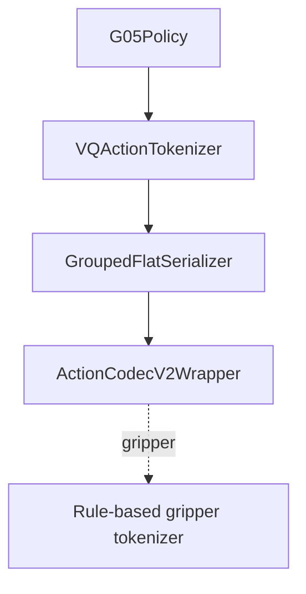

# Action Tokenizer Architecture

> The current open-source minimal posttrain setup keeps a single tokenizer entry: `ActionCodec`.

## 1. Entry

```text
configs/tokenizer/actioncodec.yaml
```

Tasks select it through defaults:

```yaml
defaults:
  - override /tokenizer: actioncodec
```

Code accesses the same config through `cfg.model.tokenizer`; the bridge is in `configs/train.yaml`:

```yaml
model:
  tokenizer: ${tokenizer}
```

## 2. Architecture



Core code:

| Component | Location |
|-----------|----------|
| Frontend | `src/g05/tokenizer/interface/vq_base.py` |
| Serializer | `src/g05/tokenizer/interface/serialization.py` |
| Backend | `src/g05/tokenizer/models/actioncodec2_v2/wrapper.py` |
| Rule tokenizer | `src/g05/tokenizer/models/binary_sequence/constrained_tokenizer.py` |

## 3. Default Layout

The default tokenizer uses grouped 20D:

```text
left_control(9) | left_gripper(1) | right_control(9) | right_gripper(1)
```

Keys matched by `rule_based_key_patterns: ["gripper"]` use rule-based binary tokenization. Control keys use ActionCodec RVQ.

R1Lite and R1Pro override `tokenizer.vq_config.parts_meta` at the task layer and add:

```text
lower_body(7)
```

## 4. Key Parameters

| Parameter | Meaning |
|-----------|---------|
| `ckpt_dir` | ActionCodec tokenizer checkpoint path, not the VLA checkpoint. |
| `num_residuals` | Number of RVQ residual codebooks enabled during training/inference. |
| `block_wise_autoregressive` | Whether action tokens are organized by block. |
| `block_size` | Token block size in BAR mode. |
| `use_group_markers` | Whether to insert part/group markers into the token sequence. |
| `dropout_noop_parts` | Whether to skip tokens for no-op parts. |
| `parts_meta` | Grouped output layout visible to the tokenizer. |

## 5. Data-Side Contract

The tokenizer grouped layout must match the final `GroupedPaddingMerger` output. Depending on the task, this merger is configured at one of:

```text
configs/task/<task>.yaml
model.processor.action_state_merger

configs/data/<task>.yaml
processors.<embodiment>.action_state_merger
```

Standard tasks output 20D; R1Lite and R1Pro output 27D. See [parts_meta.md](parts_meta.md).
