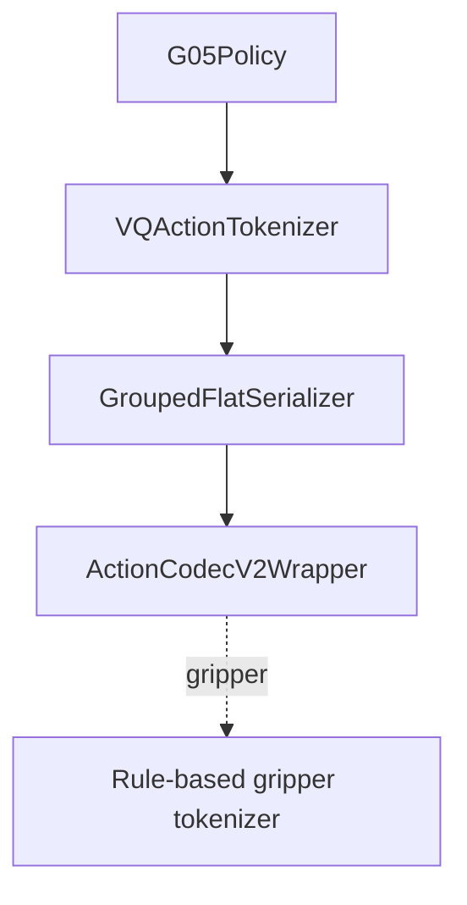

# Action Tokenizer 架构

> 当前开源 minimal posttrain 只保留 `ActionCodec` 这一条 tokenizer 配置入口。

## 1. 入口

```text
configs/tokenizer/actioncodec.yaml
```

task 通过 defaults 选择：

```yaml
defaults:
  - override /tokenizer: actioncodec
```

代码通过 `cfg.model.tokenizer` 访问同一个配置，桥接关系在 `configs/train.yaml`：

```yaml
model:
  tokenizer: ${tokenizer}
```

## 2. 架构



核心代码：

| 组件 | 位置 |
|------|------|
| Frontend | `src/g05/tokenizer/interface/vq_base.py` |
| Serializer | `src/g05/tokenizer/interface/serialization.py` |
| Backend | `src/g05/tokenizer/models/actioncodec2_v2/wrapper.py` |
| Rule tokenizer | `src/g05/tokenizer/models/binary_sequence/constrained_tokenizer.py` |

## 3. 默认布局

默认 tokenizer 使用 grouped 20D：

```text
left_control(9) | left_gripper(1) | right_control(9) | right_gripper(1)
```

`gripper` key 由 `rule_based_key_patterns: ["gripper"]` 命中，走规则二值化；control key 走 ActionCodec RVQ。

R1Lite 和 R1Pro 在 task 层覆盖 `tokenizer.vq_config.parts_meta`，增加：

```text
lower_body(7)
```

## 4. 关键参数

| 参数 | 含义 |
|------|------|
| `ckpt_dir` | ActionCodec tokenizer checkpoint 路径，不是 VLA checkpoint |
| `num_residuals` | 推理/训练时启用的 RVQ residual codebook 数量 |
| `block_wise_autoregressive` | 是否按 block 组织 action token |
| `block_size` | BAR 模式下的 token block 大小 |
| `use_group_markers` | 是否在 token 序列中插入 part/group marker |
| `dropout_noop_parts` | 是否跳过 no-op part 的 token |
| `parts_meta` | tokenizer 看到的 grouped 输出布局 |

## 5. Data 侧配套

tokenizer 的 grouped 布局必须和最终 `GroupedPaddingMerger` 输出一致。按 task 不同，该 merger 配置在以下位置之一：

```text
configs/task/<task>.yaml
model.processor.action_state_merger

configs/data/<task>.yaml
processors.<embodiment>.action_state_merger
```

标准任务输出 20D，R1Lite 和 R1Pro 输出 27D。详见 [parts_meta.md](parts_meta.md)。
