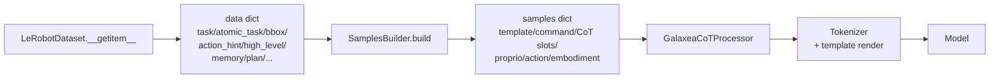

# Samples Builder Catalog

> Overview of all builders in `src/g05/data_processor/processor/samples_builder.py`: purpose, field dependencies, data coverage, templates, and when to use each one.
>
> Related test command: `python -m g05.data_processor.processor.samples_builder`, including `Slot-content Semantics` regression assertions.

## 1. Concept

`SamplesBuilder` is a subcomponent of `GalaxeaCoTProcessor`. It converts one-frame `data` dictionaries from `LeRobotDataset.__getitem__` into model-ready `samples` dictionaries containing `template`, `command`, `proprio`, `action`, CoT slots, and related fields. Each builder corresponds to one CoT output format or one command-injection strategy.



`Builder.can_handle(data)` checks that all `required_fields` exist and filters invalid values: `None`, `NaN`, `-1`, `"null"`, `"none"`, `"nan"`, `""`, and empty JSON `{}`.

## 2. Field Dependency Cheatsheet

| Field | Source in LeRobotDataset v3 | Data coverage by directory suffix |
|-------|------------------------------|-----------------------------------|
| `task` | Decoded from `task_index`. | All datasets, 100%. |
| `future_task` | Decoded from `chunked_task_index[future_task_offset]`, default offset 16. | Datasets that register `delta_timestamps["task_index"]`, such as r1lite and r1pro. End-of-episode indices are clamped to the last frame and treated as valid. |
| `atomic_task` | Decoded from `atomic_task_index`. | Only `_merged_final_v30`: R1_Lite 7 parent directories / 2668 subsets; R1_Pro 0. |
| `high_level_instruction` | Decoded from `high_level_instruction_index`. | Same as `atomic_task`. |
| `bbox` | Decoded from `bbox_index` into JSON such as `{"obj":[x1,y1,x2,y2]}`. | `_label_qualified_v30` plus `_merged_final_v30`: R1_Lite about 5201, R1_Pro 853. |
| `action_hint` | Decoded from `action_hint_index` into natural language. | Only `_merged_final_v30`, same as `atomic_task`. |
| `memory` / `memory_update` | Decoded from `prev_memory_index` / `memory_index`. | Older robocoin annotations, limited coverage. |
| `plan` / `plan_step` | Decoded from `plan_index`. | Older annotations, limited coverage. |
| `subtask` alias | Removed on 2026-05-08. | - |

The robocoin `subtask_annotation` column still exists in parquet, but it is no longer decoded into `item`. Re-enable it only after the robocoin data path is revisited.

## 3. Builder Overview

```mermaid
flowchart TD
    Base[BaseSamplesBuilder<br/>required_fields=()<br/>no CoT, command=task] --> AT[AtomicTaskBaseSamplesBuilder<br/>required=atomic_task<br/>no CoT, command=atomic_task]
    Base --> Subtask[SubtaskCoTBuilder<br/>required=task<br/>CoT=Subtask: atomic_task or task]
    Base --> BBox[BBoxCoTBuilder<br/>required=bbox<br/>CoT=BBox:&lt;loc...&gt;]
    Base --> Plan[PlanStepCoTBuilder<br/>required=plan,plan_step]
    Base --> Mem[MemorySamplesBuilder<br/>required=memory]

    Subtask --> SAH[SubtaskActionHintCoTBuilder<br/>required=atomic_task,action_hint<br/>CoT=Subtask+ActionHint]
    Subtask --> HL[HighLevelAtomicTaskCoTBuilder<br/>required=high_level,atomic_task<br/>command=high_level<br/>CoT=Subtask:atomic_task]
    Subtask --> SubFM[SubtaskCoTBuilderFMOnly<br/>same as SubtaskCoTBuilder<br/>but without action token slot]
    Subtask --> Future[FutureSubtaskCoTBuilder<br/>required=future_task<br/>CoT=Subtask:future_task+16 frames]
    BBox --> BBoxSub[BBoxSubtaskCoTBuilder<br/>required=bbox,task<br/>CoT=BBox+Subtask]
    Base --> Trace[Trace2DCoTBuilder<br/>required=trace_2d<br/>CoT=Trace:left/right gripper 2D targets]
    Mem --> MemCoT[MemoryCoTBuilder<br/>required=memory,memory_update]
    Mem --> MemSub[MemorySubtaskCoTBuilder<br/>required=memory,atomic_task]
    Base --> Mixed[MixedSamplesBuilder<br/>weighted random candidates<br/>fallback Base]
```

### 3.1 Detailed List

| Builder | required_fields | Command injection | CoT output format | Data coverage |
|---------|-----------------|-------------------|-------------------|---------------|
| `BaseSamplesBuilder` | `()` | `task` by default | none | all |
| **`AtomicTaskBaseSamplesBuilder`** | `("atomic_task",)` | **`atomic_task`** | none, direct action | `_merged_final_v30` |
| `SubtaskCoTBuilder` | `("atomic_task",)` | `task` | `Subtask: <atomic_task>` | `_merged_final_v30` |
| `SubtaskCoTBuilderFMOnly` | `("atomic_task",)` | `task` | same, but template excludes `<action_action>` | FM-only training |
| `TaskAsSubtaskCoTBuilder` | `("task",)` | `task` | `Subtask: <task>` | all; useful for foldbench-style `hardcode_instruction` where task is a fine-grained per-frame label |
| `FutureSubtaskCoTBuilder` | `("future_task",)` | `task` | `Subtask: <future_task>` 16 frames ahead | r1lite / r1pro with task_index delta |
| `BBoxCoTBuilder` | `("bbox",)` | `task` | `BBox: <obj> <loc...>` | `_label_qualified_v30` plus `_merged_final_v30` |
| `BBoxSubtaskCoTBuilder` | `("bbox", "task")` | `task` | `BBox: ... | Subtask: <atomic_task or task>` | same as BBoxCoT |
| `Trace2DCoTBuilder` | `("trace_2d",)` | `task` | `Trace: Left <loc..><loc..>; Right None` | datasets annotated with `2d_trace_index`; requires at least one visible arm |
| **`SubtaskActionHintCoTBuilder`** | `("atomic_task", "action_hint")` | `task` | `Subtask: <atomic_task> | ActionHint: <hint>` | `_merged_final_v30` |
| **`HighLevelAtomicTaskCoTBuilder`** | `("high_level_instruction", "atomic_task")` | **`high_level_instruction`** | `Subtask: <atomic_task>` | `_merged_final_v30` |
| `MemorySamplesBuilder` | `("memory",)` | `task` | none; memory is input only | robocoin |
| `MemoryCoTBuilder` | `("memory", "memory_update")` | `task` | `Updated Memory: ...` | robocoin |
| `MemorySubtaskCoTBuilder` | `("memory", "atomic_task")` | `task` | `Subtask: <atomic_task> | Updated Memory: ...` | intersection of atomic_task and memory, limited |
| `PlanStepCoTBuilder` | `("plan", "plan_step")` | `task` | `Step: <text>` | older annotations |
| `MixedSamplesBuilder` | `()` | forwards chosen builder | forwards chosen builder | depends on candidates |

Bold rows are newer or important builders related to `atomic_task` and `high_level_instruction`.

## 4. Template Fragments

Generic skeleton, PaliGemma style. Qwen replaces placeholders such as `<chat_user_prefix>` with `<|im_start|>user\n`:

```text
<chat_user_prefix><image0_image_!><image1_image_!><bos>
Embodiment: <embodiment_text_!>; Task: <command_text_!_200> State: <proprio_proprio_!>;
<chat_user_suffix><chat_assistant_prefix>
[<prompt_text_!>]
[<EOC><CoT slot 1>|<CoT slot 2>|...]
Action: <EOV><action_action>|<eos>
```

Builders differ only in the CoT slot region, from after `<EOC>` to before `Action:`, and in the injected value for `command_text`.

### 4.1 `SubtaskCoTBuilder`

```text
... <prompt_text_!>\n<EOC><atomic_task_text>|Action: <EOV><action_action>|<eos>
```

`<atomic_task_text>` is `f"Subtask: {atomic_task or task}"`.

### 4.2 `BBoxCoTBuilder`

```text
... <prompt_text_!>\n<bbox_text>|Action: <EOV><EOC><action_action>|<eos>
```

`<EOC>` appears before `<bbox_text>` because bbox generation is the start of CoT. `<bbox_text>` uses the PaliGemma yxyx format, for example `BBox: towel <loc0490><loc0116><loc0705><loc0287>`.

### 4.3 `BBoxSubtaskCoTBuilder`

```text
... <prompt_text_!>\n<EOC><bbox_text>|<atomic_task_text>|Action: <EOV><EOC><action_action>|<eos>
```

### 4.4 `SubtaskActionHintCoTBuilder`

```text
... <prompt_text_!>\n<EOC><atomic_task_text>|<action_hint_text>|Action: <EOV><EOC><action_action>|<eos>
```

### 4.5 `FutureSubtaskCoTBuilder`

```text
... <prompt_text_!>\n<EOC><atomic_task_text>|Action: <EOV><action_action>|<eos>
```

The template is identical to `SubtaskCoTBuilder`; only the filled value changes to `f"Subtask: {future_task}"`, using the task text 16 frames in the future instead of the current frame.

`future_task` is decoded in `lerobot_dataset_v3.py.__getitem__`:

```python
ct = item["chunked_task_index"]          # [action_size=32]
fidx = ct[future_task_offset].item()     # default offset=16
item["future_task"] = meta.tasks.iloc[fidx].name
```

Out-of-range end-of-episode indices are clamped to the final frame by the dataset, matching action chunk behavior and serving as a valid training signal.

### 4.6 `HighLevelAtomicTaskCoTBuilder`

The template is identical to `SubtaskCoTBuilder`. `_override_command(data)` changes the value injected into `<command_text_!_200>` from `data["task"]` to `data["high_level_instruction"]`.

### 4.7 `AtomicTaskBaseSamplesBuilder`

The template is identical to `BaseSamplesBuilder`, with no CoT slot. `_override_command` changes the command to `atomic_task`.

### 4.8 `Trace2DCoTBuilder`

```text
... <prompt_text_!>\n<EOC><trace_2d_text>|Action: <EOV><action_action>|<eos>
```

`<trace_2d_text>` looks like `Trace: Left <loc0543><loc0436>; Right None`. Normalized coordinates in [0, 1] are quantized into `<locXXXX>` tokens; invisible left/right arms use `None`.

## 5. `_override_command` Hook

`BaseSamplesBuilder.build()` injects upstream `_instructions`, usually `data["task"]`, into `<command_text_!_200>` by default. Subclasses can override `_override_command(data) -> Optional[str]`; returning a non-`None` string replaces the command content.

| Builder | `_override_command` return value |
|---------|----------------------------------|
| `AtomicTaskBaseSamplesBuilder` | `data["atomic_task"]` |
| `HighLevelAtomicTaskCoTBuilder` | `data["high_level_instruction"]` |
| all other builders | `None`, keep `task` |

The hook was added on 2026-05-08 to avoid subclasses copying the full `build()` template logic just to override the command.

## 6. `MixedSamplesBuilder` Behavior

```mermaid
flowchart TD
    Build[build(data, sample)] --> IsTrain{_training?}
    IsTrain -->|False| EvalPath
    IsTrain -->|True| TrainPath
    EvalPath --> EvalCheck{eval_builder<br/>is not None and<br/>can_handle(data)?}
    EvalCheck -->|Yes| EvalRun[eval_builder.build]
    EvalCheck -->|No| EvalFB[BaseSamplesBuilder.build<br/>no CoT]
    TrainPath --> Filter["filter candidates<br/>can_handle(data)=True"]
    Filter --> HasAny{any candidate?}
    HasAny -->|Yes| WeightedRandom[weighted random pick]
    HasAny -->|No| TrainFB[BaseSamplesBuilder.build<br/>no CoT]
    WeightedRandom --> Run[chosen.build]
```

Key constraints:

- YAML must set `_recursive_: false`; otherwise Hydra instantiates each candidate dict directly and drops the `weight` field.
- Candidate order does not matter because selection is weighted random.
- `eval_builder` is the fixed builder used for inference. If it is `null`, evaluation falls back to `BaseSamplesBuilder`.

## 7. Which Builder To Use

| Scenario | Use |
|----------|-----|
| Plain action training without CoT | `BaseSamplesBuilder` |
| Train task -> action while using a fine-grained command | `AtomicTaskBaseSamplesBuilder` |
| Train high-level -> atomic_task -> action, as multi-level CoT | `HighLevelAtomicTaskCoTBuilder` |
| Train bbox CoT | `BBoxCoTBuilder` or `BBoxSubtaskCoTBuilder` |
| Train joint atomic_task + action_hint CoT | `SubtaskActionHintCoTBuilder` |
| Train look-ahead planning by predicting a future subtask | `FutureSubtaskCoTBuilder` |
| Train gripper 2D target grounding | `Trace2DCoTBuilder` |
| Mix multiple annotation types with weighted sampling | `MixedSamplesBuilder` with candidates |

## 8. Config Example

Training config for full r1lite `_merged_final_v30` annotations:

```yaml
samples_builder:
  _target_: g05.data_processor.processor.samples_builder.MixedSamplesBuilder
  _partial_: true
  _recursive_: false
  candidates:
    # Strict annotation dependencies; active only on _merged_final_v30 data.
    - _target_: g05.data_processor.processor.samples_builder.HighLevelAtomicTaskCoTBuilder
      weight: 1.0
    - _target_: g05.data_processor.processor.samples_builder.SubtaskActionHintCoTBuilder
      weight: 1.0
    - _target_: g05.data_processor.processor.samples_builder.AtomicTaskBaseSamplesBuilder
      weight: 1.0
    - _target_: g05.data_processor.processor.samples_builder.BBoxSubtaskCoTBuilder
      weight: 1.0
    # Fallback-compatible candidates: depend on task, available in all datasets,
    # and may fall back to atomic_task or task.
    - _target_: g05.data_processor.processor.samples_builder.SubtaskCoTBuilder
      weight: 1.0
    - _target_: g05.data_processor.processor.samples_builder.BBoxCoTBuilder
      weight: 1.0
  eval_builder:
    _target_: g05.data_processor.processor.samples_builder.SubtaskCoTBuilder
```

Any candidate that cannot handle the current frame is skipped. If no candidate matches, the builder falls back to `BaseSamplesBuilder`, which has no CoT and uses pure action supervision.

## 9. Tests

`python -m g05.data_processor.processor.samples_builder` covers:

1. Template rendering for all builders across PaliGemma, Qwen3.5 base, and Qwen3.5 instruct token maps.
2. `MixedSamplesBuilder.can_handle()` filtering, including NaN/null/sentinel/empty JSON handling.
3. `set_training(False)` switching.
4. Propagation of `embodiment_type` into candidates and `eval_builder`.
5. **Slot-content semantics**: every atomic_task slot must use atomic_task text when atomic_task exists, preventing silent BBoxSubtask-style bugs.
6. Fallback chain: Subtask/BBoxSubtask can fall back to task when atomic_task is missing.
7. Strict requirements: SubtaskActionHint/MemorySubtask/HighLevelAtomicTask/AtomicTaskBase must return `can_handle=False` when atomic_task is missing.
8. `_override_command` hook return values.

Whenever a builder is added or modified, add matching assertions in sections 5-8.
