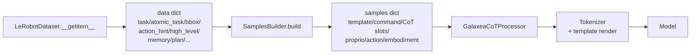

# Samples Builder 全家福

> `src/g05/data_processor/processor/samples_builder.py` 里所有 Builder 的总览：用途、字段依赖、数据范围、模板、何时该用。
>
> 配套测试：`python -m g05.data_processor.processor.samples_builder`（含 `Slot-content Semantics` 回归断言）。

## 1. 概念

`SamplesBuilder` 是 `GalaxeaCoTProcessor` 的子组件，负责把单帧 `data` dict（来自 `LeRobotDataset.__getitem__`）转换成模型所需的 `samples` dict（含 `template` / `command` / `proprio` / `action` / CoT slots 等）。一个 Builder 对应一种 CoT 输出格式或一种 command 注入策略。



`Builder.can_handle(data)` 检查 `required_fields` 是否齐全（过滤 `None` / `NaN` / `-1` / `"null"` / `"none"` / `"nan"` / `""` / 空 JSON `{}`）。

## 2. 数据字段依赖速查

| 字段 | 来源 (LeRobotDataset v3) | 数据范围（按目录后缀） |
|---|---|---|
| `task` | `task_index` 解码 | **所有数据集** 100% |
| `future_task` | `chunked_task_index[future_task_offset]` 解码（默认 offset=16） | 注册了 `delta_timestamps["task_index"]` 的数据集（r1lite/r1pro）；episode 末尾 dataset 已 clamp 到末帧，视为合法值 |
| `atomic_task` | `atomic_task_index` 解码 | **仅 `_merged_final_v30`** (R1_Lite 7 父目录 / 2668 subsets，**R1_Pro 0**) |
| `high_level_instruction` | `high_level_instruction_index` 解码 | 同 atomic_task |
| `bbox` | `bbox_index` 解码 → JSON `{"obj":[x1,y1,x2,y2]}` | `_label_qualified_v30` ∪ `_merged_final_v30` (R1_Lite ~5201, R1_Pro 853) |
| `action_hint` | `action_hint_index` 解码 → 自然语言 | 仅 `_merged_final_v30`（同 atomic_task） |
| `memory` / `memory_update` | `prev_memory_index` / `memory_index` 解码 | 旧 robocoin 标注，少量 |
| `plan` / `plan_step` | `plan_index` 解码 | 旧 robocoin 标注，少量 |
| `subtask` (alias) | **已下线 2026-05-08** | — |

> robocoin 数据自带的 `subtask_annotation` 列仍在 parquet 里，但当前不再被解码到 `item`，待 robocoin 调研后再决定接入方式。

## 3. Builder 总览

```mermaid
flowchart TD
    Base[BaseSamplesBuilder<br/>required_fields=()<br/>无 CoT,command=task] --> AT[AtomicTaskBaseSamplesBuilder<br/>required=atomic_task<br/>无 CoT,command=atomic_task]
    Base --> Subtask[SubtaskCoTBuilder<br/>required=task<br/>CoT=Subtask:atomic_task or task]
    Base --> BBox[BBoxCoTBuilder<br/>required=bbox<br/>CoT=BBox:&lt;loc...&gt;]
    Base --> Plan[PlanStepCoTBuilder<br/>required=plan,plan_step]
    Base --> Mem[MemorySamplesBuilder<br/>required=memory]

    Subtask --> SAH[SubtaskActionHintCoTBuilder<br/>required=atomic_task,action_hint<br/>CoT=Subtask+ActionHint]
    Subtask --> HL[HighLevelAtomicTaskCoTBuilder<br/>required=high_level,atomic_task<br/>command=high_level<br/>CoT=Subtask:atomic_task]
    Subtask --> SubFM[SubtaskCoTBuilderFMOnly<br/>同 SubtaskCoTBuilder<br/>但去掉 action token slot]
    Subtask --> Future[FutureSubtaskCoTBuilder<br/>required=future_task<br/>CoT=Subtask:future_task+16帧]
    BBox --> BBoxSub[BBoxSubtaskCoTBuilder<br/>required=bbox,task<br/>CoT=BBox+Subtask]
    Base --> Trace[Trace2DCoTBuilder<br/>required=trace_2d<br/>CoT=Trace:左右夹爪2D落点]
    Mem --> MemCoT[MemoryCoTBuilder<br/>required=memory,memory_update]
    Mem --> MemSub[MemorySubtaskCoTBuilder<br/>required=memory,atomic_task]
    Base --> Mixed[MixedSamplesBuilder<br/>candidates 加权随机<br/>fallback Base]
```

### 3.1 详细列表

| Builder | required_fields | command 注入 | CoT 输出格式 | 数据可用范围 |
|---|---|---|---|---|
| `BaseSamplesBuilder` | `()` | `task`（默认） | 无 | 全部 |
| **`AtomicTaskBaseSamplesBuilder`** | `("atomic_task",)` | **`atomic_task`** | 无（直接 action） | `_merged_final_v30` |
| `SubtaskCoTBuilder` | `("atomic_task",)` | `task` | `Subtask: <atomic_task>` | `_merged_final_v30` |
| `SubtaskCoTBuilderFMOnly` | `("atomic_task",)` | `task` | 同上但模板不含 `<action_action>` | FM-only 训练 |
| `TaskAsSubtaskCoTBuilder` | `("task",)` | `task` | `Subtask: <task>` | 全部；foldbench 等 hardcode_instruction 场景，task 为细粒度逐帧标签 |
| `FutureSubtaskCoTBuilder` | `("future_task",)` | `task` | `Subtask: <future_task>` (未来+16帧) | r1lite / r1pro（注册了 task_index delta） |
| `BBoxCoTBuilder` | `("bbox",)` | `task` | `BBox: <obj> <loc...>` | `_label_qualified_v30` ∪ `_merged_final_v30` |
| `BBoxSubtaskCoTBuilder` | `("bbox", "task")` | `task` | `BBox: ... \| Subtask: <atomic_task or task>` | 同 BBoxCoT |
| `Trace2DCoTBuilder` | `("trace_2d",)` | `task` | `Trace: Left <loc..><loc..>; Right None`（夹爪 2D 投影落点，至少一臂可见才触发） | 标注了 `2d_trace_index` 的数据集 |
| **`SubtaskActionHintCoTBuilder`** | `("atomic_task", "action_hint")` | `task` | `Subtask: <atomic_task> \| ActionHint: <hint>` | `_merged_final_v30` |
| **`HighLevelAtomicTaskCoTBuilder`** | `("high_level_instruction", "atomic_task")` | **`high_level_instruction`** | `Subtask: <atomic_task>` | `_merged_final_v30` |
| `MemorySamplesBuilder` | `("memory",)` | `task` | 无（memory 只作输入） | robocoin |
| `MemoryCoTBuilder` | `("memory", "memory_update")` | `task` | `Updated Memory: ...` | robocoin |
| `MemorySubtaskCoTBuilder` | `("memory", "atomic_task")` | `task` | `Subtask: <atomic_task> \| Updated Memory: ...` | atomic_task ∩ memory（少） |
| `PlanStepCoTBuilder` | `("plan", "plan_step")` | `task` | `Step: <text>` | 旧标注 |
| `MixedSamplesBuilder` | `()` | 转发 chosen | 转发 chosen | 取决于 candidates |

**粗体** = 与 atomic_task / high_level_instruction 相关的新/重要 builder。

## 4. 模板片段

通用骨架（PaliGemma 形态，Qwen 由 `<chat_user_prefix>` 等占位符替换为 `<|im_start|>user\n`）：

```text
<chat_user_prefix><image0_image_!><image1_image_!><bos>
Embodiment: <embodiment_text_!>; Task: <command_text_!_200> State: <proprio_proprio_!>;
<chat_user_suffix><chat_assistant_prefix>
[<prompt_text_!>]
[<EOC><CoT slot 1>|<CoT slot 2>|...]
Action: <EOV><action_action>|<eos>
```

各 Builder 区别仅在 CoT slot 区段（`<EOC>` 之后到 `Action:` 之前）和 `command_text` 注入值。

### 4.1 SubtaskCoTBuilder
```text
... <prompt_text_!>\n<EOC><atomic_task_text>|Action: <EOV><action_action>|<eos>
```
`<atomic_task_text>` 填值：`f"Subtask: {atomic_task or task}"`

### 4.2 BBoxCoTBuilder
```text
... <prompt_text_!>\n<bbox_text>|Action: <EOV><EOC><action_action>|<eos>
```
注意 `<EOC>` 在 `<bbox_text>` **之前**（提示模型生成 bbox 是 CoT 起点）。`<bbox_text>` 填值：PaliGemma yxyx 格式 `BBox: towel <loc0490><loc0116><loc0705><loc0287>`。

### 4.3 BBoxSubtaskCoTBuilder
```text
... <prompt_text_!>\n<EOC><bbox_text>|<atomic_task_text>|Action: <EOV><EOC><action_action>|<eos>
```

### 4.4 SubtaskActionHintCoTBuilder
```text
... <prompt_text_!>\n<EOC><atomic_task_text>|<action_hint_text>|Action: <EOV><EOC><action_action>|<eos>
```

### 4.5 FutureSubtaskCoTBuilder

```text
... <prompt_text_!>\n<EOC><atomic_task_text>|Action: <EOV><action_action>|<eos>
```
模板与 `SubtaskCoTBuilder` 完全一致；区别在 `<atomic_task_text>` 填值：`f"Subtask: {future_task}"`（未来第+16帧的 task 文本，而非当前帧）。

`future_task` 由 `lerobot_dataset_v3.py.__getitem__` 预解码：
```python
ct = item["chunked_task_index"]          # [action_size=32]
fidx = ct[future_task_offset].item()     # 默认 offset=16
item["future_task"] = meta.tasks.iloc[fidx].name
```
episode 末尾越界时 dataset 已 clamp 到末帧（与 action chunk 行为一致），视为合法训练信号。

### 4.6 HighLevelAtomicTaskCoTBuilder
模板与 SubtaskCoTBuilder 完全一致；区别在 `_override_command(data)` 把 `<command_text_!_200>` 注入值替换为 `data["high_level_instruction"]`（默认是 `data["task"]`）。

### 4.7 AtomicTaskBaseSamplesBuilder
模板与 BaseSamplesBuilder 一致（无 CoT slot），`_override_command` 把 command 替换为 `atomic_task`。

### 4.8 Trace2DCoTBuilder
```text
... <prompt_text_!>\n<EOC><trace_2d_text>|Action: <EOV><action_action>|<eos>
```
`<trace_2d_text>` 填值：`Trace: Left <loc0543><loc0436>; Right None`（归一化 0-1 坐标量化为 `<locXXXX>`，左/右臂不可见时为 `None`）。

## 5. `_override_command` 钩子

`BaseSamplesBuilder.build()` 默认把 `<command_text_!_200>` 注入为上游 `_instructions`（通常 = `data["task"]`）。子类可重载 `_override_command(data) -> Optional[str]` 返回非 `None` 字符串以替换 command 内容。

| Builder | `_override_command` 返回 |
|---|---|
| `AtomicTaskBaseSamplesBuilder` | `data["atomic_task"]` |
| `HighLevelAtomicTaskCoTBuilder` | `data["high_level_instruction"]` |
| 其它所有 builder | `None`（沿用 task） |

> 钩子是 2026-05-08 加的，目的是避免子类 override 整个 `build()` 复制 30 行模板代码。

## 6. MixedSamplesBuilder 行为

```mermaid
flowchart TD
    Build[build(data, sample)] --> IsTrain{_training?}
    IsTrain -->|False| EvalPath
    IsTrain -->|True| TrainPath
    EvalPath --> EvalCheck{eval_builder<br/>非 None 且<br/>can_handle(data)?}
    EvalCheck -->|Yes| EvalRun[eval_builder.build]
    EvalCheck -->|No| EvalFB[BaseSamplesBuilder.build<br/>无 CoT]
    TrainPath --> Filter["candidates 过滤<br/>can_handle(data)=True"]
    Filter --> HasAny{有任一?}
    HasAny -->|Yes| WeightedRandom[加权随机选 1 个]
    HasAny -->|No| TrainFB[BaseSamplesBuilder.build<br/>无 CoT]
    WeightedRandom --> Run[chosen.build]
```

**关键约束**：
- yaml 必须写 `_recursive_: false`，否则 Hydra 会把 `candidates` 列表里的每个 dict 直接实例化（丢失 `weight` 字段）。
- candidate 顺序无关紧要（按权重抽签）。
- `eval_builder` 是 inference 时的固定 builder；`null` 时走 BaseSamplesBuilder。

## 7. 何时该用哪个 Builder

| 场景 | 选 |
|---|---|
| 单纯训练（无 CoT） | `BaseSamplesBuilder` |
| 想训练 task → action 但 command 用细粒度 | `AtomicTaskBaseSamplesBuilder` |
| 想训练 high-level → atomic_task → action（多层 CoT） | `HighLevelAtomicTaskCoTBuilder` |
| 想训练 bbox CoT | `BBoxCoTBuilder` 或 `BBoxSubtaskCoTBuilder` |
| 想训练 atomic_task + action_hint 联合 CoT | `SubtaskActionHintCoTBuilder` |
| 想训练 look-ahead planning（预测未来子任务） | `FutureSubtaskCoTBuilder` |
| 想训练夹爪 2D 落点 grounding | `Trace2DCoTBuilder` |
| 多种标注混合 + 加权采样 | `MixedSamplesBuilder` 配 candidates |

## 8. Config 示例

支持完整 r1lite `_merged_final_v30` 标注的训练配置：

```yaml
samples_builder:
  _target_: g05.data_processor.processor.samples_builder.MixedSamplesBuilder
  _partial_: true
  _recursive_: false
  candidates:
    # 严格依赖标注，仅 _merged_final_v30 数据上触发
    - _target_: g05.data_processor.processor.samples_builder.HighLevelAtomicTaskCoTBuilder
      weight: 1.0
    - _target_: g05.data_processor.processor.samples_builder.SubtaskActionHintCoTBuilder
      weight: 1.0
    - _target_: g05.data_processor.processor.samples_builder.AtomicTaskBaseSamplesBuilder
      weight: 1.0
    - _target_: g05.data_processor.processor.samples_builder.BBoxSubtaskCoTBuilder
      weight: 1.0
    # 兜底：依赖 task（任何数据集都有），fallback 到 atomic_task or task
    - _target_: g05.data_processor.processor.samples_builder.SubtaskCoTBuilder
      weight: 1.0
    - _target_: g05.data_processor.processor.samples_builder.BBoxCoTBuilder
      weight: 1.0
  eval_builder:
    _target_: g05.data_processor.processor.samples_builder.SubtaskCoTBuilder
```

任何 candidate 不 `can_handle` 当前帧时，自动跳过；全部不命中时 fallback 到 `BaseSamplesBuilder`（无 CoT，纯 action 监督）。

## 9. 测试

`python -m g05.data_processor.processor.samples_builder` 内置：

1. 全部 builder 的模板渲染（PaliGemma / Qwen3.5 base / Qwen3.5 instruct 三种 token map）
2. `MixedSamplesBuilder.can_handle()` filtering（含 NaN/null/sentinel/空 JSON 过滤）
3. `set_training(False)` 切换
4. `embodiment_type` setter 传播到 candidates / eval_builder
5. **Slot-content semantics**：所有 atomic_task slot 在 atomic_task 存在时必须填 atomic_task 文本（防 BBoxSubtask 类隐性 bug）
6. fallback 链：Subtask/BBoxSubtask 缺 atomic_task 时退回 task
7. 严格 required：SubtaskActionHint/MemorySubtask/HighLevelAtomicTask/AtomicTaskBase 缺 atomic_task 必须 `can_handle=False`
8. `_override_command` 钩子返回值

每次新增 / 修改 builder，都应在 (5)-(8) 区段补对应断言。
