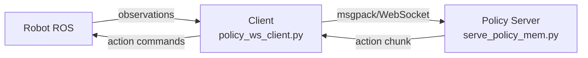

# Galaxea R1LITE Real-Robot Inference

Real-robot deployment uses a **WebSocket server-client** architecture. The policy server runs on a workstation GPU, while the robot-side client, or a client on the same machine, collects observations, requests actions, and sends them to the robot.



## 1. Start The Robot

```bash
ssh r1lite@<robot-ip>

export ROS_MASTER_URI=http://<robot-ip>
export ROS_IP=<robot-ip>
cd <r1lite-sdk>/install/share/start_configs/scripts
./robot_startup.sh boot ../session.d/ATCStandard/R1LITEBody.d/
```

## 2. Workstation Environment

```bash
export ROS_MASTER_URI=http://<robot-ip>
export ROS_IP=<robot-ip>
```

## 3. Start The Policy Server

```bash
python scripts/serve_policy_mem.py --run_dir runs/<your-run> --port 8765
```

See the detailed parameters, MEM multi-frame buffer behavior, and client protocol in:

- [serve_policy.md](serve_policy.md): single-frame server, dynamic batching, and torch.compile acceleration.
- [serve_policy_mem.md](serve_policy_mem.md): multi-frame memory server used by the main models.

The client side uses `scripts/utils/policy_ws_client.py`.

## 4. Optional ROS Bag Replay Debugging

During debugging, you can replay a pre-recorded ROS bag instead of using the real robot. Remap teleoperation action topics to ground-truth topics to compare model-inferred actions with GT:

```bash
rosbag play <YOUR ROS BAG PATH> \
/motion_target/target_joint_state_arm_left:=/motion_target/target_joint_state_arm_left_gt \
/motion_target/target_joint_state_arm_right:=/motion_target/target_joint_state_arm_right_gt \
/motion_target/target_position_gripper_left:=/motion_target/target_position_gripper_left_gt \
/motion_target/target_position_gripper_right:=/motion_target/target_position_gripper_right_gt --loop
```
