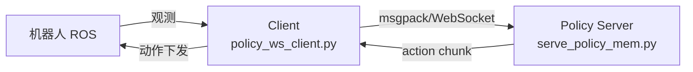

# Galaxea R1LITE 真机推理

真机部署采用 **WebSocket server-client** 架构：工作站 GPU 上跑 policy server，机器人侧（或同机）的 client 采集观测、请求动作并下发执行。



## 1. 启动机器人

```
ssh r1lite@<robot-ip>

export ROS_MASTER_URI=http://<robot-ip>
export ROS_IP=<robot-ip>
cd <r1lite-sdk>/install/share/start_configs/scripts
./robot_startup.sh boot ../session.d/ATCStandard/R1LITEBody.d/
```

## 2. 工作站环境

```
export ROS_MASTER_URI=http://<robot-ip>
export ROS_IP=<robot-ip>
```

## 3. 启动 Policy Server

```bash
python scripts/serve_policy_mem.py --run_dir runs/<your-run> --port 8765
```

详细参数、MEM 多帧 buffer 行为、client 协议见：

- [serve_policy.md](serve_policy.md) — 单帧 server、动态批处理、torch.compile 加速
- [serve_policy_mem.md](serve_policy_mem.md) — 多帧记忆（MEM）server（主力模型用这个）

Client 侧统一使用 `scripts/utils/policy_ws_client.py`。

## 4. Replay ROS Bag 调试（可选）

调试时可以回放预采集的 ROS Bag 代替真机，并把遥操作 action topic 重映射为 ground truth topic，对比模型推理动作与 GT：

```
rosbag play <YOUR ROS BAG PATH> \
/motion_target/target_joint_state_arm_left:=/motion_target/target_joint_state_arm_left_gt \
/motion_target/target_joint_state_arm_right:=/motion_target/target_joint_state_arm_right_gt \
/motion_target/target_position_gripper_left:=/motion_target/target_position_gripper_left_gt \
/motion_target/target_position_gripper_right:=/motion_target/target_position_gripper_right_gt --loop
```
