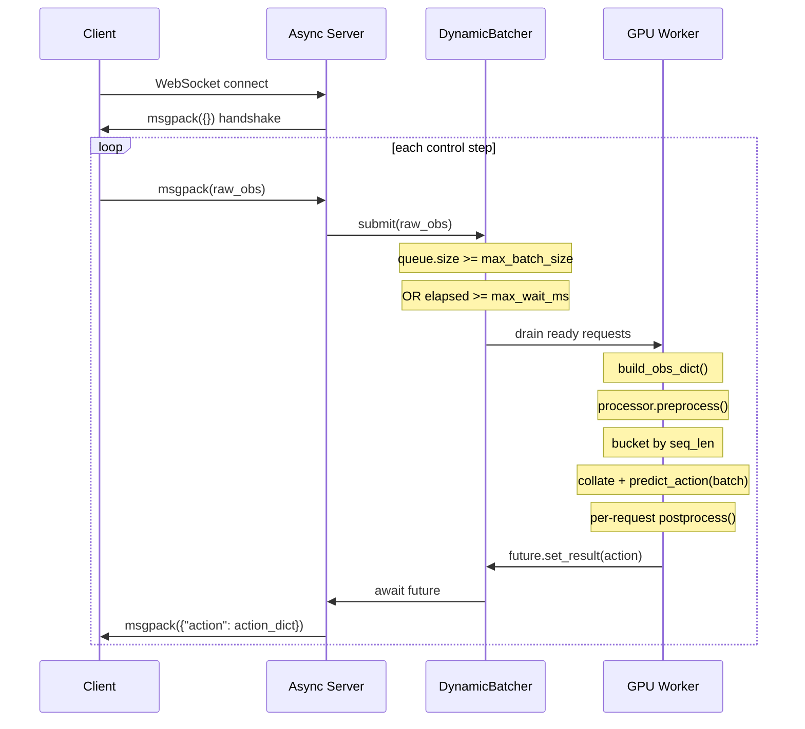

# WebSocket Policy Server Deployment Guide

## Overview

`scripts/serve_policy.py` is the built-in WebSocket policy server. It fully reuses the model and processor loading path from `eval_open_loop.py` to keep training and inference consistent. The client only sends raw observations, and the server returns denormalized action dictionaries.

The current server includes **dynamic batching, length bucketing, and backpressure**:

- `max_batch_size`: throughput cap; a forward pass is triggered as soon as the queue reaches this size.
- `max_wait_ms`: maximum queue wait per request; a forward pass runs when the timeout expires even if the batch is not full.
- `seq_bucket_step`: buckets requests by text-token length to reduce padding waste from variable-length inputs.
- `max_queue_size`: bounded queue size; overflow returns an error instead of allowing unbounded latency growth.

Compared with the older ROS-direct flow in `docs/deployment/inference.md`:

| Area | Old Flow: ROS Direct | New Flow: WebSocket Server |
|------|----------------------|----------------------------|
| Dependencies | Client needs the `g05` library. | Client has zero PyTorch dependency. |
| Preprocessing | Client side. | Server side. |
| Consistency | Easy to drift from training. | Reuses the training pipeline. |
| Transport | ROS topic. | WebSocket + msgpack. |

## Data Flow



## Startup

### Prerequisites

```bash
source startg05.sh
uv pip install websockets

# Optional: if EpisodeRecorder overlays COT text containing CJK characters on videos.
apt-get install -y fonts-wqy-zenhei
```

### Single-Embodiment Mode

Specify `eval_embodiment` to filter to one embodiment. This is recommended for real-robot deployment:

```bash
python scripts/serve_policy.py \
    --ckpt_path /path/to/checkpoints/step_10000/model_state_dict.pt \
    --host 0.0.0.0 --port 8765 \
    --max_batch_size 8 \
    --max_wait_ms 10 \
    eval_embodiment=galaxea_r1lite
```

### Mixture Mode

Omit `eval_embodiment`; the client routes by sending the `embodiment_type` field:

```bash
python scripts/serve_policy.py \
    --ckpt_path /path/to/checkpoints/step_10000/model_state_dict.pt \
    --host 0.0.0.0 --port 8765 \
    --max_batch_size 8 \
    --max_wait_ms 10
```

### torch.compile Acceleration

Add `model.use_torch_compile=true` to enable `torch.compile` with `max-autotune` mode. The first inference compiles for a few minutes; later inferences are significantly faster.

```bash
python scripts/serve_policy.py \
    --ckpt_path /path/to/checkpoints/step_10000/model_state_dict.pt \
    --host 0.0.0.0 --port 8765 \
    eval_embodiment=galaxea_r1lite \
    model.use_torch_compile=true
```

### Arguments

| Argument | Default | Description |
|----------|---------|-------------|
| `--ckpt_path` | required | Checkpoint path, for example `.../step_10000/model_state_dict.pt`. |
| `--host` | `0.0.0.0` | Listen address. |
| `--port` | `8765` | Listen port. |
| `--max_batch_size` | `8` | Dynamic batching batch-size cap. |
| `--max_wait_ms` | `10.0` | Maximum per-request queue wait. |
| `--max_queue_size` | `256` | Queue length cap; overflow is rejected immediately. |
| `--seq_bucket_step` | `64` | Text-token length bucket granularity. |
| `eval_embodiment=xxx` | optional | Filter to one embodiment. |
| `model.use_torch_compile=true` | optional | Enable torch.compile acceleration. |
| other `key=value` | - | Hydra overrides forwarded to the config. |

### Dynamic Batching Tuning

| Scenario | Recommendation |
|----------|----------------|
| Latency first | Lower `--max_wait_ms`, for example `2-5`. |
| Throughput first | Increase `--max_batch_size` and moderately increase `--max_wait_ms`. |
| Large text-length variation | Keep `--seq_bucket_step=64` or reduce it to `32`. |
| Strong traffic spikes | Increase `--max_queue_size` while monitoring P99 latency. |

## Client Protocol

### Connection

1. Connect to `ws://{host}:{port}`.
2. Receive handshake packet: `unpackb(ws.recv())` -> empty dict `{}`.
3. Start the send/receive loop.

### Request Format

```python
obs = {
    "images": {
        "head_rgb":       np.ndarray([3, H, W], dtype=uint8),
        "left_wrist_rgb": np.ndarray([3, H, W], dtype=uint8),
        ...
    },
    "state": {
        "left_arm":     np.ndarray([6], dtype=float32),
        "right_arm":    np.ndarray([6], dtype=float32),
        "left_gripper": np.ndarray([D], dtype=float32),
        ...
    },
    "task": "pick up cup",
    "embodiment_type": "galaxea_r1lite",  # required in mixture mode
}
ws.send(packb(obs))
```

Notes:

- Images are `[C, H, W]` 3D arrays without a batch dimension; the server adds the batch dimension.
- State entries are `[D]` 1D arrays without a time dimension; the server expands them as needed.
- `task` is raw text. Do not add prefixes such as `[Low]:`; the processor handles formatting.
- Do not send `*_is_pad`; the server builds padding masks.

### Response Format

```python
response = unpackb(ws.recv())
actions = response["action"]
# actions = {
#     "left_arm":     np.ndarray([T, 6], dtype=float32),
#     "right_arm":    np.ndarray([T, 6], dtype=float32),
#     "left_gripper": np.ndarray([T, 1], dtype=float32),
#     ...
# }
```

`T` is the action horizon from `action_size` in the training config.

### Error Response

```python
response = {
    "error": {
        "code": 400 | 500 | 503,
        "message": "human readable error",
    }
}
```

- `400`: invalid input schema.
- `503`: dynamic batching queue is full and backpressure is applied.
- `500`: server-side inference failure.

## Internal Architecture

### Checkpoint Directory Layout

Both the raw training directory and directories exported by `tools/export_checkpoint.py` are supported:

```text
# Raw training directory.
run_dir/
├── .hydra/config.yaml
├── dataset_stats.json
└── checkpoints/
    └── step_10000/
        └── model_state_dict.pt

# Exported directory.
export_dir/
├── .hydra/config.yaml
├── dataset_stats.json
├── export_meta.json
└── checkpoints/
    └── model_state_dict.pt
```

The server walks upward from `ckpt_path` to find the `run_dir` containing `.hydra/config.yaml`, then loads the config and normalizer automatically.

### Code Alignment

| Function | Aligned file | Reference |
|----------|--------------|-----------|
| Config loading | `src/g05/utils/checkpoint/ckpt_utils.py` | `find_run_dir()`, `load_config_from_run_dir()` |
| Model loading | `scripts/eval_open_loop.py` | L362-L370 |
| Normalizer loading | `scripts/eval_open_loop.py` | L373-L374 |
| Processor construction | `src/g05/utils/eval/eval_utils.py` | `build_eval_processor()` L80-L96 |
| Inference loop | `scripts/eval_open_loop.py` | L124-L127 |
| Postprocess | `scripts/eval_open_loop.py` | L176 |

### Key Design Points

**Dummy action**: the client has no GT action during inference, but the model still needs an `action_dim_is_pad` mask. `build_obs_dict()` creates a zero dummy action with `action_is_pad=True`, letting `ConcatLeftAlign.forward()` generate the correct mask without affecting inference.

**Mixture handling**: `build_eval_processor(cfg)` handles both single and mixture processors. In mixture mode, `MixtureProcessor.preprocess()` routes by `data["embodiment"]`. Dynamic batching conservatively buckets by sub-processor, then postprocesses each request with the corresponding sub-processor after the forward pass.

**Length bucketing**: the server runs `processor.preprocess()` first, then buckets by `input_ids` length with `seq_bucket_step`. Each microbatch uses `collate_fn_pad_sequences()` to minimize padding waste.

**Backpressure**: requests enter a bounded queue. When `max_queue_size` is exceeded, the server immediately returns a 503-style error packet instead of allowing real-robot control latency to grow without bound.

## Consistency Tests

### 1. Dataset vs Server Visualization

`tests/test_serve_vs_dataset.py` checks whether the offline dataset path used by `eval_open_loop` and the online `serve_policy` path feed equivalent data into `processor.preprocess`.

```bash
python tests/test_serve_vs_dataset.py \
    --ckpt_path runs/pretrain/6k_pretrain_full_ddp_arQ9999_fmZscore/pretrain_0301/checkpoints/step_117428.pt \
    eval_embodiment=galaxea_r1lite
```

Optional arguments:

| Argument | Default | Description |
|----------|---------|-------------|
| `--num_samples` | 3 | Number of samples to compare. |
| `--output_dir` | `<run_dir>/test_serve_vs_dataset` | Visualization output directory. |

Outputs:

- `sample_X_images.png`: raw image comparison.
- `sample_X_pre_preprocess.png`: state-value comparison before preprocess.
- `sample_X_post_preprocess.png`: proprio/action/mask comparison after preprocess.
- `sample_X_pixel_values.png`: image comparison after preprocess.
- `summary.txt`: difference summary.

### 2. Three-Way Consistency: Training Batch vs Eval vs Serve

`tests/test_train_eval_serve_consistency.py` uses a real training batch as ground truth and checks whether eval and serve preprocess outputs match training.

```bash
python tests/test_train_eval_serve_consistency.py \
    --ckpt_path runs/pretrain/6k_pretrain_full_ddp_arQ9999_fmZscore/pretrain_0301/checkpoints/step_117428.pt \
    --train_batch /path/to/real_batch.pkl \
    eval_embodiment=galaxea_r1lite
```

Checks:

| Check | Description | Impact |
|-------|-------------|--------|
| A. Template | Placeholder and text consistency. | Directly determines `input_ids`. |
| B. Tensor shapes | Shapes of `input_ids`, `pixel_values`, `proprio`, and related tensors. | Model input shape. |
| C. dim_pad_mask | Action/proprio padding dimensions. | Postprocess splitting. |
| D. Embodiment | Whether `samples.embodiment` is injected. | Template `<embodiment_text_!>`. |
| E. eval==serve | Same input values across both paths. | Deployment correctness. |
| F. Structure | Completeness of `samples` subfields. | Collate correctness. |
| G. input_ids | Token-level comparison between training and eval. | Training/inference alignment. |

Note: if the training batch and eval sample come from different embodiments, C and G differences are expected and reported as INFO/WARN instead of FAIL.

### 3. Dynamic Batching Unit Tests

`tests/test_serve_policy_dynamic_batching.py` covers:

- `infer_batch()` equivalence with single-request `infer()`.
- Correct bucketing and `max_batch_size` splitting logic.
- Backpressure rejection when the queue is full.

## Troubleshooting

| Symptom | Cause | Fix |
|---------|-------|-----|
| Client stalls after connecting | Server did not send the handshake packet. | Use the latest `serve_policy.py`. |
| `KeyError: "action"` | Response format mismatch. | Verify that the server returns `{"action": ...}`. |
| `error.code=503` | Dynamic batching queue is full. | Increase `--max_queue_size` or reduce traffic/latency targets. |
| `ModuleNotFoundError: websockets` | Missing dependency. | Run `uv pip install websockets`. |
| `FileNotFoundError: .hydra/config.yaml` | Wrong checkpoint path. | Verify the checkpoint directory layout. |
| Mixture-mode `KeyError` | Client did not send `embodiment_type`. | Add the field or filter to one embodiment with `eval_embodiment`. |
