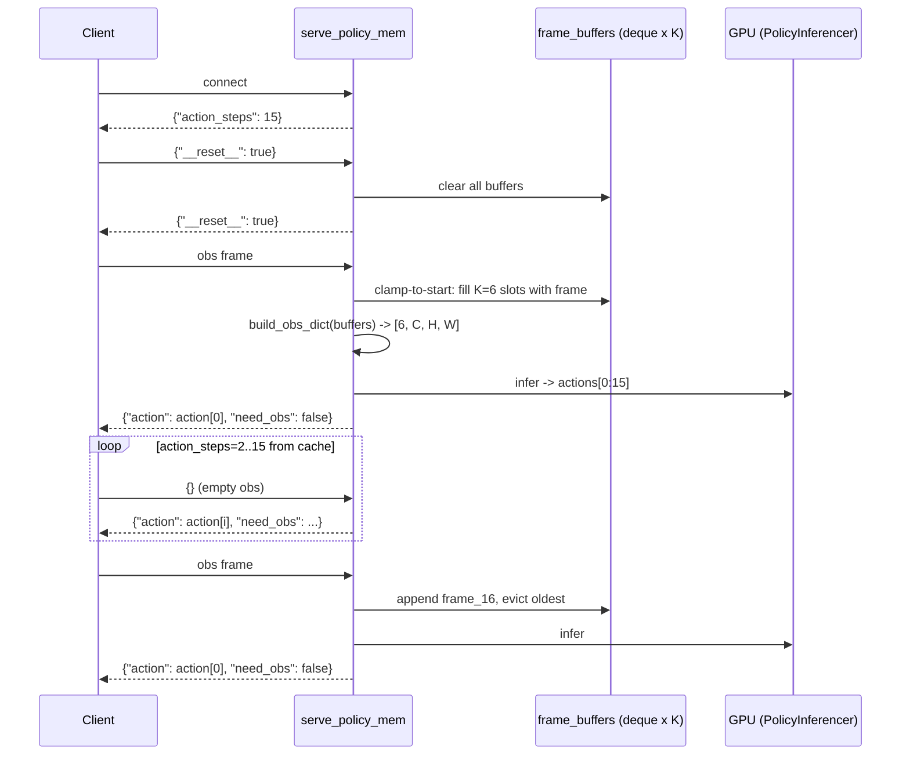

# WebSocket Policy Server: MEM Multi-Frame Deployment Guide

## Overview

`scripts/serve_policy_mem.py` is the WebSocket policy server for **MEM (Multi-frame Encoder Module)** models. It extends `serve_policy.py` with per-camera frame buffers so the model sees K historical observation frames instead of repeated copies of one frame.

It is intended for MEM training configs with `obs_size > 1`, such as `10k_pretrain_full_AC2_2cb_qwen35_2b_mem.yaml` with `obs_size=6`. Single-frame models are also compatible: `buffer maxlen=1` is equivalent to the old behavior.

### Differences From `serve_policy.py`

| Area | `serve_policy.py` | `serve_policy_mem.py` |
|------|-------------------|-----------------------|
| Observation frames | Expands one frame to K. | Uses real K-frame history. |
| Frame buffer | None. | Per-camera `deque(maxlen=K)`. |
| Episode reset | Clears action cache. | Clears action cache and frame buffers. |
| `--task_config` | Not supported. | Supports manually specifying a task YAML. |
| Timing logs | Total time only. | Five-stage timing breakdown. |

## Data Flow



## Startup

### Prerequisites

```bash
source startg05.sh
uv pip install websockets
```

### Option 1: Auto-Load From `run_dir` (Recommended)

Published checkpoint packages and training run directories include `.hydra/config.yaml`, which the server reads automatically:

```bash
python scripts/serve_policy_mem.py \
    --ckpt_path /path/to/checkpoints/step_10000/model_state_dict.pt \
    --action_steps 15 \
    eval_embodiment=galaxea_r1lite
```

### Option 2: Manually Specify A Task Config

If the checkpoint directory is missing `.hydra/config.yaml`, specify the training task YAML with `--task_config`:

```bash
python scripts/serve_policy_mem.py \
    --ckpt_path /path/to/checkpoints/step_10000/model_state_dict.pt \
    --task_config configs/task/<your_task>.yaml \
    --action_steps 15 \
    eval_embodiment=galaxea_r1lite
```

### Arguments

| Argument | Default | Description |
|----------|---------|-------------|
| `--ckpt_path` | required | Checkpoint file path. |
| `--task_config` | None | Manually specified task YAML; overrides the run_dir config. |
| `--action_steps` | 16 | Number of output steps per inference. **For MEM, align this with `obs_stride`.** |
| `--host` | `0.0.0.0` | Listen address. |
| `--port` | `8765` | Listen port. |
| `--device` | `cuda` | Inference device. |
| `eval_embodiment=xxx` | optional | Filter to one embodiment. |

## Frame-Spacing Alignment

During training, `obs_stride` defines the control-step spacing between adjacent frames. During inference, the buffer stores one frame every `action_steps`, so this must hold:

```text
action_steps = obs_stride x (control_fps / data_fps)
```

| Control Frequency | obs_stride | data_fps | action_steps |
|:-----------------:|:----------:|:--------:|:------------:|
| 15 Hz | 15 | 15 | **15** |
| 30 Hz | 15 | 15 | **30** |
| 15 Hz | 10 | 15 | **10** |

If `action_steps` does not match, frame spacing in the buffer differs from training and causes distribution shift.

## Frame Buffer Mechanism

### Storage

```python
_frame_buffers = {
    "head_rgb":       deque(maxlen=6),  # one deque per camera
    "left_wrist_rgb": deque(maxlen=6),
    "right_wrist_rgb": deque(maxlen=6),
}
_state_buffers = {
    "left_arm":     deque(maxlen=6),
    "left_gripper": deque(maxlen=6),
    "right_arm":    deque(maxlen=6),
    "right_gripper": deque(maxlen=6),
}
```

### Write Timing

One new frame is written on each **recompute**, after the current action chunk has been consumed.

| Scenario | Behavior |
|----------|----------|
| First episode frame | Clamp-to-start: fill all K slots with the first frame. |
| Later frames | Append normally; the deque evicts the oldest frame automatically. |

### Read Format

```python
torch.stack(list(frame_buffers["head_rgb"]))  # -> [K, C, H, W], oldest first
```

### Episode Reset

The client sends `{"__reset__": true}`. The server clears all deques and resets `_buffers_initialized = False`.

## Client Protocol

The client uses `scripts/utils/policy_ws_client.py`, shared with the single-frame server. Multi-frame logic lives entirely on the server side, and the protocol is the same as `serve_policy.py`:

```python
from scripts.utils.policy_ws_client import PolicyWebSocketClient

async with PolicyWebSocketClient("ws://localhost:8765") as client:
    # Reset before each episode to clear server-side buffers.
    await client.reset()

    for step in range(max_steps):
        resp = await client.infer(raw_obs)
        action = resp["action"]       # {part: ndarray[dim]}
        need_obs = resp["need_obs"]   # bool

        # When need_obs=False, sending an empty obs returns from server cache.
        if not need_obs:
            resp = await client.infer({})
```

### Request Format

```python
obs = {
    "images": {
        "head_rgb":       np.ndarray([3, H, W], dtype=uint8),
        "left_wrist_rgb": np.ndarray([3, H, W], dtype=uint8),
        "right_wrist_rgb": np.ndarray([3, H, W], dtype=uint8),
    },
    "state": {
        "left_arm":     np.ndarray([6], dtype=float32),
        "left_gripper": np.ndarray([1], dtype=float32),
        "right_arm":    np.ndarray([6], dtype=float32),
        "right_gripper": np.ndarray([1], dtype=float32),
    },
    "task": "pick up the cup",
    "embodiment_type": "galaxea_r1lite",  # required in mixture mode
}
```

## Log Example

```text
INFO  Frame buffer enabled: obs_size=6, cameras=['head_rgb', 'left_wrist_rgb', 'right_wrist_rgb']
INFO  Policy server listening on ws://0.0.0.0:8765 (mode=chunk(15), device=cuda)
INFO  Client connected: ('192.168.1.100', 54321) (action_steps=15)
INFO  Episode reset from client ('192.168.1.100', 54321)
INFO  Recompute: 395.2ms total | buffers=0.1ms build_obs=2.3ms infer=390.5ms post=2.3ms (next 14 from cache)
```

## Config Mapping

| Task config field | Server behavior |
|-------------------|-----------------|
| `data.obs_size.image: 6` | `deque(maxlen=6)` |
| `data.obs_stride.image: 15` | Manually set `--action_steps 15` to align. |
| `model.model_arch.vision.spacetime_mode: factorized` | ViT uses factorized temporal + spatial attention internally. |
| `model.processor.num_obs_steps: 6` | Processor expects `[6, C, H, W]` input. |
| `model.model_arch.cond_steps: 1` | After MEM compresses 6 frames, the VLM sees only 1 step. |

## Troubleshooting

| Symptom | Cause | Fix |
|---------|-------|-----|
| `ModuleNotFoundError: websockets` | Dependency is not installed. | `uv pip install websockets` |
| Inference is unstable or jittery | `action_steps` does not match `obs_stride`. | Compute the correct value with the formula above. |
| `FileNotFoundError: .hydra/config.yaml` | MEM training did not save a Hydra config. | Use `--task_config`. |
| `Frame buffer enabled` log is missing | `num_obs_steps=1`, so no multi-frame buffer is needed. | Check that the expected config loaded. |
| Bad action at episode start | Old frames remain because reset was not called. | Call `await client.reset()` before each episode. |

## Related Files

| File | Purpose |
|------|---------|
| `scripts/serve_policy_mem.py` | MEM multi-frame server. |
| `scripts/utils/policy_ws_client.py` | Client shared with the single-frame server. |
| `scripts/serve_policy.py` | Original single-frame server. |
| `src/g05/models/g05/inferencer.py` | PolicyInferencer inference wrapper. |
| `src/g05/utils/websocket/` | msgpack encode/decode utilities. |
| `src/g05/utils/checkpoint/ckpt_utils.py` | `load_config_from_task_yaml`. |
