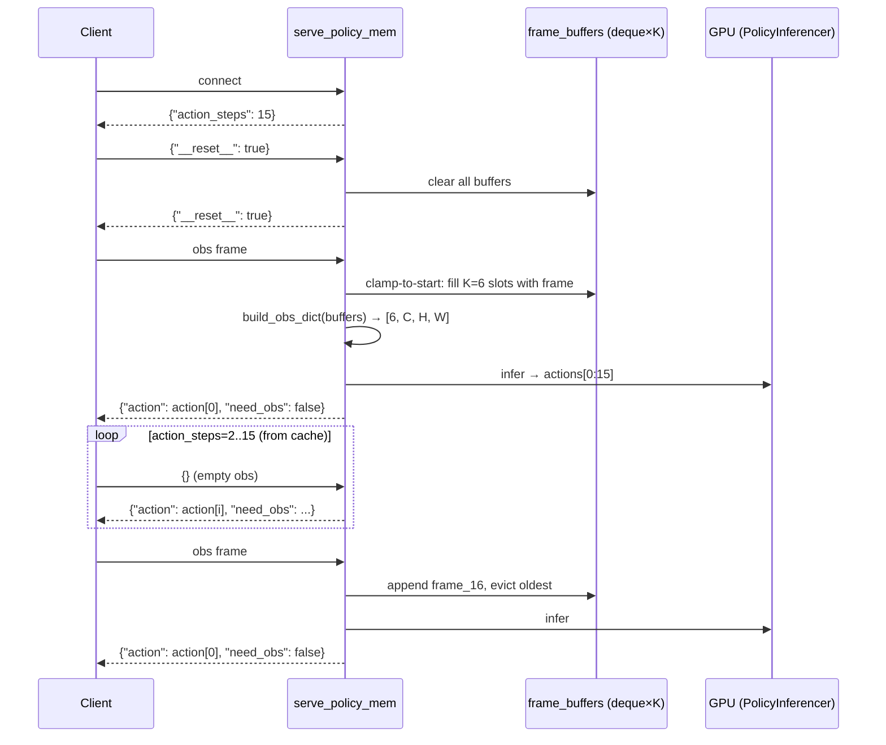

# WebSocket Policy Server — MEM 多帧版部署指南

## 概述

`scripts/serve_policy_mem.py` 是支持 **MEM (Multi-frame Encoder Module)** 的 WebSocket policy server。在 `serve_policy.py` 基础上增加了 per-camera frame buffer，使模型能看到 K 帧历史观测而非单帧复制。

适用于 `obs_size > 1` 的 MEM 训练配置（如 `10k_pretrain_full_AC2_2cb_qwen35_2b_mem.yaml`，obs_size=6）。单帧模型也兼容（buffer maxlen=1，等价旧行为）。

### 与 serve_policy.py 的区别

| | serve_policy.py | serve_policy_mem.py |
|--|-----------------|---------------------|
| 观测帧数 | 单帧 expand 到 K | 真实 K 帧历史 |
| Frame buffer | 无 | per-camera deque(maxlen=K) |
| Episode reset | 清 action cache | 清 action cache + 清帧 buffer |
| `--task_config` | 不支持 | 支持手动指定 task yaml |
| Timing 日志 | 仅 total | 5 段分段计时 |

## 数据流



## 启动

### 前置条件

```bash
source startg05.sh
uv pip install websockets  # 首次需安装
```

### 方式 1：从 run_dir 自动加载（推荐）

发布的 checkpoint 包和训练 run 目录都自带 `.hydra/config.yaml`，server 会自动读取：

```bash
python scripts/serve_policy_mem.py \
    --ckpt_path /path/to/checkpoints/step_10000/model_state_dict.pt \
    --action_steps 15 \
    eval_embodiment=galaxea_r1lite
```

### 方式 2：手动指定 task config

checkpoint 目录缺少 `.hydra/config.yaml` 时，用 `--task_config` 手动指定训练时的 task yaml：

```bash
python scripts/serve_policy_mem.py \
    --ckpt_path /path/to/checkpoints/step_10000/model_state_dict.pt \
    --task_config configs/task/<your_task>.yaml \
    --action_steps 15 \
    eval_embodiment=galaxea_r1lite
```

### 参数说明

| 参数 | 默认值 | 说明 |
|------|--------|------|
| `--ckpt_path` | (必填) | Checkpoint 文件路径 |
| `--task_config` | None | 手动指定 task yaml（覆盖 run_dir 的 config） |
| `--action_steps` | 16 | 每次推理输出步数。**MEM 需要对齐 obs_stride** |
| `--host` | `0.0.0.0` | 监听地址 |
| `--port` | `8765` | 监听端口 |
| `--device` | `cuda` | 推理设备 |
| `eval_embodiment=xxx` | (可选) | 过滤到单 embodiment |

## 帧间距对齐（关键）

训练时 `obs_stride` 定义了相邻帧之间的控制步间隔。推理时 buffer 每 `action_steps` 步存一帧，所以必须满足：

```
action_steps = obs_stride × (control_fps / data_fps)
```

| 控制频率 | obs_stride | data_fps | action_steps |
|:---:|:---:|:---:|:---:|
| 15 Hz | 15 | 15 | **15** |
| 30 Hz | 15 | 15 | **30** |
| 15 Hz | 10 | 15 | **10** |

如果 `action_steps` 不匹配，buffer 里帧的时间间隔会和训练时不同，导致 distribution shift。

## Frame Buffer 机制

### 存储结构

```python
_frame_buffers = {
    "head_rgb":       deque(maxlen=6),  # 每个 camera 一个 deque
    "left_wrist_rgb": deque(maxlen=6),
    "right_wrist_rgb": deque(maxlen=6),
}
_state_buffers = {
    "left_arm":     deque(maxlen=6),
    "left_gripper": deque(maxlen=6),
    "right_arm":    deque(maxlen=6),
    "right_gripper": deque(maxlen=6),
}
```

### 写入时机

每次 **recompute**（action chunk 用完后）收到新观测时写入一帧。

| 场景 | 行为 |
|------|------|
| Episode 首帧 | Clamp-to-start：用第一帧填满所有 K 个槽 |
| 后续帧 | 正常 append，deque 自动丢弃最老帧 |

### 读取方式

```python
torch.stack(list(frame_buffers["head_rgb"]))  # → [K, C, H, W] oldest-first
```

### Episode 重置

Client 发 `{"__reset__": true}` → Server 清空所有 deque + 重置 `_buffers_initialized = False`。

## Client 协议

Client 使用 `scripts/utils/policy_ws_client.py`（与单帧版共用，多帧逻辑在 server 端），协议与 `serve_policy.py` 完全一致：

```python
from scripts.utils.policy_ws_client import PolicyWebSocketClient

async with PolicyWebSocketClient("ws://localhost:8765") as client:
    # Episode 开始前 reset（清 server 端 buffer）
    await client.reset()

    for step in range(max_steps):
        resp = await client.infer(raw_obs)
        action = resp["action"]       # {part: ndarray[dim]}
        need_obs = resp["need_obs"]   # bool

        # need_obs=False 时可以发空 obs（server 从 cache 返回）
        if not need_obs:
            resp = await client.infer({})
```

### 发送格式（与 serve_policy.py 相同）

```python
obs = {
    "images": {
        "head_rgb":       np.ndarray([3, H, W], dtype=uint8),
        "left_wrist_rgb": np.ndarray([3, H, W], dtype=uint8),
        "right_wrist_rgb": np.ndarray([3, H, W], dtype=uint8),
    },
    "state": {
        "left_arm":     np.ndarray([6], dtype=float32),
        "left_gripper": np.ndarray([1], dtype=float32),
        "right_arm":    np.ndarray([6], dtype=float32),
        "right_gripper": np.ndarray([1], dtype=float32),
    },
    "task": "pick up the cup",
    "embodiment_type": "galaxea_r1lite",  # mixture 模式必填
}
```

## 日志示例

```
INFO  Frame buffer enabled: obs_size=6, cameras=['head_rgb', 'left_wrist_rgb', 'right_wrist_rgb']
INFO  Policy server listening on ws://0.0.0.0:8765 (mode=chunk(15), device=cuda)
INFO  Client connected: ('192.168.1.100', 54321) (action_steps=15)
INFO  Episode reset from client ('192.168.1.100', 54321)
INFO  Recompute: 395.2ms total | buffers=0.1ms build_obs=2.3ms infer=390.5ms post=2.3ms (next 14 from cache)
```

## 配置对应关系

| Task Config 字段 | Server 行为 |
|-----------------|-------------|
| `data.obs_size.image: 6` | `deque(maxlen=6)` |
| `data.obs_stride.image: 15` | 需手动设置 `--action_steps 15` 对齐 |
| `model.model_arch.vision.spacetime_mode: factorized` | ViT 内部使用 factorized T+S attention |
| `model.processor.num_obs_steps: 6` | processor 期望 `[6, C, H, W]` 输入 |
| `model.model_arch.cond_steps: 1` | 6帧经 MEM 压缩后 VLM 只看 1 步 |

## 排错

| 症状 | 原因 | 解决 |
|------|------|------|
| `ModuleNotFoundError: websockets` | 未安装 | `uv pip install websockets` |
| 推理结果异常（抖动大） | `action_steps` 与 `obs_stride` 不匹配 | 按公式计算正确值 |
| `FileNotFoundError: .hydra/config.yaml` | MEM 训练没有保存 hydra config | 使用 `--task_config` 指定 |
| `Frame buffer enabled` 日志未出现 | `num_obs_steps=1`（不需要多帧） | 检查 config 是否加载正确 |
| Episode 开始动作异常 | 未 reset 导致旧帧残留 | Client 在 episode 开始前调 `await client.reset()` |

## 相关文件

| 文件 | 说明 |
|------|------|
| `scripts/serve_policy_mem.py` | MEM 多帧 server |
| `scripts/utils/policy_ws_client.py` | client（与单帧版共用） |
| `scripts/serve_policy.py` | 原版 server（单帧） |
| `src/g05/models/g05/inferencer.py` | PolicyInferencer 推理封装 |
| `src/g05/utils/websocket/` | msgpack 编解码 |
| `src/g05/utils/checkpoint/ckpt_utils.py` | `load_config_from_task_yaml` |
