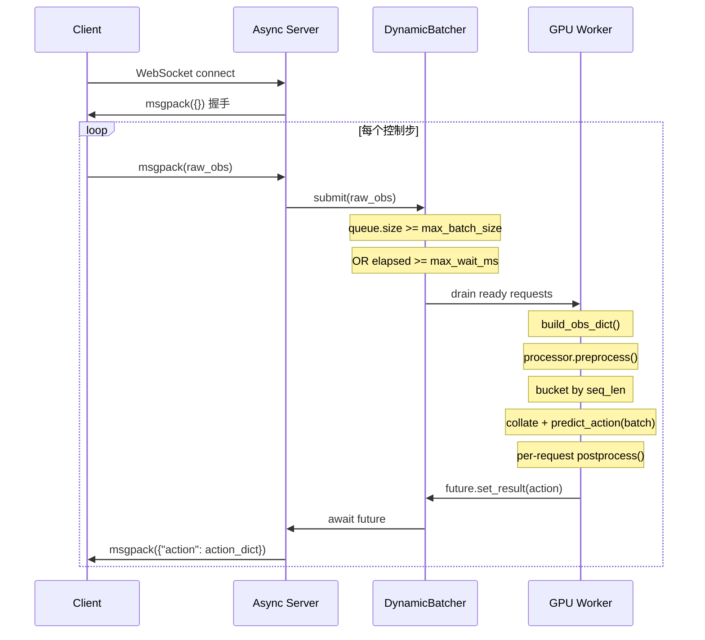

# WebSocket Policy Server 部署指南

## 概述

`scripts/serve_policy.py` 是内置的 WebSocket policy server，**完全复用** `eval_open_loop.py` 的模型/processor 加载路径，保证训练-推理一致性。Client 只需发送 raw observation，server 返回反归一化后的 action dict。

当前版本已内置 **dynamic batching + length bucketing + backpressure**：

- `max_batch_size`：吞吐量上限；队列累计到该值立即触发一次 forward
- `max_wait_ms`：单请求排队上限；即使未凑满 batch，超时也立刻 forward
- `seq_bucket_step`：按文本 token 长度分桶，降低变长输入 padding 浪费
- `max_queue_size`：队列上限；超过后返回错误而不是让延迟无限增长

与旧方案（`docs/deployment/inference.md`）的区别：

| | 旧方案 (ROS direct) | 新方案 (WebSocket server) |
|--|---------------------|--------------------------|
| 依赖 | Client 需要 `g05` 库 | Client 零 PyTorch 依赖 |
| Preprocessing | Client 端 | Server 端 |
| 一致性 | 容易出现训练-推理不一致 | 完全复用训练 pipeline |
| 通信 | ROS topic | WebSocket + msgpack |

## 数据流



## 启动

### 前置条件

```bash
source startg05.sh          # 激活环境
uv pip install websockets    # 首次需安装

# 若需录制视频（EpisodeRecorder）且视频上叠加中文 COT 文本，需安装 CJK 字体：
apt-get install -y fonts-wqy-zenhei
```

### 单 Embodiment 模式

指定 `eval_embodiment` 过滤到单一 embodiment，推荐用于真机部署：

```bash
python scripts/serve_policy.py \
    --ckpt_path /path/to/checkpoints/step_10000/model_state_dict.pt \
    --host 0.0.0.0 --port 8765 \
    --max_batch_size 8 \
    --max_wait_ms 10 \
    eval_embodiment=galaxea_r1lite
```

### Mixture 模式

不指定 `eval_embodiment`，client 通过 `embodiment_type` 字段路由：

```bash
python scripts/serve_policy.py \
    --ckpt_path /path/to/checkpoints/step_10000/model_state_dict.pt \
    --host 0.0.0.0 --port 8765 \
    --max_batch_size 8 \
    --max_wait_ms 10
```

### torch.compile 加速

添加 `use_torch_compile=true` 启用 `torch.compile`（使用 `max-autotune` mode，首次推理编译约几分钟，后续推理显著加速）：

```bash
python scripts/serve_policy.py \
    --ckpt_path /path/to/checkpoints/step_10000/model_state_dict.pt \
    --host 0.0.0.0 --port 8765 \
    eval_embodiment=galaxea_r1lite \
    model.use_torch_compile=true
```

### 参数说明

| 参数 | 默认值 | 说明 |
|------|--------|------|
| `--ckpt_path` | (必填) | Checkpoint 文件路径，如 `.../step_10000/model_state_dict.pt` |
| `--host` | `0.0.0.0` | 监听地址 |
| `--port` | `8765` | 监听端口 |
| `--max_batch_size` | `8` | dynamic batching 的 batch 上限 |
| `--max_wait_ms` | `10.0` | 单请求在队列中的最大等待时间 |
| `--max_queue_size` | `256` | 队列长度上限，超限直接拒绝 |
| `--seq_bucket_step` | `64` | 文本 token 长度分桶粒度 |
| `eval_embodiment=xxx` | (可选) | 过滤到单 embodiment |
| `model.use_torch_compile=true` | (可选) | 启用 torch.compile 加速 |
| 其他 `key=value` | | 同 Hydra override 语法，透传到 config |

### Dynamic Batching 调参建议

| 场景 | 建议 |
|------|------|
| 延迟优先 | 减小 `--max_wait_ms`，例如 `2-5` |
| 吞吐优先 | 增大 `--max_batch_size`，并适当增大 `--max_wait_ms` |
| 文本长度差异大 | 保持 `--seq_bucket_step=64` 或调小到 `32` |
| 请求峰值明显 | 增大 `--max_queue_size`，同时监控 P99 延迟 |

## Client 协议

### 连接

1. WebSocket 连接到 `ws://{host}:{port}`
2. 接收握手包：`unpackb(ws.recv())` → 空 dict `{}`
3. 开始发送-接收循环

### 发送格式 (msgpack)

```python
obs = {
    "images": {
        "head_rgb":       np.ndarray([3, H, W], dtype=uint8),
        "left_wrist_rgb": np.ndarray([3, H, W], dtype=uint8),
        ...
    },
    "state": {
        "left_arm":    np.ndarray([6], dtype=float32),
        "right_arm":   np.ndarray([6], dtype=float32),
        "left_gripper": np.ndarray([D], dtype=float32),
        ...
    },
    "task": "pick up cup",              # 原始指令
    "embodiment_type": "galaxea_r1lite", # mixture 模式必填
}
ws.send(packb(obs))
```

**注意**：
- images 为 `[C, H, W]`（3D），无 batch 维度，server 自行补充
- state 为 `[D]`（1D），无时间维度，server 自行扩展
- task 发原始文本，不加 `[Low]:` 等前缀，processor 内部统一处理
- 不需要发 `*_is_pad` 字段，server 自行构建

### 接收格式 (msgpack)

```python
response = unpackb(ws.recv())
actions = response["action"]
# actions = {
#     "left_arm":     np.ndarray([T, 6], dtype=float32),
#     "right_arm":    np.ndarray([T, 6], dtype=float32),
#     "left_gripper": np.ndarray([T, 1], dtype=float32),
#     ...
# }
```

其中 `T` = action horizon（由训练 config 中的 `action_size` 决定）。

### 错误响应

当请求无效、队列已满或服务端推理失败时，server 返回：

```python
response = {
    "error": {
        "code": 400 | 500 | 503,
        "message": "human readable error"
    }
}
```

- `400`：输入 schema 不合法
- `503`：动态批处理队列已满，触发背压
- `500`：服务端推理异常

## 内部架构

### Checkpoint 目录结构要求

训练原始目录和 `tools/export_checkpoint.py` 导出目录均支持：

```
# 训练原始目录
run_dir/
├── .hydra/config.yaml       # 训练时保存的 Hydra config
├── dataset_stats.json       # normalizer 统计数据
└── checkpoints/
    └── step_10000/
        └── model_state_dict.pt

# export 导出目录
export_dir/
├── .hydra/config.yaml
├── dataset_stats.json
├── export_meta.json
└── checkpoints/
    └── model_state_dict.pt
```

Server 从 `ckpt_path` 向上查找含 `.hydra/config.yaml` 的 `run_dir`，自动加载 config 和 normalizer。

### 代码对齐关系

| 功能 | 对齐文件 | 引用 |
|------|---------|------|
| Config 加载 | `src/g05/utils/checkpoint/ckpt_utils.py` | `find_run_dir()`, `load_config_from_run_dir()` |
| 模型加载 | `scripts/eval_open_loop.py` | L362-370 |
| Normalizer 加载 | `scripts/eval_open_loop.py` | L373-374 |
| Processor 构建 | `src/g05/utils/eval/eval_utils.py` | `build_eval_processor()` L80-96 |
| 推理循环 | `scripts/eval_open_loop.py` | L124-127 |
| Postprocess | `scripts/eval_open_loop.py` | L176 |

### 关键设计

**Dummy Action**：推理时 client 无 GT action，但模型需要 `action_dim_is_pad` mask。`build_obs_dict()` 构建零值 dummy action（`action_is_pad=True`），让 `ConcatLeftAlign.forward()` 自动生成正确 mask，不影响推理结果。

**Mixture 处理**：`build_eval_processor(cfg)` 自动处理 single/mixture。Mixture 时 `MixtureProcessor.preprocess()` 内部按 `data["embodiment"]` 路由到子 processor；dynamic batching 阶段保守地按 sub-processor 分桶，forward 后再逐请求回到对应 sub-processor 做 postprocess。

**Length Bucketing**：server 先跑 `processor.preprocess()`，再按 `input_ids` 长度做 `seq_bucket_step` 分桶；同一微批内部用 `collate_fn_pad_sequences()` padding，尽量减少长短文本混跑带来的空算力。

**Backpressure**：请求先进入有界队列；超过 `max_queue_size` 后不继续排队，而是立即返回 `503` 风格错误包，避免真实机器人控制链路被无限放大延迟。

## 一致性测试

### 1. Dataset vs Server 可视化对比

`tests/test_serve_vs_dataset.py` 验证 dataset（eval_open_loop 离线路径）和 serve_policy（在线路径）送入 `processor.preprocess` 的数据是否一致。

```bash
python tests/test_serve_vs_dataset.py \
    --ckpt_path runs/pretrain/6k_pretrain_full_ddp_arQ9999_fmZscore/pretrain_0301/checkpoints/step_117428.pt \
    eval_embodiment=galaxea_r1lite
```

可选参数：

| 参数 | 默认值 | 说明 |
|------|--------|------|
| `--num_samples` | 3 | 对比的样本数 |
| `--output_dir` | `<run_dir>/test_serve_vs_dataset` | 可视化图片输出目录 |

输出：
- `sample_X_images.png` — 原始图像对比
- `sample_X_pre_preprocess.png` — preprocess 前 state 值对比
- `sample_X_post_preprocess.png` — preprocess 后 proprio/action/mask 对比
- `sample_X_pixel_values.png` — preprocess 后图像对比
- `summary.txt` — 差异汇总

### 2. 三路一致性检查（训练 batch vs eval vs serve）

`tests/test_train_eval_serve_consistency.py` 用真实训练 batch 作为 ground truth，检查 eval/serve 的 preprocess 输出是否与训练一致。

```bash
python tests/test_train_eval_serve_consistency.py \
    --ckpt_path runs/pretrain/6k_pretrain_full_ddp_arQ9999_fmZscore/pretrain_0301/checkpoints/step_117428.pt \
    --train_batch /path/to/real_batch.pkl \
    eval_embodiment=galaxea_r1lite
```

检查项：

| 检查 | 说明 | 影响 |
|------|------|------|
| A. Template | 模板占位符和文本是否一致 | 直接决定 input_ids |
| B. Tensor shapes | input_ids, pixel_values, proprio 等形状 | 模型输入形状 |
| C. dim_pad_mask | action/proprio padding 维度 | postprocess 拆分 |
| D. Embodiment | samples.embodiment 是否注入 | 模板 `<embodiment_text_!>` |
| E. eval==serve | 同一输入两条路径值一致 | 部署正确性 |
| F. Structure | samples 子字段完整性 | collate 正确性 |
| G. input_ids | token 级对比训练 vs eval | 训练-推理对齐 |

> **注意**：训练 batch 和 eval 可能来自不同 embodiment，此时 C/G 检查的差异是预期的（标注为 INFO/WARN 而非 FAIL）。

### 3. Dynamic Batching 单元测试

`tests/test_serve_policy_dynamic_batching.py` 覆盖以下行为：

- `infer_batch()` 与单请求 `infer()` 等价
- 分桶与 `max_batch_size` 切分逻辑正确
- 队列满载时触发背压拒绝

## 排错

| 症状 | 原因 | 解决 |
|------|------|------|
| Client 连接后卡住 | Server 未发握手包 | 确认使用最新版 serve_policy.py |
| `KeyError: "action"` | 响应格式不匹配 | 确认 server 返回 `{"action": ...}` 包裹 |
| `error.code=503` | 动态批处理队列已满 | 调大 `--max_queue_size` 或减小流量/延迟目标 |
| `ModuleNotFoundError: websockets` | 未安装依赖 | `uv pip install websockets` |
| `FileNotFoundError: .hydra/config.yaml` | ckpt_path 路径不对 | 确认 checkpoint 目录结构正确 |
| Mixture 模式 KeyError | Client 未发 `embodiment_type` | 添加该字段或使用 `eval_embodiment` 过滤到单 embodiment |
