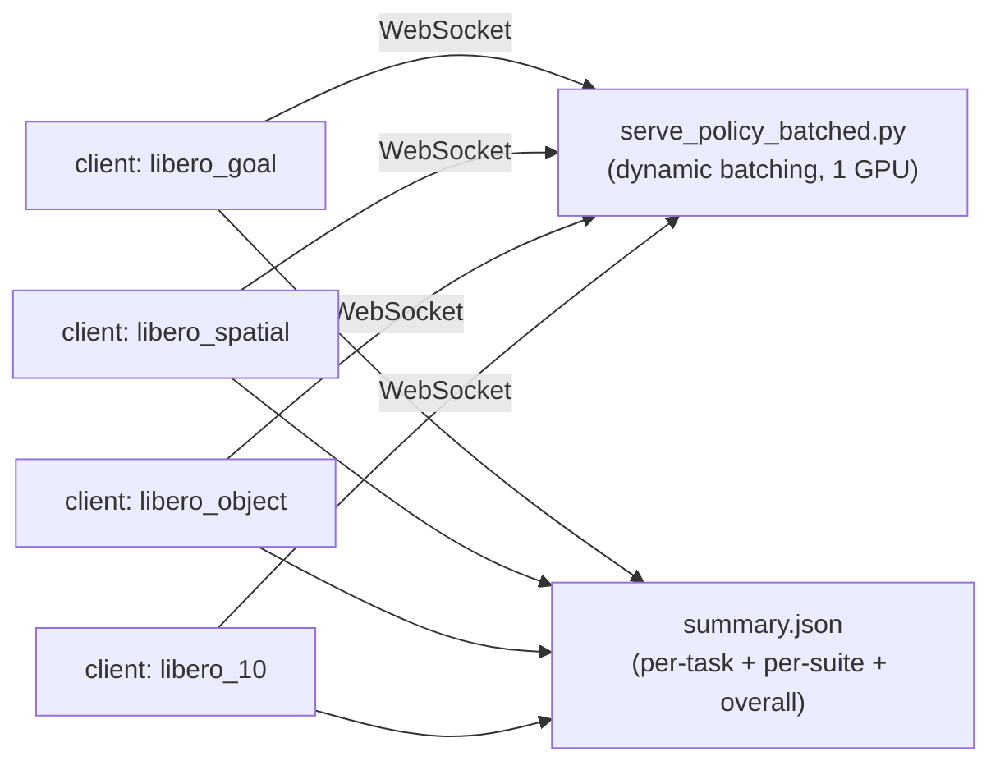

# LIBERO Evaluation

This directory contains the client-side code for LIBERO simulation evaluation and the local LIBERO path configuration. The one-command evaluation entry point is `scripts/run/eval_libero.sh`, which lives outside this directory.

## Contents

| File | Purpose |
|------|---------|
| `eval_libero_parallel.py` | Single-suite evaluation client: parallel environment rollouts that call the policy server over WebSocket. |
| `libero_eval_utils.py` | LIBERO utilities: observation/action conversion, gripper command state machine, environment construction, and video saving. |
| `libero_vector_env.py` | `LiberoAsyncVectorEnv`, a multiprocessing parallel environment wrapper. |
| `config.yaml` | Local LIBERO resource paths. This file is gitignored and generated automatically on first run. |

## Prerequisites

1. **Install LIBERO**: see the "Install Libero simulation support" section in the repository root `README.md`, for example `cd ../LIBERO && uv pip install -e .`.
2. **Path config `config.yaml`**: when the LIBERO package is imported for the first time without config, it asks for paths interactively. Background runs can fail with `EOFError`. This repository handles that as follows:
   - Set `LIBERO_CONFIG_PATH=$(pwd)/experiments/libero` before evaluation, as shown in the command below.
   - `ensure_libero_config()` in `libero_eval_utils.py` derives resource paths from the installed LIBERO package and generates `config.yaml` at evaluation startup, so manual creation is not required.
   - The file contains local absolute paths and is gitignored. Edit it manually only if your LIBERO resources are not in the default location.

## Checkpoint Layout

LIBERO evaluation should use a self-contained checkpoint bundle with only the
files required for evaluation:

```text
checkpoints/g05-libero/
├── model.pt
├── action_tokenizer.pt
├── dataset_stats.json
├── .hydra/
│   └── config.yaml
└── hf_processor/
    ├── config.json
    ├── configuration.json
    ├── tokenizer.json
    ├── tokenizer_config.json
    ├── preprocessor_config.json
    ├── video_preprocessor_config.json
    ├── vocab.json
    └── merges.txt
```

Requirements:

- `.hydra/config.yaml` must be resolvable by the current codebase and use public `g05.*` targets, not legacy private-package targets.
- `.hydra/config.yaml` must not reference data YAML files that are absent from the current repository.
- `model.model_arch.hf_processor_path` and `model.processor.tokenizer_params.pretrained_model_name_or_path` must point to the bundled `hf_processor/`.
- `model.tokenizer.vq_config.ckpt_dir` and `model.model_arch.AT_CONFIG.ckpt_dir` must point to the bundled `action_tokenizer.pt`.
- `dataset_stats.json` must live at the bundle root; the policy server reads it from the checkpoint run directory.

## One-Command Batch Evaluation

```bash
bash scripts/run/eval_libero.sh <ckpt_path> [options] [key=value ...]

# Example
LIBERO_CONFIG_PATH=$(pwd)/experiments/libero \
CUDA_VISIBLE_DEVICES=0 \
HF_HUB_OFFLINE=1 \
TRANSFORMERS_OFFLINE=1 \
uv run bash scripts/run/eval_libero.sh \
    checkpoints/g05-libero/model.pt \
    --suites "libero_goal" \
    --num_trials 1 \
    --num_parallel 1
```

The script starts one batched policy server and one parallel client per suite, then summarizes all results automatically:



Common options, with the full list documented in the script header:

| Option | Default | Description |
|--------|---------|-------------|
| `--output_dir` | `outputs/libero_eval_<ckpt-name>` | Output root directory. |
| `--num_trials` | 50 | Number of trials per task. |
| `--num_parallel` | 10 | Number of parallel environments per client. |
| `--suites` | all 4 suites | Space-separated suite names. |
| `--save_videos` | off | Save rollout videos. |
| `key=value` | - | Hydra override forwarded to the server. |

## Output Layout

```text
outputs/libero_eval_<name>/
├── server.log                          # policy server log
├── <suite>/
│   ├── client.log                      # client log
│   └── <suite>_parallel_results.json   # per-task results
└── summary.json                        # per-task / per-suite / overall success rates
```

## Run A Single Suite

```bash
# 1. Start the server.
uv run python scripts/serve_policy_batched.py --ckpt_path <ckpt> --port 12345 eval_embodiment=libero --action_steps 10

# 2. Run the client.
uv run python experiments/libero/eval_libero_parallel.py \
    --server_uri ws://127.0.0.1:12345 \
    --task_suite_name libero_goal \
    --num_trials_per_task 10 \
    --output_dir outputs/my_eval/libero_goal
```

The client also supports `--task_id` for a single task, `--seed`, `--env_resolution`, and related options. See the argparse definitions at the end of `eval_libero_parallel.py`.

Maximum steps per episode are hardcoded in `get_max_steps()` in `libero_eval_utils.py`: spatial 220, object 280, goal 300, 10 520, and 90 400.

## Training

The LIBERO fine-tuning config is `configs/task/libero.yaml`, and the data entry point is `configs/data/libero.yaml`:

```bash
# Sanity check: parses config, loads the current checkpoint/tokenizer, and exits after dry-run startup.
bash scripts/run/finetune.sh 1 libero --dry-run --max_datasets 1 --overfit_batch 1

# Full training.
bash scripts/run/finetune.sh 8 libero
```
