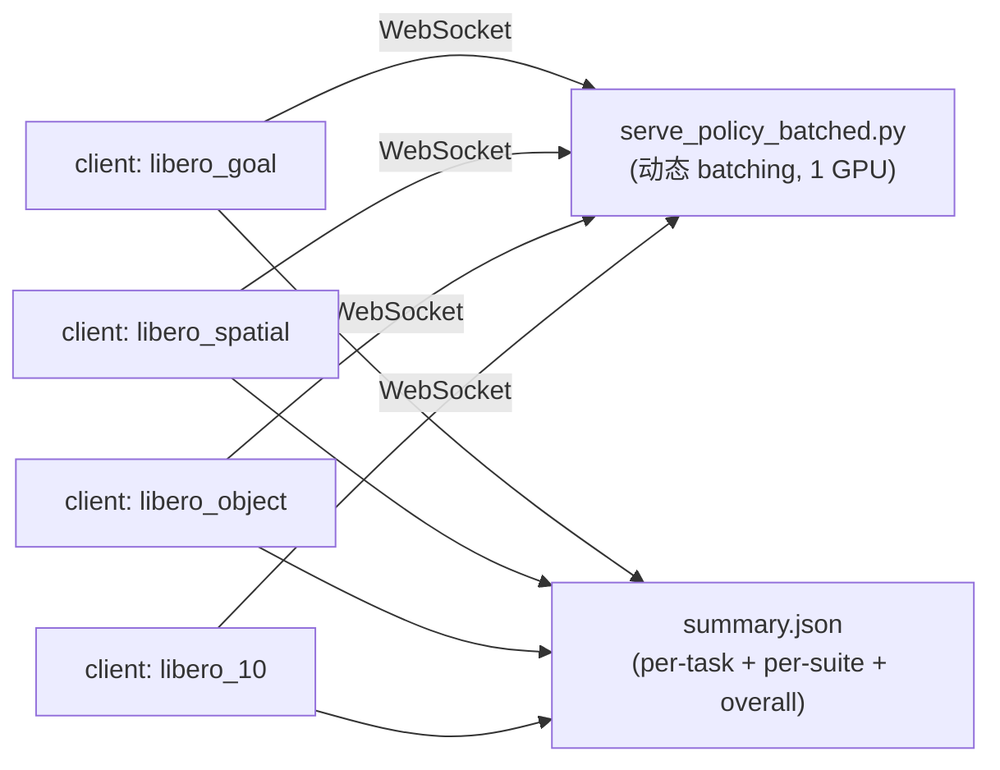

# LIBERO 评估

本目录包含 LIBERO 仿真评估的 client 端代码与本机 LIBERO 路径配置。一键评估入口在 `scripts/run/eval_libero.sh`（不在本目录）。

## 目录内容

| 文件 | 说明 |
|------|------|
| `eval_libero_parallel.py` | 单 suite 评估 client：并行 env rollout，通过 WebSocket 调用 policy server |
| `libero_eval_utils.py` | LIBERO 工具：obs/action 转换、gripper 命令状态机、env 构建、视频保存 |
| `libero_vector_env.py` | `LiberoAsyncVectorEnv`，多进程并行 env 封装 |
| `config.yaml` | 本机 LIBERO 资源路径（**gitignored**，首次运行自动生成，见下） |

## 前置条件

1. **安装 LIBERO**：见仓库根 `README.md`「安装 Libero 仿真支持」一节（`cd ../LIBERO && uv pip install -e .`）。
2. **路径配置 `config.yaml`**：LIBERO 包首次 import 时若找不到配置会交互式询问路径（后台运行会直接 `EOFError` 卡死）。本仓库的处理方式：
   - 评估前设置 `LIBERO_CONFIG_PATH=$(pwd)/experiments/libero`，见下方命令；
   - `libero_eval_utils.py` 的 `ensure_libero_config()` 在评估启动时自动从已安装的 LIBERO 包推导各资源路径并生成 `config.yaml`，无需手工创建；
   - 该文件含本机绝对路径，已 gitignore。如 LIBERO 资源放在非默认位置，可手工编辑此文件。

## Checkpoint 组织结构

LIBERO 评测推荐使用自包含 checkpoint bundle，并只保留评测必需文件：

```text
checkpoints/g05-libero/
├── model.pt
├── action_tokenizer.pt
├── dataset_stats.json
├── .hydra/
│   └── config.yaml
└── hf_processor/
    ├── config.json
    ├── configuration.json
    ├── tokenizer.json
    ├── tokenizer_config.json
    ├── preprocessor_config.json
    ├── video_preprocessor_config.json
    ├── vocab.json
    └── merges.txt
```

要求：

- `.hydra/config.yaml` 必须是当前代码库可解析的配置，target 使用公开的 `g05.*`，不能保留旧的私有包 target。
- `.hydra/config.yaml` 不能引用当前仓库不存在的 data yaml。
- `model.model_arch.hf_processor_path` 和 `model.processor.tokenizer_params.pretrained_model_name_or_path` 指向 bundle 内的 `hf_processor/`。
- `model.tokenizer.vq_config.ckpt_dir` 和 `model.model_arch.AT_CONFIG.ckpt_dir` 指向 bundle 内的 `action_tokenizer.pt`。
- `dataset_stats.json` 放在 bundle 根目录，policy server 会从 checkpoint 的 run dir 读取它。

## 一键批量评估

```bash
bash scripts/run/eval_libero.sh <ckpt_path> [options] [key=value ...]

# 示例
LIBERO_CONFIG_PATH=$(pwd)/experiments/libero \
CUDA_VISIBLE_DEVICES=0 \
HF_HUB_OFFLINE=1 \
TRANSFORMERS_OFFLINE=1 \
uv run bash scripts/run/eval_libero.sh \
    checkpoints/g05-libero/model.pt \
    --suites "libero_goal" \
    --num_trials 1 \
    --num_parallel 1
```

脚本会启动 1 个 batched policy server + 每个 suite 1 个并行 client，全部跑完后自动汇总：



常用选项（完整列表见脚本头部注释）：

| 选项 | 默认 | 说明 |
|------|------|------|
| `--output_dir` | `outputs/libero_eval_<ckpt名>` | 输出根目录 |
| `--num_trials` | 50 | 每个 task 的 trial 数 |
| `--num_parallel` | 10 | 每个 client 的并行 env 数 |
| `--suites` | 4 个 suite 全跑 | 空格分隔的 suite 名 |
| `--save_videos` | 关 | 保存 rollout 视频 |
| `key=value` | — | 透传给 server 的 Hydra override |

## 输出布局

```
outputs/libero_eval_<name>/
├── server.log                          # policy server 日志
├── <suite>/
│   ├── client.log                      # client 日志
│   └── <suite>_parallel_results.json   # per-task 结果
└── summary.json                        # 汇总（per-task / per-suite / OVERALL 成功率）
```

## 单独跑某个 suite

```bash
# 1. 先起 server
uv run python scripts/serve_policy_batched.py --ckpt_path <ckpt> --port 12345 eval_embodiment=libero --action_steps 10

# 2. 再跑 client
uv run python experiments/libero/eval_libero_parallel.py \
    --server_uri ws://127.0.0.1:12345 \
    --task_suite_name libero_goal \
    --num_trials_per_task 10 \
    --output_dir outputs/my_eval/libero_goal
```

client 还支持 `--task_id`（只跑单个 task）、`--seed`、`--env_resolution` 等，见 `eval_libero_parallel.py` 末尾的 argparse 定义。

各 suite 的单 episode 最大步数硬编码在 `libero_eval_utils.py` 的 `get_max_steps()`：spatial 220 / object 280 / goal 300 / 10 520 / 90 400。

## 训练

LIBERO 微调 config 为 `configs/task/libero.yaml`，数据入口为 `configs/data/libero.yaml`：

```bash
# 快速 sanity check：解析配置、加载当前 checkpoint/tokenizer，dry-run 启动后退出。
bash scripts/run/finetune.sh 1 libero --dry-run --max_datasets 1 --overfit_batch 1

# 完整训练。
bash scripts/run/finetune.sh 8 libero
```
